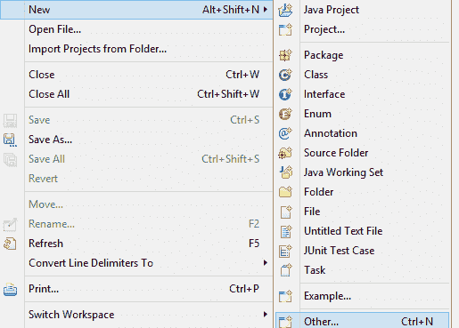
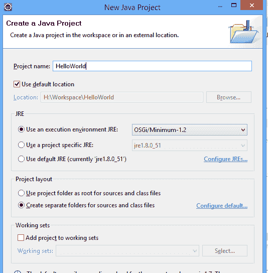
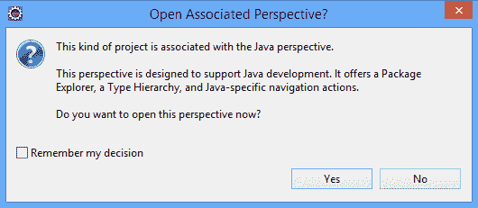
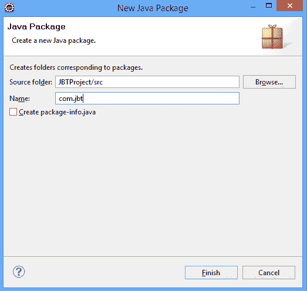
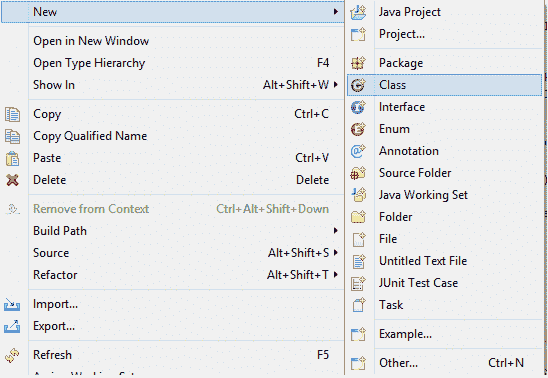
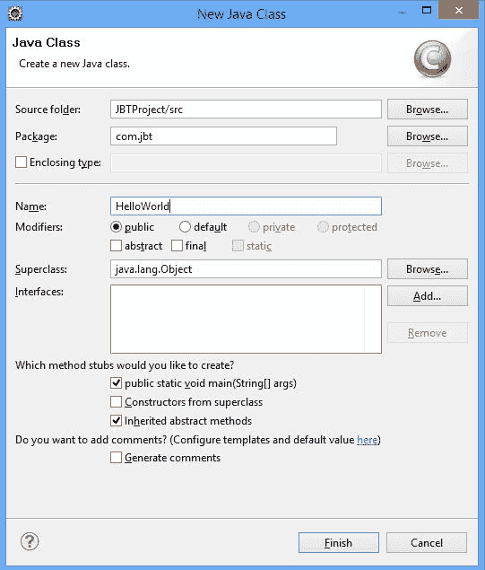
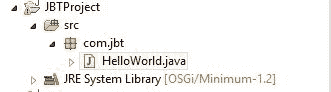

# 使用Eclipse编写Hello World程序

> 原文： [https://javabeginnerstutorial.com/core-java-tutorial/write-hello-world-application-using-eclipse/](https://javabeginnerstutorial.com/core-java-tutorial/write-hello-world-application-using-eclipse/)

在本教程中，我们将学习使用Eclipse IDE创建Hello World应用程序。 要了解以下材料，您应该熟悉如何使用Eclipse来获得有关Eclipse [的说明，请单击此处](https://javabeginnerstutorial.com/eclipse-2/eclipse-beginners-tutorial-2/)。

## 创建项目

要创建我们的项目，请从菜单中选择 ***文件> >新建> > Java Project*** 。 如果找不到“ Java项目”作为选项，请单击“其他”，如下所示。

从下一个窗口中选择Java项目，然后单击 ***下一步*** 。 提供一个项目名称，如下所示。

单击 ***完成*** 。 Eclipse将要求您将透视图更改为Java Perspective。 单击是。 如您所见，一个新的Java项目将出现在 **Java Perspective** 的 **Package Explorer视图**中。

## 创建一个包

现在，我们将为我们的Java项目创建一个程序包。 **软件包**用于避免*命名冲突*，以便*控制访问*（访问修饰符）和*来捆绑相关类型*的组。

要创建包，请在Java项目（ **JBTProject** ）中选择 ***src*** 文件夹，右键单击该文件夹并选择 ***新的> >软件包*** 。

在对话框中输入软件包名称，然后单击“完成”。

## 创建Java类的步骤

创建包后，我们可以在包内创建Java类。 右键单击要在其中创建Java类的包，然后选择 ***新> >类。*** 

在对话框中提供类名称，然后单击完成。 其他选项可供选择。 选择其他选项以创建您的主要方法。

创建Class后，项目的结构将如下所示。

## 编译&运行Java应用程序

创建Java应用程序之后，下一步就是编译并运行代码。

### 编译代码

要编译代码，请使用键盘快捷键“ CTRL + B”。 它将构建Java应用程序。 如果要构建单个应用程序，请单击该应用程序，然后从菜单中选择 ***项目> >构建项目*** 。

### 运行代码

要运行代码，您可以使用键盘快捷键“ ALT + SHIFT + X”和J。

或者，您可以单击文件，然后从菜单中选择 ***运行> >运行为> > Java应用程序*** 。

单击“运行”后，将执行Hello World应用程序，并且您的输出将显示在 ***控制台视图*** 中。

现在我们已经学会了在Eclipse中创建Hello World应用程序。 在下一篇文章中，我们将讨论Eclipse提供的一些其他功能，这些功能使编码更容易。

<noscript><iframe allow="accelerometer; autoplay; encrypted-media; gyroscope; picture-in-picture" allowfullscreen="" frameborder="0" height="360" src="https://www.youtube.com/embed/79l5QSuI4ko?feature=oembed" title="Hello world program in java eclipse" width="640"></iframe></noscript>

###### 下一篇文章

##### [执行顺序](https://javabeginnerstutorial.com/core-java-tutorial/order-of-execution-of-blocks-in-java/ "Order of execution")