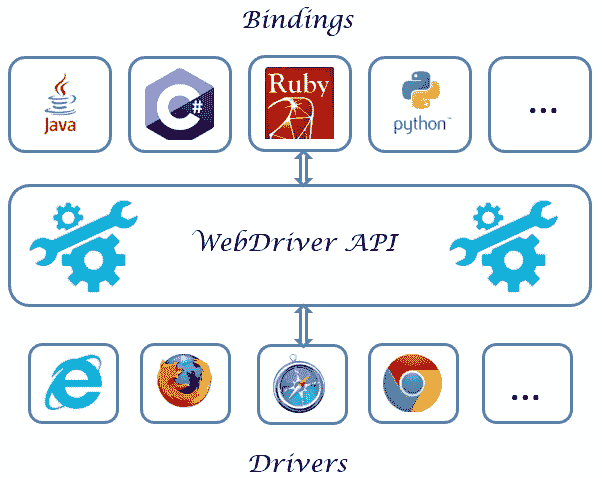

# 9a。 WebDriver –体系结构及其工作方式

> 原文： [https://javabeginnerstutorial.com/selenium/9a-webdriver-architecture/](https://javabeginnerstutorial.com/selenium/9a-webdriver-architecture/)

学习WebDriver的方法很有趣，而且常常使人弯腰，所以请做好准备……在 *Southern Surprises* 的土地上跋涉，我们将遇到一些奇妙，荒唐和古怪的事物。

您将发现Selenium WebDriver为什么将使您的生活变得如此好-从质量保证的角度来看，以及为什么我们将其称为“统治冠军”！ 为了掌握该工具并构建测试自动化框架，对我们正在处理的内容进行更深入的了解非常重要。 那么，我们还等什么呢？ 现在让我们开始打好基础！

哪种方式比图形表示更容易理解？ 这就是我们的大脑喜欢记住事物的方式，这也是我们将要前进的方式。

从这张图片中我们可以看出，这个架构有3层，

1.  绑定
2.  WebDriver API和
3.  车手

让我们一次讨论这一步骤。 *大字警报！* **绑定** –根据Wikipedia，这意味着将一件事映射到另一件事。 只要记住这两个词，*粘合代码*即可。

有很多高级编程语言，您可能想使用C＃，但其他人可能更喜欢Python。 每个人都希望利用通用的WebDriver API来以自己舒适的语言自动化浏览器。 这是语言级别绑定进入图片的地方。 这些就像用相应语言编写的*粘合代码/包装库*与WebDriver API进行通信。 除了Java，C＃，Ruby，Python绑定外，还有更多。 也很容易添加新的。

接下来到**驱动程序**上。 WebDriver API使我们可以拥有一些驱动程序，这些驱动程序知道如何驱动与之对应的特定浏览器。 我们有Chrome驱动程序，IE驱动程序，Microsoft Edge驱动程序，Firefox驱动程序（内置）等。还有移动专用驱动程序，例如iOS驱动程序，Selendriod（适用于Android的硒）等。例如，Chrome驱动程序知道如何 驱动Chrome浏览器执行低级活动，例如操纵Web元素，导航到网页，从中获取用户输入等等。

我们在代码中提到了所需的驱动程序。 该驱动程序服务器作为可执行文件提供。 当我们运行测试时，驱动程序服务器会侦听本地计算机上的端口。 它将解释从WebDriver API接收的命令，在实际的浏览器上执行，并将结果通过API返回给我们的代码。

## *放大并将其放在一起：*

在本系列中，我们将使用Java编写测试程序。 可以将其视为用于使浏览器自动化的脚本语言。 相应的Java绑定代码向WebDriver API发出命令。 与浏览器通信的WebDriver的所有实现都使用通用的有线协议。 有线协议基本上是基于HTTP的RESTful Web服务，以“命令”和“响应”的请求/响应对实现。 因此，我们可以将HTTP请求（例如GET，POST，PUT等）发送到驱动程序服务器。 该服务器是运行RemoteWebDriver的计算机。 例如，ChromeDriver服务器是指直接实现有线协议的Chrome浏览器。 运行Java测试时，此服务器将侦听并等待这些命令。 它会相应地解释它们，执行低级浏览器活动，然后以HTTP响应消息进行响应。

## *缩小：*

语言级别绑定（发出命令）**->** WebDriver通用有线协议（基于HTTP的基于REST的Web服务）**->** 驱动程序服务器（解释HTTP请求并以HTTP响应进行响应 讯息）

如果您没有获得完整的图像，请不要惊慌。 休息片刻，因为有很多帖子可以跟进，随着我们的前进，您一定会获得清晰的了解。

注意，在Eclipse中设置WebDriver时，您将看到实际的Java语言绑定。 很快我们将下载驱动程序服务器可执行文件，将它们包含在我们的代码中，并使浏览器操作也自动执行。 因此，加油并注意即将发布的帖子！

很快见，祝您有美好的一天。

###### 下一篇文章

##### [9b。 WebDriver –在Eclipse中设置](https://javabeginnerstutorial.com/selenium/9b-webdriver-eclipse-setup/ "9b. WebDriver – Set Up in Eclipse")