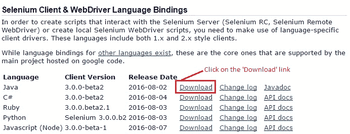
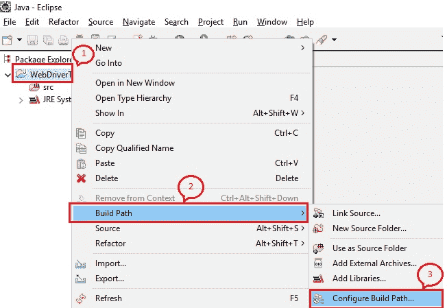
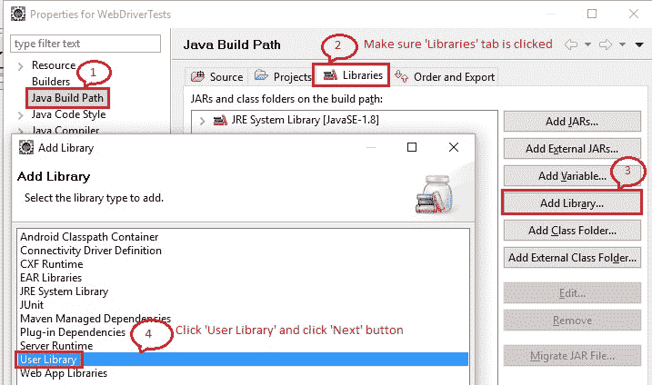
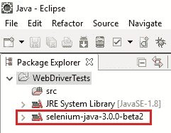
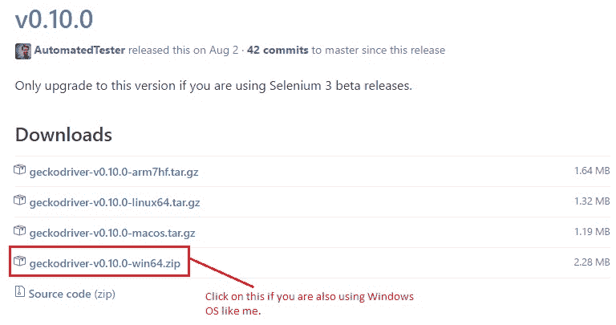

# 9B WebDriver – 在 Eclipse 中设置

> 原文： [https://javabeginnerstutorial.com/selenium/9b-webdriver-eclipse-setup/](https://javabeginnerstutorial.com/selenium/9b-webdriver-eclipse-setup/)

欢迎来到我们的第一篇关于 WebDriver 系列的*探索*帖子。 建议您密切注意并共同努力，以使设置过程更加简单！

## 先决条件：

1.  拥有有效的互联网连接。
2.  在系统上下载并安装 Java SE Development Kit（JDK）。 （<http://www.oracle.com/technetwork/java/javase/downloads/index.html>）
3.  下载 Eclipse IDE。 不需要安装。 只需将所有内容提取到一个文件夹中，然后双击可执行文件即可。 （<http://www.eclipse.org/downloads/>）

是时候按照 3 个步骤来设置环境了，

### 步骤 1：

转到 [http://www.seleniumhq.org/download/](http://www.seleniumhq.org/download/) 。 在“Selenium Client & WebDriver 语言绑定”部分下，单击“Java”语言的下载链接。 （请注意，您看到的版本号可能与此处快照中的版本号不同，因为创建此文章时，最新的版本是 3.0.0-beta2。）



### 步骤 2：

将下载的文件解压缩到系统上所需的位置。 切换到 Eclipse 并选择所需的工作空间目录。

创建一个新的 Java 项目，如下所示：“文件 -> 新建 -> Java 项目”。 我已将项目命名为“WebDriver 测试”。

### 步骤 3：

右键单击创建的项目。 选择“构建路径”->“配置构建路径...”



现在有**两种方式**可以将外部 JAR 添加到我们的项目中。

## 方法 1：

确保已选择“库”标签。 单击“添加外部 JAR ...”按钮。 “JAR 选择”窗口将打开。 浏览至 seleniumhq.org 站点（Selenium 客户端和 WebDriver 语言绑定）中的文件的下载和提取位置。

确保选择所有类型为“可执行 Jar 文件”的文件。 目前，我在“`selenium-java-3.0.0-beta2`”文件夹中有一个文件，在`selenium-java-3.0.0-beta2\lib`文件夹中有 16 个文件。

点击“打开”，将它们添加到“库”标签中。


## 方法 2：

当您出于各种目的添加大量外部 JAR 文件（例如 WebDriver，JUnit，Ant 等）时，这确实非常方便。如果遵循方法 1，则区分为每种目的添加的 JAR 可能会变得非常困难。 在方法 2 中，我们将相应地创建一个单独的文件夹和名称，以便于识别和记录文档。

确保选择了“库”标签。 单击，添加库…->用户库->接下来。



现在，单击“用户库...”，将打开一个新窗口。 单击，新建...->指定文件夹的名称->确定。


单击“添加外部 JAR ...”按钮。 “JAR 选择”窗口将打开。 浏览至 seleniumhq.org 站点（Selenium 客户端和 WebDriver 语言绑定）中的文件的下载和提取位置。

确保选择所有类型为“可执行 Jar 文件”的文件。 目前，我在“`selenium-java-3.0.0-beta2`”文件夹中有一个文件，在`selenium-java-3.0.0-beta2\lib`文件夹中有 16 个文件。

点击“打开”，将它们添加到“用户库”窗口下创建的文件夹中。 点击“确定”，现在您将在“添加库”窗口中看到带有复选框的用户库。 确保选中此复选框，然后单击“完成”。 创建的用户库将在项目属性窗口的“库”选项卡中提供所有添加的外部 JAR。


单击“确定”按钮后，新添加的 JAR 将在“包资源管理器”窗格中的项目下显示。



**注意**：*（这只是告诉您做一个注释）*

*此设置可与 Selenium 2 版本完美配合（我已经使用了很长时间了，一切都很好）。 但是，如果您使用的是 Selenium 3 beta 版本（如上面的屏幕快照所示），则需要执行一些其他步骤。*

*   *从“<https://github.com/mozilla/geckodriver/releases>”下载“`geckodriver.exe`”。*



*   *编写测试脚本时，请确保包括以下行（还要确保系统中的 Firefox 浏览器版本为 48+）*

```java
System.setProperty("webdriver.gecko.driver", "<path_to_geckodriver.exe>");
```

你猜怎么了？！ 您已经准备就绪，很快我们将通过启动 Firefox 浏览器来创建和运行我们的第一个测试脚本。

在另一篇文章中再见。 祝你今天愉快！

