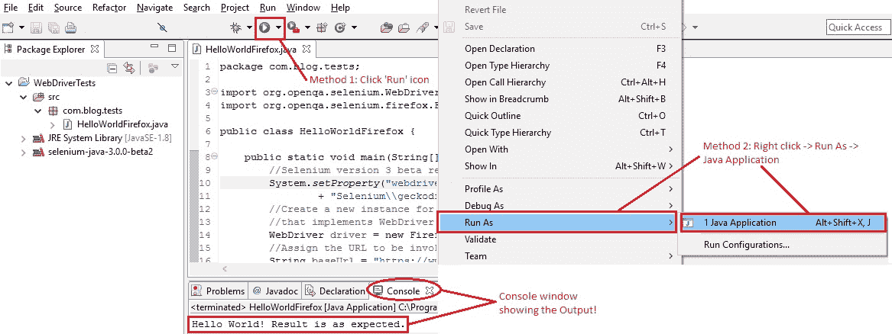

# 9d。 WebDriver –执行测试

> 原文： [https://javabeginnerstutorial.com/selenium/9d-webdriver-executing-test/](https://javabeginnerstutorial.com/selenium/9d-webdriver-executing-test/)

如果您无法执行并查看输出，那么逐行代码遍历有什么好处？ 因此，不必再大惊小怪了，让我们运行代码！！

Eclipse使我们能够通过3种方式来完成相同的任务，

*   **方法1：**单击Eclipse中的“运行”快捷方式图标。
*   **方法2：**右键单击类文件，运行方式-> Java应用程序。
*   **方法3：**使用组合键CTRL + F11。

### *散布一些视觉效果：*

执行我们的测试将打开一个新的Firefox浏览器窗口，并按照代码执行测试步骤。 如上面的屏幕快照所示，输出显示在控制台中。

WebDriver系列的第一个 ***BrainBell*** 的时间：*回忆！* 您知道吗，在记住事物的过程中，我们甚至还添加了新的想法？ 回忆是对大脑中散布的元素的动态重建-称之为创造性的重新想象。 您记得的越多，就越记得！

因此，回想一下我们是如何为刚刚执行的拳头场景编写代码的，而您都可以尝试自己的一些简单场景。 如果您在旅途中遇到任何颠簸，请在评论部分给我大喊。

在另一个帖子中再见！ 祝你今天愉快！

###### 下一篇文章

##### [9e。 WebDriver –用于启动其他浏览器的代码示例](https://javabeginnerstutorial.com/selenium/9e-webdriver-code-launching-browsers/ "9e. WebDriver – Code samples for launching other browsers")