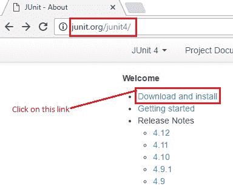
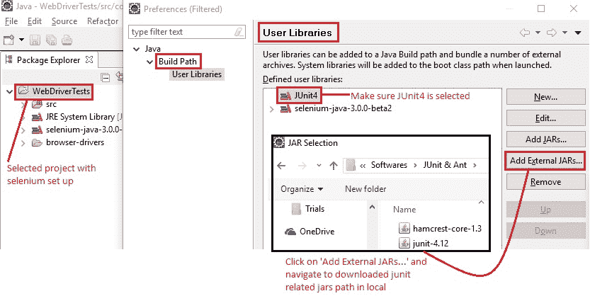
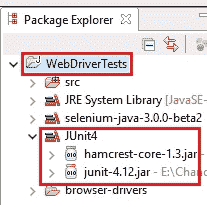

# 9F WebDriver – JUnit 环境设置

> 原文： [https://javabeginnerstutorial.com/selenium/9f-webdriver-junit-environment-setup/](https://javabeginnerstutorial.com/selenium/9f-webdriver-junit-environment-setup/)

大家好！ 带出隐藏在您体内的测试忍者，因为今天我们将为 JUnit 框架设置环境。

### 跳入：

#### 步骤 1：

转到 [http://junit.org/junit4/](http://junit.org/junit4/) ，然后点击“下载并安装”链接。

#### 步骤 2：

以下几点将使该过程更加容易理解，

1.  您将被重定向到 GitHub。 在“普通的 JAR”下，可以使用 junit 和 hamcrest-core JAR。
2.  点击“`junit.jar`”会将您重定向到包含下载链接的页面。 点击最新版本的“jar”链接（撰写本文时为 v4.12）。 它将自动下载到您的系统。
3.  接下来，点击“`hamcrest-core.jar`”。 与上述类似，单击最新的“jar”下载链接（截至本帖子发布之日起为 v1.3）。
4.  这样，两个必需的 jar 都立即下载到您的系统中。

下图是突出显示步骤的图像，

#### 步骤 3：

下一个工作是在 Eclipse IDE 中将这两个 jar 添加到我们的项目中。 该过程与我们在[“9b 设置 WebDriver（在 Eclipse 中）”](https://javabeginnerstutorial.com/selenium/9b-webdriver-eclipse-setup/)中遵循的过程非常相似。请参考该指南以获取分步说明以及屏幕截图。

1.  打开 Eclipse IDE 并导航到相应的工作区。
2.  右键单击“设置 Selenium 的项目 -> 构建路径 -> 配置构建路径…”
3.  确保选择了“库”选项卡。 点击“添加库...”
4.  选择“用户库”，接下来单击“用户库...”
5.  单击“新建...”，并为库“JUnit4”命名，然后单击“确定”。
6.  在“用户库”弹出窗口中，确保选择了新创建的 Junit4 库。 点击“添加外部 JAR ...”
7.  导航到本地系统中下载的与 junit 相关的 jar 的保存路径。 选择 junit 和 hamcrest-core JAR，然后单击“打开”

相应地单击 OK 和“完成”按钮，新创建的 JUnit4 库将添加到项目构建路径，如下所示，

    

这样，JUnit 4 的环境就设置好了！ 在我们的下一篇文章中，让我们在 JUnit 框架中编写 WebDriver 测试并执行它们以查看结果。

在另一个帖子中再见！ 祝你今天愉快！

