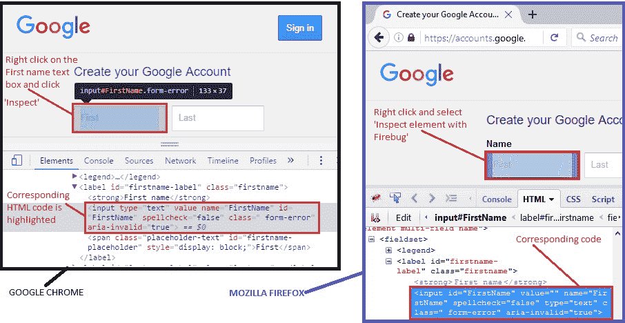
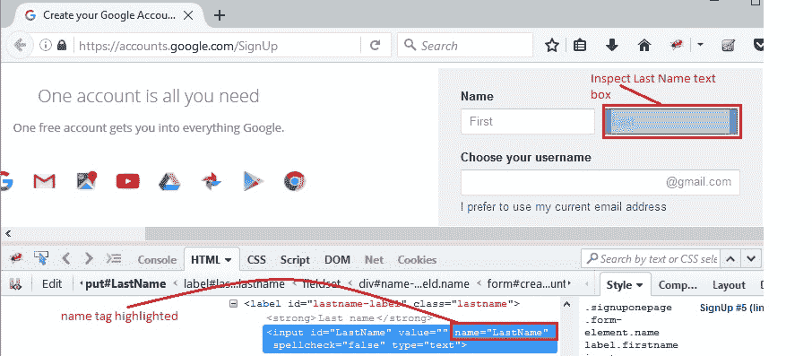
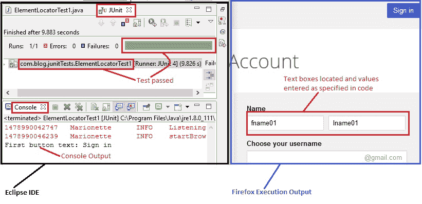

# 9J WebDriver – 定位元素：第 1 部分（按 ID，名称，标签名称）

> 原文： [https://javabeginnerstutorial.com/selenium/9j-webdriver-locating-elements-1/](https://javabeginnerstutorial.com/selenium/9j-webdriver-locating-elements-1/)

朋友！ 如果您进入了 Selenium 世界，那么您一定已经遇到了 Web 元素！ 文本框，按钮，链接，复选框，单选按钮，下拉菜单，警报等，所有内容均视为网络元素。 使用定位器类型和策略，我们可以轻松识别页面上任何所需的元素。 这是与页面进行交互并在代码中进一步引用这些元素的最关键步骤。 是的，它与我们在 Selenium IDE 中看到的[非常相似](https://javabeginnerstutorial.com/selenium/7k-ide-locating-elements/)，除了语法和概念的应用方式。

使用 Selenium webDriver 定位 Web 元素的一般语法是：

```java
driver.findElement(By.LocatorStrategyType ("Locator_Value"));
```

**说明**：

*   `driver` – 实现 WebDriver 接口的相应驱动程序类的实例变量
*   `findElement()` – 查找并返回具有指定位置策略的第一个 Web 元素
*   `findElements()` – 查找并返回与给定位置策略匹配的 Web 元素列表
*   `By` – 始终使用按类别定位目标
*   `LocatorStrategyType` – ID，名称，标记名，类名，`cssSelector`，`linkText`，`partialLinkText`，xpath 是可用于在页面上定位元素的某些定位器类型
*   `Locator_Value` – 可以标识元素的值/ HTML 标记

#### 可用的定位器类型包括：

*   ID
*   名称
*   标签名
*   类名称
*   链接文本
*   `partialLinkText`
*   `cssSelector`
*   XPath

可以随时通过编程方式掌握页面上所需的元素，但要实现此目的，我们的创作方可能不得不偷看一下。 原因是，我们并不总是可以控制页面上的 HTML。 这就是为什么我们有这么多的定位器类型，而且绝对没有理由惊慌！

让我们继续，并通过代码示例详细了解每种定位器类型。

## 通过 ID 定位

ID 是在页面上定位元素的最有用和首选的方式，因为它是唯一的。 但是，当心！ 一些开发人员或者自动生成这些 ID，或者完全忘记添加一个。 那就是我们去寻找其他定位器类型的时候。

**语法**：`driver.findElement(By.id("element_id"));`

**说明**：找到具有匹配 ID 属性的第一个元素。

**示例**：打开 Goog​​le 帐户创建页面。 让我们通过 ID 识别名字文本框。

*   Google Chrome – 右键单击要确定其 ID 的网络元素，然后选择“检查”。 或通过单击`F12`打开开发人员工具，单击左上角的检查元素图标，然后在页面上单击所需的 Web 元素。 两种方法都将突出显示与所选元素相对应的 HTML 代码。
*   Mozilla Firefox – 右键单击 Web 元素，然后选择“使用 Firebug 检查元素”（以防您错过了 [Firebug 安装和使用](https://javabeginnerstutorial.com/selenium/7n-ide-using-firebug/) 上的帖子）。 或者，如果您确实不想使用 Firebug，则右键单击该元素并选择“检查元素”。 在两种情况下，都将打开并突出显示相应的 HTML 代码。

    

如上面的屏幕截图所示，“名字”文本框的 ID 为“名字”。 因此，此处使用的代码是

```java
driver.findElement(By.id("FirstName"));
```

## 按名称定位

`name`属性也可用于在页面上定位元素。

**语法**：`driver.findElement(By.name("element_name"));`

**说明**：找到具有匹配名称属性的第一个元素。

**示例**：让我们按名称标识姓氏文本框。

右键单击姓氏文本框，然后单击检查元素以获取相应的 HTML 代码。 在我们的案例中，`name`属性的值为`LastName`。 因此，按名称定位此网络元素的代码将是，

```java
driver.findElement(By.name("LastName"));
```



## 通过标签名定位

在这里，我们使用标记的实际名称，例如`<a>`作为锚，`<form>`作为表。 当我们想要获得具有给定标签名称的所有元素时，这很有用。 如果被测页面只有一个标签，则`findElement`将起作用。 但否则，建议对结果建立索引以找到我们希望使用的特定元素。

**语法**：`driver.findElements(By.tagName("element_html_tag"));`

**说明**：找到具有匹配标签名称的所有元素。

**示例**：让我们找到 Gmail 帐户创建页面右上角的“登录”按钮。

右键单击按钮，然后单击检查元素以获取相应的 HTML 代码。 我们可以看到它具有锚标记。 让我们继续并在列表中获取所有具有`tagName="a"`的网络元素，然后通过其索引找到第一个元素，以便与“登录”按钮进行交互。

```java
// List of all elements with anchor tag
List<WebElement> buttons = driver.findElements(By.tagName("a"));
// Locate 'Sign in' button by indexing the list
WebElement signInButton = buttons.get(0);
```

## 概览

为了避免在尝试使用这些定位器时可能遇到的意外意外，让我们看一个实现上述定位器类型的测试用例。

#### 场景

1.  打开 Firefox 浏览器。
2.  导航到 Google 帐户创建页面
3.  通过 ID 找到名字文本框
4.  输入“`fname01`”作为名字
5.  按名称找到姓氏文本框
6.  输入“`lname01`”作为姓氏
7.  使用`tagName`找到“登录”按钮
8.  将按钮文字打印到控制台进行验证

此方案的 JUnit 代码是，

```java
import java.util.List;
import java.util.concurrent.TimeUnit;

import org.junit.After;
import org.junit.Before;
import org.junit.Test;
import org.openqa.selenium.By;
import org.openqa.selenium.WebDriver;
import org.openqa.selenium.WebElement;
import org.openqa.selenium.firefox.FirefoxDriver;

public class ElementLocatorTest1 {
	//Declaring variables
	private WebDriver driver; 
	private String baseUrl;

	@Before
	public void setUp() throws Exception{
		// Selenium version 3 beta releases require system property set up
		System.setProperty("webdriver.gecko.driver", "E:\\Softwares\\"
				+ "Selenium\\geckodriver-v0.10.0-win64\\geckodriver.exe");
		// Create a new instance for the class FirefoxDriver
		// that implements WebDriver interface
		driver = new FirefoxDriver();
		// Implicit wait for 5 seconds
		driver.manage().timeouts().implicitlyWait(5, TimeUnit.SECONDS);
		// Assign the URL to be invoked to a String variable
		baseUrl = "https://accounts.google.com/SignUp";
	}

	@Test
	public void testPageTitle() throws Exception{
		// Open baseUrl in Firefox browser window
		driver.get(baseUrl);
		// Locate First Name text box by id and
		// assign it to a variable of type WebElement
		WebElement firstName = driver.findElement(By.id("FirstName"));
		// Clear the default placeholder or any value present
		firstName.clear();
		// Enter/type the value to the text box
		firstName.sendKeys("fname01");
		// Locate last name text box by name
		WebElement lastName = driver.findElement(By.name("LastName"));
		// Clear and enter a value
		lastName.clear();
		lastName.sendKeys("lname01");
		// List of all elements with anchor tag
		List<WebElement> buttons = driver.findElements(By.tagName("a"));
		// Locate 'Sign in' button by indexing the list
		WebElement signInButton = buttons.get(0);

		// Verifying if the button is located
System.out.println("First button text: " + signInButton.getText());
	}

	 @After
	  public void tearDown() throws Exception{
		// Close the Firefox browser
		driver.close();
	}
}
```

#### 解释

将导入两个新的包，

**导入**`org.openqa.selenium.WebElement` – 实例化一个新的 Web 元素。

**导入**`org.openqa.selenium.By` – 该包引用了被称为定位器类型的`By`类。

注释清楚地提供给每一行代码，因此很容易解释。



执行测试用例后，成功显示为绿色，并且输出显示在控制台上，确认“登录”按钮与`tagName`一起位于。 图像的右半部分显示了在 Firefox 浏览器中执行的自动输出。 名字和姓氏文本框将填充代码中给出的值。

让我们在这里休息一下。 在下面的文章中，我们将通过示例看到另外三种查找元素的方法。 蒙克就这些想法直到那时！

祝你今天愉快！

