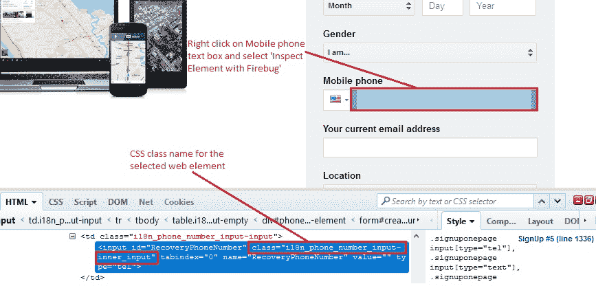
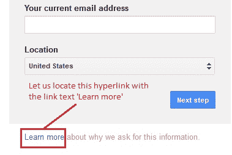
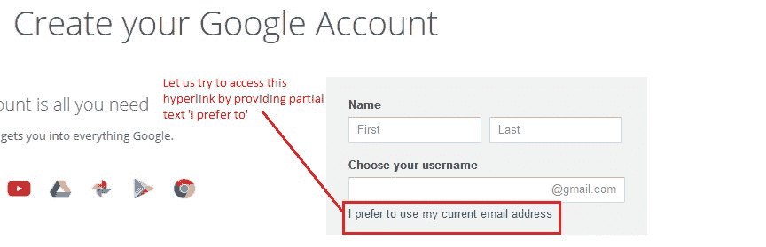
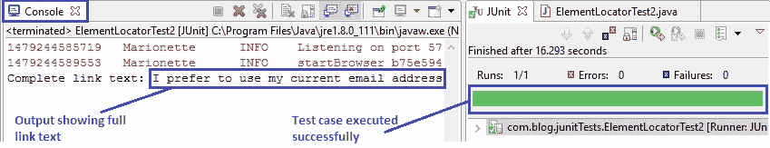
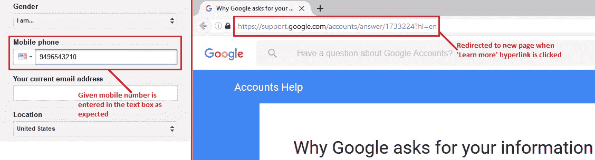

# 9K WebDriver – 定位元素：第 2 部分（按`className`，`linkText`，`partialLinkText`）

> 原文： [https://javabeginnerstutorial.com/selenium/9k-webdriver-locating-elements-2/](https://javabeginnerstutorial.com/selenium/9k-webdriver-locating-elements-2/)

朋友！ 让我们今天更深入地研究一下定位元素的更多策略。 在这篇文章中，我们将重点放在

*   `className`
*   `LinkText`
*   `partialLinkText`

### 按类名称定位

类名称不过是用于设置 Web 元素样式的 CSS 类名称。 重要的是要注意页面上的许多 Web 元素可能具有相同的`className`。 在这种情况下，可以使用`findElements`方法，并且可以为结果建立索引。 请参考通过`tagName`策略定位（解释以及[先前文章](https://javabeginnerstutorial.com/selenium/9j-webdriver-locating-elements-1/)中提供的示例）。 如果我们有一个具有唯一`className`的元素，或者被测元素是该页面中使用该`className`的第一个元素，则`findElement`将执行此任务。

**语法**：`driver.findElement(By.className("element_class_name"))`*

**说明**：找到具有匹配 CSS 类名称的第一个元素。

**示例**：让我们找到 gmail 帐户创建页面的“手机”文本框。

右键单击文本框，然后选择检查元素以获取相应的 HTML 代码。 我们可以看到“`input`”标签包含`class ="i18n_phone_number_input-inner_input"`。 让我们继续使用此类名称查找“手机”文本框，以进行进一步的交互。

*代码：*

```java
driver.findElement(By.className("i18n_phone_number_input-inner_input"));
```



### 通过`linkText`定位

当您想与超链接进行交互时，`linkText`非常有用。 使用该链接在网页上显示的实际文本。 那有多容易？

**语法**：`driver.findElement(By.linkText("hyperlink_text");`

**说明**：找到具有匹配链接文本的第一个超链接。

**示例**：让我们找到在 gmail 帐户创建页面底部提供的超链接“了解更多信息”。

*代码：*

```java
driver.findElement(By.linkText("Learn more"));
```



### 通过`partialLinkText`定位

`PartialLinkText`也用于与超链接进行交互，与`linkText`定位策略非常相似。 此方法不提供部分完整链接，而是提供链接显示的完整文本。 因此，可以将链接文本的一部分作为匹配条件。

**语法**：`driver.findElement(By.partialLinkText("hyperlink_partial_text");`

**说明**：找到第一个超链接，其中**包含**指定的部分链接文本。

**示例**：让我们在 Gmail 帐户创建页面的“选择用户名”文本框下方找到超链接“我更喜欢使用我当前的电子邮件地址” - 文本：**我更喜欢**。

*代码：*

```java
driver.findElement(By.partialLinkText("I prefer to"));
```



## 概览

让我们看一个实现上述三种定位器类型的测试用例。

#### 场景

1.  打开 Firefox 浏览器。
2.  导航到 Google 帐户创建页面
3.  通过`className`找到手机文本框
4.  输入“`9496543210`”作为手机号码
5.  通过`linkText`找到“了解详情”超链接
6.  链接超链接
7.  找到“我更喜欢使用当前的电子邮件地址”超链接和`partialLinkText`
8.  将完整的链接文本打印到控制台进行验证

此方案的 JUnit 代码是，

```java
import java.util.concurrent.TimeUnit;
import org.junit.After;
import org.junit.Before;
import org.junit.Test;
import org.openqa.selenium.By;
import org.openqa.selenium.WebDriver;
import org.openqa.selenium.WebElement;
import org.openqa.selenium.firefox.FirefoxDriver;

public class ElementLocatorTest2 {
		//Declaring variables
		private WebDriver driver; 
		private String baseUrl;

		@Before
		public void setUp() throws Exception{
			// Selenium version 3 beta releases require system property set up
			System.setProperty("webdriver.gecko.driver", "E:\\Softwares\\"
					+ "Selenium\\geckodriver-v0.10.0-win64\\geckodriver.exe");
			// Create a new instance for the class FirefoxDriver
			// that implements WebDriver interface
			driver = new FirefoxDriver();
			// Implicit wait for 5 seconds
			driver.manage().timeouts().implicitlyWait(5, TimeUnit.SECONDS);
			// Assign the URL to be invoked to a String variable
			baseUrl = "https://accounts.google.com/SignUp";
		}

		@Test
		public void testPageTitle() throws Exception{
			// Open baseUrl in Firefox browser window
			driver.get(baseUrl);
			// Locate Mobile phone text box by className and
			// assign it to a variable of type WebElement
			WebElement mobileNum = driver.findElement(By.className("i18n_phone_number_input-inner_input"));
			// Clear the default placeholder or any value present
			mobileNum.clear();
			// Enter/type the value to the text box
			mobileNum.sendKeys("9496543210");
			// Locate 'Learn more' hyperlink by link text
			WebElement link1 = driver.findElement(By.linkText("Learn more"));
			// Click on 'Learn more'
			link1.click();
			// Locate hyperlink by partial link text
			WebElement link2 = driver.findElement(By.partialLinkText("I prefer to"));
			// Printing the complete link text to console
			System.out.println("Complete link text: " + link2.getText());
		}

		 @After
		  public void tearDown() throws Exception{
			// Close the Firefox browser
			driver.close();
		}
}
```

*执行结果*

注释清楚地提供给每一行代码，因此很容易解释。



在 JUnit 窗格中，绿色条显示测试用例已成功执行。 输出将打印到控制台，以确认仅提供子文本“我更喜欢”作为 partialLinkText，即可访问“我更喜欢使用当前的电子邮件地址”超链接。



该图像的左半部分显示输入的电话号码，右半部分显示在 Firefox 浏览器中执行的最终输出。 点击“了解详情”链接后，我们将重定向到相应的页面。

是时候再休息一次了。 在接下来的文章中，准备好消化更多的信息，因为我们将研究两种有效的元素定位技术。

享受这一天！

