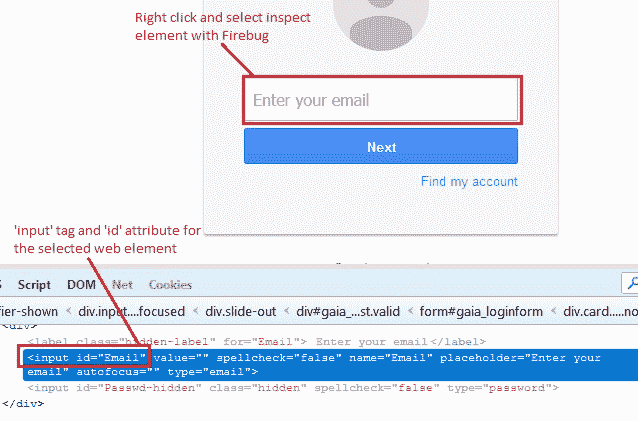

# 9L WebDriver – 定位元素：第 3a 部分（按`cssSelector`定位）

> 原文： [https://javabeginnerstutorial.com/selenium/9l-webdriver-locating-elements-3a/](https://javabeginnerstutorial.com/selenium/9l-webdriver-locating-elements-3a/)

嗨呀测试人员！ 让我们直接进入`cssSelector`定位策略。

如果我们没有选择使用 ID，类或名称来查找元素的方法，该怎么办？ 袖子上有东西吗？ 好吧，我有一个`cssSelector`。 这是一种先进而有效的策略。

##### 热身

*   **CSS** （级联样式表）。 根据维基百科的说法，“CSS 是一种样式表语言，用于描述以标记语言编写的文档的表示形式”。 它通过添加样式来更改 HTML 元素的外观，并定义应如何在网页上显示它们。
*   **选择器**是使用 HTML 标记，属性及其值构造的模式。 然后将它们用于匹配所需的 Web 元素。

##### 使用`cssSelector`定位器优于 XPath 定位器的优点

*   速度更快，尤其是在 Internet Explorer 中
*   更简单
*   更具可读性
*   首选使用方式

## 通过`cssSelector`定位

有多种使用`cssSelector`定位器的方式，这取决于可用的标签，属性，关键字等。要列出它们，

1.  使用标签和 ID 属性
2.  使用标签和类属性
3.  使用标签和名称属性
4.  使用标签和多个属性
5.  定位子元素
6.  按子字符串匹配

在这篇文章中，我们将介绍前四种方法。 是时候一步一步地完成这些工作了。

## 1.使用标签和 ID 属性

借助`cssSelector`定位策略，可以使用元素的 HTML 标记及其 ID 属性及其值来对其进行访问。

有两种方法可以实现此目的：

**语法**：`driver.findElement(By.cssSelector("tag_name#value_of_id"));`

或

`driver.findElement(By.cssSelector("tag_name[id='value_of_id']"));;`

**说明**：使用匹配的 CSS 选择器定位元素。 在第一种方法中，`#`符号代表“`id`”属性。

**示例**：让我们在 Gmail 帐户登录页面上找到“电子邮件”文本框。

右键单击“输入电子邮件”文本框，然后选择检查元素以获取相应的 HTML 代码。 我们可以看到“`input`”标签的“`id`”属性为“`email`”。

*代码：*

```java
driver.findElement(By.cssSelector("input#Email"));
```

（或者）

```java
driver.findElement(By.cssSelector("input[id='Email']"));
```



## 2.使用标签和类属性

元素的 HTML 标签及其类属性及其值可用于访问它。 也有两种方法可以实现此目的，

**语法**：`driver.findElement(By.cssSelector("tag_name.value_of_class"));`

或

`driver.findElement(By.cssSelector("tag_name[class='value_of_class']”));`

**说明**：使用匹配的 CSS 选择器定位元素。 在第一种方法中，“`.`”符号代表“`class`”属性。

**示例**：让我们在使用类属性的 Gmail 帐户“注册”页面上找到“手机”文本框。

右键点击“手机”文本框，然后选择检查元素，以获取相应的 HTML 代码，如下所示，

```java
<input   tabindex="0" name="RecoveryPhoneNumber" 
id="RecoveryPhoneNumber" value="" 
class="i18n_phone_number_input-inner_input" type="tel">
```

我们可以看到“`input`”标签具有“`class`”属性，名称为“`i18n_phone_number_input-inner_input`”。

*代码：*

```java
driver.findElement(By.cssSelector("input.i18n_phone_number_input-inner_input "));
```

(or)

```java
driver.findElement(By.cssSelector("input[class='i18n_phone_number_input-inner_input']"));
```

## 3.使用标签和名称属性

元素的 HTML 标记及其名称属性及其值可用于访问它。

**语法**：`driver.findElement(By.cssSelector("tag_name[name='value_of_name']"))`

**说明**：使用匹配的 CSS 选择器定位元素。

**示例**：让我们在 Gmail 帐户注册页面上找到名字文本框。

右键点击“名字”文本框，然后选择检查元素，以获取相应的 HTML 代码，如下所示，

```java
<input value="" name="FirstName" 
id="FirstName" spellcheck="false" class="   
form-error" aria-invalid="true" type="text">
```

我们可以看到，“`input`”标签的“`name`”属性为“`FirstName`”。

*代码：*

```java
driver.findElement(By.cssSelector("input[name='FirstName']"));
```

## 4.使用标签和多个属性

元素的 HTML 标签和一个以上的属性及其值可用于访问它。

**语法**：`driver.findElement(By.cssSelector("tag_name[attribute1='value_of_attribute1'][attribute2='value_of_attribute2']"))`

**说明**：使用匹配的 CSS 选择器定位元素。 以这种方式可以提到许多属性。

**示例**：让我们使用 ID，类型和名称属性在 Gmail 帐户注册页面上找到“创建密码”文本框。

右键点击“创建密码”文本框，然后选择检查元素以获取相应的 HTML 代码，如下所示，

```java
<input name="Passwd" id="Passwd" type="password">
```

我们可以看到，“`input`”标签具有“`name`”和“`id`”属性，它们的值均为“`Passwd`”，“`type`”属性为`password`。

*代码：*

```java
driver.findElement(By.cssSelector("input#Passwd[name='Passwd']"));
```

(or)

```java
driver.findElement(By.cssSelector("input[type='Password'][name='Passwd'"));
```

如果使用 id，则可以用“`#`”符号表示，而可以用“`.`”符号表示类。

*感觉都糟透了吗？ 需要一些时间练习吗？*

我知道，您急需先休息一下。 你的愿望就是我的命令！ 现在，时间全在您了。

我们的下一篇文章很快见。 祝你有美好的一天！

