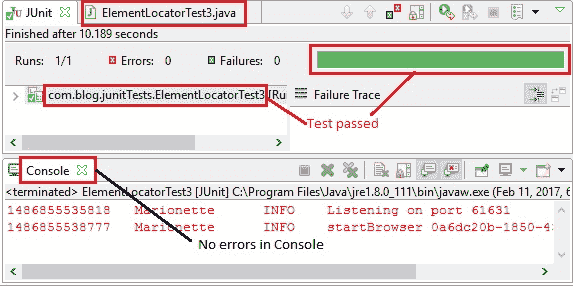
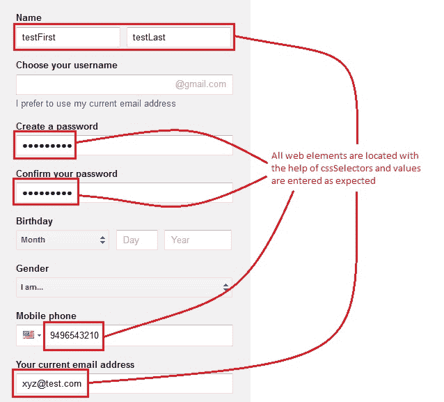

# 9M WebDriver – 定位元素：第 3b 部分（`cssSelector`续）

> 原文： [https://javabeginnerstutorial.com/selenium/9m-webdriver-locating-elements-3b/](https://javabeginnerstutorial.com/selenium/9m-webdriver-locating-elements-3b/)

嗨，忍者！ 这篇文章是我们先前文章“[*9l WebDriver – 定位元素：第 3a 部分（由`cssSelector`提供）*](https://javabeginnerstutorial.com/selenium/9l-webdriver-locating-elements-3a/)”的延续。 。 在继续进行操作之前，请确保对它进行了仔细的研究。

使用`cssSelector`定位器的最后两种方法尚待讨论：

1.  定位子元素
2.  按子字符串匹配

事不宜迟，让我们开始行动吧！

## 定位子元素

也可以使用`cssSelectors`来定位子元素。

让我们考虑一下 HTML 代码，

锚标记是“`div`”的子元素。 要访问子元素，

*使用 ID：*

```java
driver.findElement(By.cssSelector("div#child a"));
```

`#`代表“ID”，子元素标签写在空格后面。

*使用类别：*

```java
driver.findElement(By.cssSelector("div.bg_main a"));
```

`.`代表“类”

**示例**：让我们在 Gmail 帐户注册页面上找到名字文本框。

右键点击“名字”文本框，然后选择检查元素，以获取相应的 HTML 代码，如下所示，

```java
<label id="recovery-email-label">
	<strong>Your current email address</strong>
	<input name="RecoveryEmailAddress" id="RecoveryEmailAddress" value="" 	
               spellcheck="false" type="text">
</label>
```

“标签”标签的子元素可以通过其`input`标签和`name`属性进行访问。

*代码：*

```java
driver.findElement(By.cssSelector("label#recovery-email-label input[name='RecoveryEmailAddress']"));
```

如果父元素具有**多个子元素**（例如下拉列表），并且它们没有“`id`”或“`class`”或此类属性来标识，则“`nth-of-type`”用于定位特定的子元素。

考虑一下 HTML 代码，

```java

   <li>Cat</li>
   <li>Dog</li>
   <li>Birds</li>

```

要标识子元素“狗”，

*代码：*

```java
driver.findElement(By.cssSelector("ul#pets li:nth-of-type(2)"));
```

## 按子字符串匹配

`cssSelectors`也帮助我们使用子字符串来定位元素。

### 匹配前缀（或）开头

为了匹配具有已知前缀的元素，

**语法**：`driver.findElement(By.cssSelector(")tag_name[attribute^='prefix_value_of_attribute']"))`

**解释**：找到以给定前缀开头的元素。 用“`^`”符号表示。

考虑以下代码，

```java
<input value="" name="LastName" id="LastName" spellcheck="false" type="text">
```

我们可以看到`input`标签具有一个名为“`LastName`”的“`id`”属性。 要找到此元素，我们可以指定查找以“`Last`”开头的“`id`”属性值。

*代码：*

```java
driver.findElement(By.cssSelector("input[id^='Last']"));
```

### 匹配后缀（或）结尾

为了匹配具有已知后缀的元素，

**语法**：`driver.findElement(By.cssSelector("tag_name[attribute$='suffix_value_of_attribute']"))`

**说明**：找到以给定后缀结尾的元素。 用“`$`”符号表示。

Considering the below code,

```java
<input name="PasswdAgain" id="PasswdAgain" type="password">
```

我们可以看到“`input`”标签的“`name`”属性为“`PasswdAgain`”。 要找到此元素，我们可以指定查找以“`Again`”结尾的“`name`”属性值。

*代码：*

```java
driver.findElement(By.cssSelector("input[name$='Again']"));
```

### 匹配一个子字符串

为了使元素与子字符串匹配，

**语法**：`driver.findElement(By.cssSelector("tag_name[attribute*='substring_of_attribute_value']"))`

**说明**：找到包含给定子字符串的元素。 用“`*`”符号表示。

Considering the below code,

```java
<input name="PasswdAgain" id="PasswdAgain" type="password">
```

我们可以看到“`input`”标签的“`name`”属性为“`PasswdAgain`”。 要找到此元素，我们可以指定查找包含“`wdAg`”的“`name`”属性值。

*代码：*

```java
driver.findElement(By.cssSelector("input[name*='wdAg']"));
```

## 概览

让我们看一个测试用例，它实现了使用本方法和上一篇文章中介绍的`cssSelector`定位器的不同方法，

**场景**

1.  打开 Firefox 浏览器。
2.  导航到 Google 帐户创建页面
3.  找到带有 HTML 标签和名称属性的“名字”文本框
4.  输入“`testFirst`”作为名字
5.  在“姓氏”文本框中找到一个以子字符串开头的值
6.  输入“`testLast`”作为姓氏
7.  找到带有 HTML 标签，类型和名称属性的“创建密码”文本框
8.  输入“`Pass1234!`”作为密码
9.  在“确认您的密码”文本框中找到包含子字符串的值
10.  输入“`Pass1234!`”作为确认密码
11.  找到带有 HTML 标签和类别属性的“手机”文本框
12.  输入“`9496543210`”作为电话号码
13.  使用子元素方法找到“当前电子邮件地址”文本框
14.  输入“`...`”
15.  验证“JUnit”窗格是否成功，并确认 Eclipse IDE 控制台输出屏幕

此方案的 JUnit 代码是，

```java
package com.blog.junitTests;

import java.util.concurrent.TimeUnit;

import org.junit.After;
import org.junit.Before;
import org.junit.Test;
import org.openqa.selenium.By;
import org.openqa.selenium.WebDriver;
import org.openqa.selenium.WebElement;
import org.openqa.selenium.firefox.FirefoxDriver;

public class ElementLocatorTest3 {
        //Declaring variables
        private WebDriver driver; 
        private String baseUrl;

        @Before
        public void setUp() throws Exception{
            // Selenium version 3 beta releases require system property set up
            System.setProperty("webdriver.gecko.driver", "E:\\Softwares\\"
                    + "Selenium\\geckodriver-v0.10.0-win64\\geckodriver.exe");
            // Create a new instance for the class FirefoxDriver
            // that implements WebDriver interface
            driver = new FirefoxDriver();
            // Implicit wait for 5 seconds
            driver.manage().timeouts().implicitlyWait(5, TimeUnit.SECONDS);
            // Assign the URL to be invoked to a String variable
            baseUrl = "https://accounts.google.com/SignUp";
        }

        @Test
        public void testPageTitle() throws Exception{
            // Open baseUrl in Firefox browser window
            driver.get(baseUrl);
            // Locate 'First Name' text box by cssSelector: tag and name attribute
            // assign it to a variable of type WebElement
            WebElement firstName = driver.findElement(By.cssSelector("input[name='FirstName']"));
            // Clear the default placeholder or any value present
            firstName.clear();
            // Enter/type the value to the text box
            firstName.sendKeys("testFirst");
            //Locate 'Last Name' text box by cssSelector: begins with sub-string
            WebElement lastName = driver.findElement(By.cssSelector("input[id^='Last']"));
            lastName.clear();
            lastName.sendKeys("testLast");
            //Locate password text box by cssSelector: tag and type, name attributes
            WebElement pwd = driver.findElement(By.cssSelector("input[type='Password'][name='Passwd']"));
            pwd.clear();
            pwd.sendKeys("Pass1234!");
            //Locate 'Confirm your password' text box by cssSelector: contains sub-string
            WebElement confirmPwd = driver.findElement(By.cssSelector("input[name*='wdAg']"));
            confirmPwd.clear();
            confirmPwd.sendKeys("Pass1234!");
            // Locate Mobile phone text box by cssSelector: tag and class
            WebElement mobileNum = driver.findElement(By.cssSelector("input.i18n_phone_number_input-inner_input")); 
            mobileNum.clear();
            mobileNum.sendKeys("9496543210");
            //Locate "current email address" text box by cssSelector: child element method
            WebElement recoveryEmail = driver.findElement(By.cssSelector("label#recovery-email-label input[name='RecoveryEmailAddress']"));
            recoveryEmail.clear();
            recoveryEmail.sendKeys("[[email protected]](/cdn-cgi/l/email-protection)");
        }

         @After
          public void tearDown() throws Exception{
            // Close the Firefox browser
            driver.close();
        }
}
```

*执行结果*

注释清楚地提供给每行代码，因此是不言自明的。



在 JUnit 窗格中，绿色条显示测试用例已成功执行。 另外，控制台窗口中不会记录任何错误。

下图显示了在 Firefox 浏览器中执行的最终输出。



今天的忍者就这些了！ 在另一篇文章中再见。

祝你有美好的一天！

