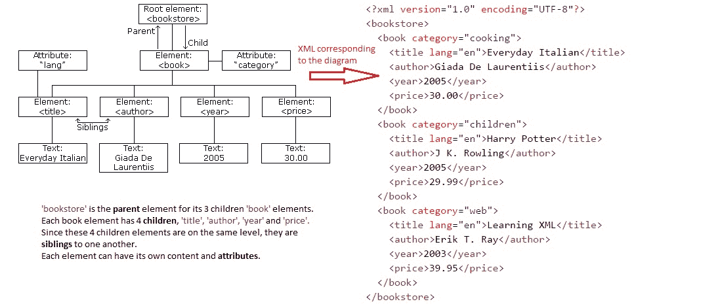
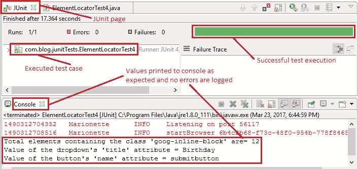
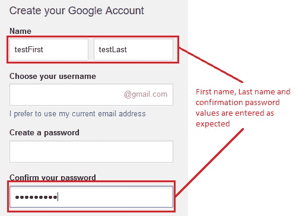

# 9n。 WebDriver –定位元素：第4a部分（通过xpath）

> 原文： [https://javabeginnerstutorial.com/selenium/9n-webdriver-locating-elements-4a/](https://javabeginnerstutorial.com/selenium/9n-webdriver-locating-elements-4a/)

欢迎回来，我们今天将讨论XPath策略。 这也是一种先进且有效的定位策略（cssSelectors也是！）。 虽然有效，但有时可能会造成混淆。 因此，让我们深入研究如何理解我们经常被误解的朋友，并一劳永逸地提出好的代码。

当所有希望都丧失了时，拯救自己的唯一机会就是转向XPath策略。 因为在大多数情况下，我们将测试现有的东西并且无法修改。 我们并不总是能够控制页面以添加一些ID，从而使自动化成为一项更简单的任务。 因此，请停止咆哮并认真对待！

*<u>准备点亮</u>*

**XPath** （XML路径语言）：根据 [w3schools](https://www.w3schools.com/xml/xpath_intro.asp) 的说法，XPath是一种“路径式”语言，用于标识和浏览XML文档中的各种元素和属性。

因此，XPath提供了用于定位HTML文档中任何元素的语法。

***<u>即时贴：</u>***

*如果到目前为止，您从未接触过XPath，请在继续进行操作之前先了解XPath术语。 特别是，节点和这些节点之间的关系即父母，子女，兄弟姐妹，祖先，后代。*

如果您已经知道这些术语，并且希望略微刷一下，请参考下图。 礼貌： [w3schools](https://www.w3schools.com/xml/dom_intro.asp)



现在是当今的主要任务：**通过XPath策略定位元素！** 在这篇文章中，我们将研究以下技术，

1.  捷径
2.  绝对XPath和相对XPath
3.  使用标签和属性
4.  使用两个条件
5.  使用contains（）
6.  查找多个元素

让我们从最简单的动机开始。

### 1.捷径：

是否想以简单的方式在网页上找到任何元素的XPath？ 做完了 是否希望几乎每次都处于完美的工作状态？ 也做完了。 马上完成所有这些操作呢？ 它让您涵盖了摇滚明星！ 您只需要“萤火虫”！ 它可以作为Firefox浏览器的附加组件使用。

食谱来了：

1.  点击Firebug图标或按“ F12”。
2.  检查其XPath是必需的元素。
3.  相应的代码将在Firebug面板的“ HTML”部分中突出显示。
4.  右键点击突出显示的代码，然后选择“复制XPath”
5.  瞧！ 您已将准备好的烘焙XPath复制到剪贴板！

瞥见我们刚才所说的话，


如果您希望获得有关Firebug的详细信息，请在处查看[。](https://javabeginnerstutorial.com/selenium/7n-ide-using-firebug/)

2.现在对于 ***<u>长短</u>*** ：

为了从头提出XPath，我们首先需要了解可用的两种Xpath。 它们是绝对XPath和相对XPath。

*奖励：<u>准备点亮</u>* *（更多时间）*

| **绝对XPath** | **相对XPath** |
| 它以单个正斜杠（/）开头。 | 它以双正斜杠（//）开头。 |
| ‘/”指示XPath引擎参考根节点搜索元素。 | “ //”指示XPath引擎在DOM结构中的任何位置搜索匹配的元素。 |
| 与相对的XPath相比，元素标识更快。 | 由于仅指定了部分路径，因此需要花费更多时间来标识元素。 |
| 即使对HTML DOM结构进行了最细微的更改（例如添加标签或删除标签），绝对XPath也会失败。 | 相对XPath较短，更改的可能性较小，从而使其更可靠。 |
| 例如，/ html / head / body / div [2] / form / input | 例如//输入[@ name =“用户名”] |

有了这些基本知识，就让我们开始吧！

### 3.使用标签和属性：

可以使用其HTML标签，其属性（例如ID，名称，类，标题，值，href，src等）及其相应的值来定位特定的Web元素。

***语法*** *：* *driver.findElement（By.xpath（“ // tag_name [@ attribute ='value']”）））;*

***解释*** *：*标识XPath指向的元素。 “ //”标识指定的节点，“ @”符号用于选择与给定值匹配的指定属性。

***示例*** *：*让我们在Gmail帐户注册页面上找到名字文本框。

右键点击“名字”文本框，然后选择检查元素，以获取相应的HTML代码，如下所示，

```java
<input value="" name="FirstName" id="FirstName" spellcheck="false" 
class="form-error" aria-invalid="true" type="text">
```

我们可以看到“ input”标签具有一个“ name”属性，其值为“ FirstName”。

*代码：*（可以使用以下任一选项）

```java
driver.findElement(By.xpath("//input[@name='FirstName']"));
driver.findElement(By.xpath("//input[@id='FirstName']"));
driver.findElement(By.xpath("//input[@class='form-error']"));
```

如果您希望使用绝对路径，

```java
driver.findElement(By.xpath("/html/body/div[1]/div[2]/div/div[1]/div/form/div[1]/fieldset/label[1]/input"));
```

表单标签有许多子div标签。 在我们的情况下，我们希望选择第一个div标签。 可以将其指定为“ **div [1]** ”。 这些方括号[]中的数字表示要选择的确切同级。

### 4.使用两个条件

如果多个标签具有相同的属性值怎么办？ 或者，如果您希望仅在元素与指定条件都匹配时才定位它，该怎么办？

***语法*** *：* *driver.findElement（By.xpath（“ // tag_name [@ attribute1 ='value1'] [@ attribute2 ='value2' ]”））；*

***说明*** *：*标识具有指定tag_name的元素，这些元素的属性与给定值匹配。

***示例*** *：*让我们在Gmail帐户注册页面上找到“确认密码”文本框。

右键点击“创建密码”和“确认密码”文本框，然后选择检查元素以获取相应的HTML代码，如下所示，

```java
<input name="Passwd" id="Passwd" type="password">
<input name="PasswdAgain" id="PasswdAgain" type="password">
```

请注意，两个文本框的“类型”属性值均相同，但“ id”和“名称”的值均不同。 因此，为了找到“确认密码”文本框，让我们同时提及其“类型”和“ id”值。

*代码：*

```java
driver.findElement(By.xpath("//input[@type='password'][@id='PasswdAgain']"));
```

### 5.使用contains（）：

如今，大多数属性值（例如“ id”，“ src”，“ href”等）都是使用恒定的前缀或后缀动态生成的。

想象一个网页每天都有变化的图像。 其src可以是“ Image_random-generated-key_date.jpg”。 在这种情况下，我们可以通过XPath使用在其src属性中包含“ Image”值的“ img”标记定位图像。 因此，通过指定属性的部分值，我们可以找到元素。

***语法*** *：* *driver.findElement（By.xpath（“ // tag_name [contains（@ attribute，'value'）]]“）））;*

***说明*** *：*标识具有指定tag_name的元素，该元素的属性与给定的部分值相匹配。

***示例*** *：*让我们在Gmail帐户注册页面上找到“下一步”按钮。

右键单击按钮并检查元素以获取相应的HTML代码，如下所示，

*Code:*

```java
driver.findElement(By.xpath("//div[contains(@class,'button')]/input"));
```

注意，该XPath标识div元素，该div元素包含带有部分值'button'的class属性（< div **class** =” form-element nextstep- **按钮**” [>），然后找到其子“ input”标签（即“提交”按钮）。

### 6.查找多个元素

您可能会遇到希望查找具有特定类或名称的所有元素并对它们执行某些操作的情况。 星号（*）符号可助我们一臂之力！

***示例*** *：*让我们在Gmail帐户注册页面上找到所有类值为“ goog-inline-block”的元素。

*Code:*

```java
driver.findElements(By.xpath("//*[contains(@class,'goog-inline-block')]"));
```

这将找到在其“类别”属性中包含值“ goog-inline-block”的所有标签。

明确指出要使用“ **findElements** ”，以便将所有已标识的Web元素添加到列表中。 如果使用“ findElement”，它将仅返回所标识的第一个元素。

**<u>总体图片</u>**

让我们来看一个测试案例，该案例实现了迄今为止本文中涵盖的所有技术，

*场景*

1.  打开Firefox浏览器。
2.  导航到Google帐户创建页面
3.  使用绝对XPath找到“名字”文本框
4.  输入“ testFirst”作为名字
5.  使用标签和“ id”属性找到“姓氏”文本框（当然是相对的XPath！）
6.  输入“ testLast”作为姓氏
7.  使用两个条件（类型和ID属性）找到“确认密码”文本框
8.  输入“ Pass1234！”作为确认密码
9.  使用星号将所有包含在其“类别”属性中值“ goog-inline-block”的元素定位
10.  将找到的元素总数打印到控制台
11.  将第一个标识的元素的标题值打印到控制台
12.  使用contains（）找到“下一步”按钮
13.  将其“名称”属性的值打印到控制台
14.  验证Eclipse IDE控制台的输出屏幕和JUnit窗格是否成功

此方案的JUnit代码是，

```java
package com.blog.junitTests;

import java.util.List;
import java.util.concurrent.TimeUnit;

import org.junit.After;
import org.junit.Before;
import org.junit.Test;
import org.openqa.selenium.By;
import org.openqa.selenium.WebDriver;
import org.openqa.selenium.WebElement;
import org.openqa.selenium.firefox.FirefoxDriver;

public class ElementLocatorTest4 {
	//Declaring variables
	private WebDriver driver; 
	private String baseUrl;

	@Before
	public void setUp() throws Exception{
		// Selenium version3 beta releases require system property set up
		System.setProperty("webdriver.gecko.driver", "E:\\ Softwares\\Selenium\\geckodriver-v0.10.0-win64\\geckodriver.exe");
		// Create a new instance for the class FirefoxDriver
		// that implements WebDriver interface
		driver = new FirefoxDriver();
		// Implicit wait for 5 seconds
		driver.manage().timeouts().implicitlyWait(5, TimeUnit.SECONDS);
		// Assign the URL to be invoked to a String variable
		baseUrl = "https://accounts.google.com/SignUp";
	}

	@Test
	public void testPageTitle() throws Exception{
		// Open baseUrl in Firefox browser window
		driver.get(baseUrl);
		// Locate 'First Name' text box by absolute XPath
		// assign it to a variable of type WebElement	
		WebElement firstName = driver.findElement(By.xpath("/html/body/div[1]/div[2]/div/div[1]"
			+ "/div/form/div[1]/fieldset/label[1]/input"));
		// Clear the default placeholder or any value present
		firstName.clear();
		// Enter/type the value to the text box
		firstName.sendKeys("testFirst");
		// Locate 'Last Name' text box by relative XPath: using tag and id attribute
		WebElement lastName = driver.findElement(By.xpath("//input[@id='LastName']"));
		lastName.clear();
		lastName.sendKeys("testLast");
		// Locate 'Confirm your password' text box by XPath: using two conditions   
		WebElement confirmPwd = driver.findElement(By.xpath("//input[@type='password'][@id='PasswdAgain']"));
		confirmPwd.clear();
		confirmPwd.sendKeys("Pass1234!");
		//Locate all elements with class 'goog-inline-block' by relative XPath: using asterisk symbol
		List<WebElement> dropdowns = driver.findElements(By.xpath("//*[contains(@class,'goog-inline-block')]"));
		// Prints to the console, the total number of elements located 
		System.out.println("Total elements containing the class 'goog-inline-block' are= " + dropdowns.size());	
		// Prints first identified element's title value to console
		System.out.println("Value of the dropdown's 'title' attribute = " + dropdowns.get(0).getAttribute("title"));
		// Locate 'Next step' button by XPath: contains() and child element
		WebElement submitBtn = driver.findElement(By.xpath("//div[contains(@class,'button')]/input"));
		// Prints submitBtn's 'name' attribute's value to the console 
		System.out.println("Value of the button's 'name' attribute = " + submitBtn.getAttribute("name"));
	}

	 @After
	  public void tearDown() throws Exception{
		// Close the Firefox browser
		driver.close();
	}
}
```

*执行结果：*

这段代码将作为本文讨论的每种技术的一部分进行解释。

在JUnit窗口中，绿色条显示测试用例已成功执行。 控制台窗口显示没有任何错误。 它还显示带有星号的Web元素总数，以及下拉菜单和按钮的属性值。



下图显示了成功执行测试脚本后获得的Firefox输出。



休息一下伙计！ 我们的下一篇文章将是定位元素策略的最后一篇。 所以不要错过！ 很快见，祝您愉快！

###### 下一篇文章

##### [9o。 WebDriver –定位元素：第4b部分（由XPath续）](https://javabeginnerstutorial.com/selenium/9o-webdriver-locating-elements-4b/ "9o. WebDriver – Locating elements: Part 4b (by XPath contd.)")