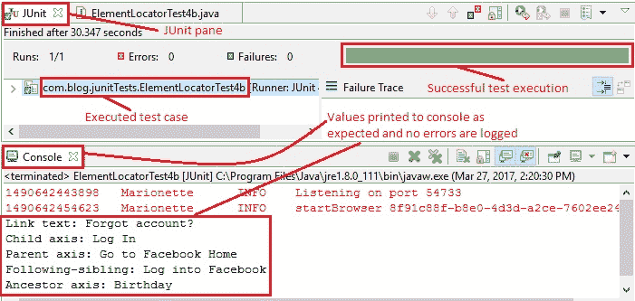

# 9O WebDriver – 定位元素：第 4b 部分（XPath 续）

> 原文： [https://javabeginnerstutorial.com/selenium/9o-webdriver-locating-elements-4b/](https://javabeginnerstutorial.com/selenium/9o-webdriver-locating-elements-4b/)

嗨冠军！ 欢迎来到我们关于定位元素的最后一篇文章。 好极了！！！

这是我们上一篇文章“[9n。 WebDriver – 定位元素：第 4a 部分（由 XPath 提供）](https://javabeginnerstutorial.com/selenium/9n-webdriver-locating-elements-4a/)”。 您以前曾经听过我说过这个，然后您会再次听我说过……在继续使用 XPath 策略之前，请先阅读第 4a 部分。

在这篇文章中，我们将研究以下技术，

1.  使用`Text()`
2.  使用`starts-with()`
3.  使用 XPath 轴

这些技术以及我们在第 4a 部分中看到的技术可以结合起来，并用于形成有效的 XPath，该 XPath 可以定位网页上的任何元素。 现在通过示例来介绍当今的技术。

## 1.使用`text()`

通过提供与网页上显示的文本**完全相同的**文本，这是一种轻松定位元素的方法。

**注意：**

*当心！ 即使错误地包含空格，您也可能遇到“`ElementNotFound`”异常。 在代码中提供的文本必须与可见文本完全匹配，这一点非常重要，我的意思是从字面上看！*

**示例**：让我们找到“Facebook 注册”页面上的“忘记帐户？”链接。

右键点击“忘记帐户？”链接，然后选择检查元素以获取相应的 HTML 代码，如下所示，

```java
<a href="https://www.facebook.com/recover/initiate?lwv=111" 
data-testid="forgot_account_link">Forgot account?</a>
```

让我们通过提供出现在 Facebook 页面上的文本来找到此链接。

*代码：*

```java
driver.findElement(By.xpath("//a[text()='Forgot account?']"));
```

如果要查找包含部分文本的所有元素，可以将`contains()`和`text()`技术结合使用。 可以使用`findElements`方法在列表中获取所有元素。

让我们尝试在同一示例中同时实现`contains()`和`text()`。 由于我们只有一个链接与该文本，因此将使用`findElement`方法。

```java
driver.findElement(By.xpath("//*[contains(text(),'Forgot')]"));
```

## 2.使用`starts-with()`

通过指定属性的部分值（前缀），可以使用`starts-with()`查找元素。 当页面重新加载时属性值动态更改时，此功能非常有用。

**示例**：让我们在“Facebook 注册”页面上找到“新密码”文本框。

右键点击“新密码”文本框，然后选择检查元素以获取相应的 HTML 代码，

```java
<input class="inputtext _58mg _5dba _2ph-" data-type="text" 
name="reg_passwd__" aria-required="1" placeholder="" id="u_0_d" 
aria-label="New password" type="password">
```

让我们通过提供`type`属性的部分前缀值“通过”来找到此文本框。 请注意，“登录”部分中的密码字段还具有`type`作为`password`。

```java
<input class="inputtext" name="pass" id="pass" tabindex="2" type="password">
```

因此，第二个元素必须位于我们的案例中。

*代码：*

```java
driver.findElement(By.xpath("(//input[starts-with(@type,'pass')])[2]"));
```

## 3.使用 XPath 轴

XPath 轴定义在当前节点浏览 DOM 的树形结构时要考虑的相对于当前节点的节点集或方向。

下表（礼貌性表示： [w3schools](https://www.w3schools.com/xml/xpath_axes.asp) ）显示了所有 13 个可用的 XPath 轴及其结果。

| **轴名称** | **结果** |
| --- | --- |
| 祖先 | 选择当前节点的所有祖先（父，祖父级等） |
| 祖先或自己 | 选择当前节点的所有祖先（父，祖父级等）和当前节点本身 |
| 属性 | 选择当前节点的所有属性 |
| 子项 | 选择当前节点的所有子节点 |
| 后代 | 选择当前节点的所有后代（子代，孙代等） |
| 后代或自己 | 选择当前节点的所有后代（子代，孙代等）和当前节点本身 |
| 之后 | 选择当前节点的结束标记之后的文档中的所有内容 |
| 之后的同级 | 选择当前节点之后的所有同级 |
| 命名空间 | 选择当前节点的所有名称空间节点 |
| 父项 | 选择当前节点的父节点 |
| 之前 | 选择出现在文档中当前节点之前的所有节点，但祖先，属性节点和名称空间节点除外 |
| 之前的同级 | 选择当前节点之前的所有同级 |
| 自己 | 选择当前节点 |

让我们来看一些重要的

### 3a. 父轴

选择当前节点的父级。

**示例**：让我们找到位于 Facebook Sign Up 页面左上方的 Facebook 徽标的锚标记。

在检查元素后，

```java
<a href="https://www.facebook.com/" title="Go to Facebook Home">
   <i class="fb_logo img sp_euCDsy2vhU4 sx_af4dba">
       Facebook
   </i>
</a> 
```

*代码：*

```java
driver.findElement(By.xpath("//i[@class='fb_logo']/parent::a"));
```

将找到具有`href`和`title`属性的父节点“`a`”。

### 3b. 祖先轴

选择当前节点的所有祖先（父代，祖父级等）。

**示例**：让我们在“Facebook 注册”页面上找到文字“生日”。

Upon inspecting the element,

Birthday

*代码：*

```java
driver.findElement(By.xpath("//select[@id='month']/ancestor::div[@class='_5k_5']/preceding-sibling::div"));
```

带有 ID 的“`select`”标签，选择了“`month`”。 转到类“`_5k_5`”的祖先`div`标签。 然后到其前一个带有“`div`”标签的同级节点，其文本为“`Birthday`”。

选择该特定示例以显示可以组合多个轴以获得所需的结果。

### 3c. 子轴

选择当前节点的所有子节点

**示例**：让我们找到“Facebook 注册”页面上的“登录”按钮。

Upon inspecting the element,

```java
 <label class="uiButton uiButtonConfirm" for="u_0_q" id="loginbutton"></label> 
```

*代码：*

```java
driver.findElement(By.xpath("//label[@id='loginbutton']/child::input"));
```

标识为“`loginbutton`”的标签的子节点-标识为“`u_0_q`”的输入标签。

### 3d. 后代轴

选择当前节点的所有后代（子代，孙代等）。

**示例**：让我们在“Facebook 注册”页面上找到“名字”文本框。

Upon inspecting the element,

First name

```java
<input id=”u_0_1″ class=”inputtext _58mg _5dba _2ph-” data-type=”text” name=”firstname” aria-required=”1″ placeholder=”” aria-label=”First name” type=”text”> </div>
```

*代码：*

```java
driver.findElement(By.xpath("//div[contains(@class,'uiStickyPlaceholderInput')]/descendant::input"));
```

类别为`uiStickyPlaceholderInput`的`div`标签的后代节点-ID 为`u_o_1`的输入标签已找到。

### 3e. 同级轴

选择当前节点之后的所有同级

**示例**：让我们在“Facebook 注册”页面页脚部分中找到“登录”链接。

Upon inspecting the element,

```java
<td class="_51m- hLeft plm">
   <a href="/r.php" title="Sign Up for Facebook">Sign Up</a>
</td>
<td class="_51m- hLeft plm">
   <a href="/login/" title="Log into Facebook">Log In</a>
</td> 
```

*代码：*

```java
driver.findElement(By.xpath("//td[@class='_51m- hLeft plm']/following-sibling::td/child::a"));
```

以下`td`标签的同级类`_51m-hLeft plm`是另一个`td`标签，其子对象是带有标题“登录 Facebook”的锚标签。

将后继同级和子级轴组合在一起，以在页脚部分中找到“登录”超链接。

### 3f. 上一个同级轴

选择当前节点之前的所有同级

**示例**：让我们找到“Facebook 注册”页面上的“女性”单选按钮。

Upon inspecting the element,

```java
<span class="_5k_2 _5dba">
   <input id="u_0_g" name="sex" value="1" type="radio">
   <label class="_58mt" for="u_0_g">Female</label>
</span> 
```

*代码：*

```java
driver.findElement(By.xpath("//label[@class='_58mt']/preceding-sibling::input"));
```

“标签”标签的前面同级是“无线电”类型的`input`标签。 这样就找到了所需的单选按钮。

这样，就涵盖了一些常用的 XPath 轴类型。

我们在 BrainBell 方面一直处于停滞状态。 那为什么要延迟呢？ 开始了，

**BrainBell** – **注意！** *注意您的大脑状态。*

*   *症状*：没有任何东西被注册，开始浏览文章或忘记您刚刚阅读的内容。
*   *诊断*：您的大脑超负荷。
*   *补救*：休息一下！ 但是记得很快回来😉

*我将根据我的经验个人建议 **Pomodoro 技术**。 它非常有效。 试一试！*

## 概览

让我们来看一个测试案例，该案例实现了迄今为止本文中涵盖的所有技术，

*场景*

1.  打开 Firefox 浏览器。
2.  导航到 www.facebook.com
3.  使用`text()`找到“忘记帐户？”链接
4.  将链接文本打印到控制台
5.  使用`starts-with()`找到“新密码”文本框
6.  输入值“`test1234!`”
7.  使用子轴找到“登录”按钮
8.  将值属性打印到控制台
9.  使用父轴找到 Facebook 徽标
10.  将其`title`属性的值打印到控制台
11.  在页脚部分的“兄弟姐妹”轴中找到“登录”链接
12.  将其`title`属性的值打印到控制台
13.  使用上一个同级轴找到“女性”单选按钮
14.  点击单选按钮
15.  使用祖先轴找到文本“生日”
16.  将其文本打印到控制台
17.  使用后代轴找到“名字”文本框
18.  输入值“首先测试”
19.  验证 Eclipse IDE 控制台的输出屏幕和 JUnit 窗格是否成功

此方案的 JUnit 代码是，

```java
package com.blog.junitTests;

import java.util.concurrent.TimeUnit;

import org.junit.After;
import org.junit.Before;
import org.junit.Test;
import org.openqa.selenium.By;
import org.openqa.selenium.WebDriver;
import org.openqa.selenium.WebElement;
import org.openqa.selenium.firefox.FirefoxDriver;

public class ElementLocatorTest4b {
    // Declaring variables
    private WebDriver driver;
    private String baseUrl;

    @Before
    public void setUp() throws Exception {
        // Selenium version 3 beta releases require system property set up
        System.setProperty("webdriver.gecko.driver", "E:\\Softwares\\Selenium\\geckodriver-v0.10.0-win64\\geckodriver.exe");
        // Create a new instance for the class FirefoxDriver
        // that implements WebDriver interface
        driver = new FirefoxDriver();
        // Implicit wait for 5 seconds
        driver.manage().timeouts().implicitlyWait(5, TimeUnit.SECONDS);
        // Assign the URL to be invoked to a String variable
        baseUrl = "https://www.facebook.com/";
    }

    @Test
    public void testPageTitle() throws Exception {
        // Open baseUrl in Firefox browser window
        driver.get(baseUrl);

        // Locate 'Forgot Account' link using XPath: text()
        WebElement forgotAccLink = driver.findElement(By.xpath("//*[contains(text(),'Forgot')]"));
        // Prints the link text to the console
        System.out.println("Link text: " + forgotAccLink.getText());
        // Locate 'New password' text box by XPath: using starts-with()
        WebElement passwordNew = driver.findElement(By.xpath("(//input[starts-with(@type,'pass')])[2]"));
        // Clear the default placeholder or any value present
        passwordNew.clear();
        // Enter/type the value to the text box
        passwordNew.sendKeys("test1234!");

        // Locate 'Log In' button using XPath: child axis
        WebElement logIn = driver.findElement(By.xpath("//label[@id='loginbutton']/child::input"));
        // Prints 'value' attribute to console
        System.out.println("Child axis: " + logIn.getAttribute("value"));
        // Locate 'Facebook' logo using XPath: parent axis
        WebElement fbLogo = driver.findElement(By.xpath("//i[contains(@class,'fb_logo')]/parent::a"));
        // Prints 'title' attribute's value to console
        System.out.println("Parent axis: " + fbLogo.getAttribute("title"));
        // Locate 'Log In' link in footer section using XPath: following-sibling axis
        WebElement loginFooter = driver.findElement(By.xpath("//td[@class='_51m- hLeft plm']/following-sibling::td/child::a"));
        //Prints 'title' attribute's value to console
        System.out.println("Following-sibling: " + loginFooter.getAttribute("title"));
        // Locate 'female' radio button using XPath: preceding-sibling axis
        WebElement femaleRadioBtn = driver.findElement(By.xpath("//label[@class='_58mt']/preceding-sibling::input"));
        // Click the radio button
        femaleRadioBtn.click();
        // Locate 'Birthday' text using XPath: ancestor axis
        WebElement birthday = driver.findElement(By.xpath("//select[@id='month']/ancestor::div[@class='_5k_5']/preceding-sibling::div"));
        //Prints text to console
        System.out.println("Ancestor axis: " + birthday.getText());
        // Locate 'first name' test box using XPath: descendant axis
        WebElement firstName = driver.findElement(By.xpath("//div[contains(@class,'uiStickyPlaceholderInput')]/descendant::input"));
        firstName.clear();
        firstName.sendKeys("test first");
    }

    @After
    public void tearDown() throws Exception {
        // Close the Firefox browser
        driver.close();
    }
}
```

*执行结果：*

这段代码将作为本文讨论的每种技术的一部分进行解释。

在 JUnit 窗口中，绿色条显示测试用例已成功执行。 控制台窗口显示没有任何错误。 它还可以按预期显示所有打印结果。



下图显示了成功执行测试脚本后获得的 Firefox 输出。


好吧！ 现在，您应该全都适应定位策略。 我们将在所有即将到来的示例中看到这些策略的应用。 因此，请继续关注此空间。

在另一个帖子中再见！ 祝你有美好的一天！

