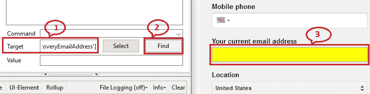

# 9P WebDriver – 节省时间的捷径：定位器验证

> 原文： [https://javabeginnerstutorial.com/selenium/9p-webdriver-shortcut-locator-validation/](https://javabeginnerstutorial.com/selenium/9p-webdriver-shortcut-locator-validation/)

今天*锦上添花*：“一种验证所选择的定位器策略是否唯一标识被测网络元素的捷径”。

想象一下，您有一个取决于许多因素的测试脚本。 当您要测试新的 Web 元素时，要求您对它进行一些补充。 为了定位每个元素，可以使用先前文章中讨论的任何定位器策略（按 ID，名称，`tagName`，`className`，`linkText`，`cssSelector`，xpath 等）。 要检查代码是否按预期工作并且 Web 元素是否正确定位，您将不得不一次又一次地运行整个测试用例。 真痛苦！

在这种情况下，谁不喜欢快捷键或节省时间！ 我听到你了

现在该重新回顾我们的魔术师草地，“**Selenium IDE**”，并利用“命令/目标/值编辑器”中的**目标**和**查找**功能，以便开启我们的旅程。

#### 示例：

让我们使用`cssSelector`（标记和名称属性）在 Gmail 帐户注册页面上找到“您当前的电子邮件地址”文本框。

右键点击“您当前的电子邮件地址”文本框，然后选择检查元素以获取相应的 HTML 代码，如下所示，

```java
<input name="RecoveryEmailAddress" id="RecoveryEmailAddress" 
value="" spellcheck="false" style="background-color: rgb(255, 255, 255);" 
type="text">
```

我们可以看到`input`标签的`name`属性为“`RecoveryEmailAddress`”。 下图显示了验证我们的定位器所遵循的步骤。



1.  输入“`css = input[name='RecoveryEmailAddress']`”作为目标。 要了解此命令的形成方式，请查阅“[7l Selenium IDE – 定位元素（续）（通过 CSS，DOM，XPath）](https://javabeginnerstutorial.com/selenium/7l-ide-locating-elements-contd/)”
2.  点击**查找**
3.  **“您当前的电子邮件地址”**文本框在 Gmail 帐户注册页面上突出显示。

这表明我们的定位器可以唯一地标识所需的元素，并且可以更加有把握地直接在代码中使用它。 这种方法节省了大量时间。 任务完成！

容易挤柠檬！ 是不是

在另一篇文章中再见。 祝您有美好的一天！

