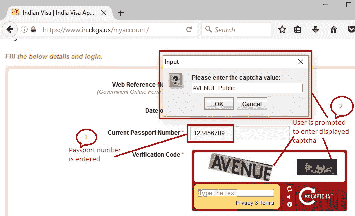
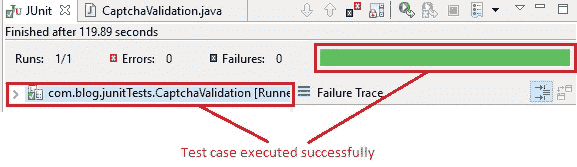
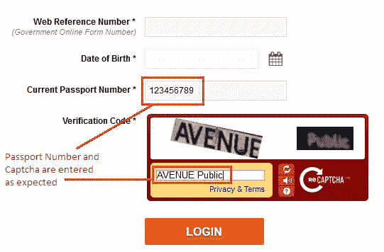

# 9Q WebDriver – 处理验证码

> 原文： [https://javabeginnerstutorial.com/selenium/9q-webdriver-handling-captcha/](https://javabeginnerstutorial.com/selenium/9q-webdriver-handling-captcha/)

有人说验证码吗？ 好吧，我听到了！ 让我们看看如何使用 Selenium WebDriver 处理这些问题，是的，我们将尝试尽快完成这项工作，因为今天晚些时候我将不得不参加比赛。

*准备开始*

**CAPTCHA** 是“`Completely Automated Public Turing test to tell Computers and Humans Apart`”（用于分辨电脑和人类的完备自动化公开图灵测试）的首字母缩写。

哦，别生我的气！ 那不是错字！ 确实有一个叫做`backronym`的**缩写**。 当由其他词的缩写形成缩写时，称为缩写。 但是，如果创建了一个新短语以适合已经存在的首字母缩写，那么它被称为简称。

因此，现在您知道什么是简称，并且 CAPTCHA 代表什么，让我们详细介绍一下。 验证码主要用于确定用户是否为人类。 它会生成图像或人类可以解决的某种形式的测试，但漫游器/计算机程序无法解决。

因此，其主要目的是防止漫游器和其他自动化程序从网站获取任何敏感信息。 因此， **验证码可以杀死自动化！** 如果我们能够使其自动化，那么使用验证码的原因就变得毫无价值。

我有袖子吗？ 让我看看…

1.  出于测试目的，我们总是可以要求开发人员
    1.  **禁用**验证码验证
    2.  提供**解决方法**或后门以获取验证码值
    3.  调整验证码，使其每次都接受一个**特定输入值**
    4.  开发一种方法，将随机文本存储在验证码图像的`alt`属性中，然后可以使用可用的定位符获取该随机文本并将其传递到验证码文本框中

但是，请确保它们仅在测试环境中处于活动状态，并且仅用于自动化目的。

请注意，在使用上述这些方法进行测试时，*应用安全性*受到损害。

2.  如果您想按原样测试应用，即在不出于自动化目的对测试环境进行任何修改的情况下，请分离所有涉及验证码验证的测试脚本并将其打包为单个测试套件。 在人为干预的情况下运行此测试套件。 **我知道这是部分自动化，但并非总是可以在给定的情况下将所有内容自动化。 为了得到一些东西，你应该准备放弃一些东西。**
    1.  除验证码外，整个测试用例均可自动执行。
    2.  可以使用隐式或显式等待，并且提示用户输入显示的验证码。
    3.  运行测试脚本时，将照常执行每个步骤。 到达提示命令后，浏览器将弹出一个窗口。 用户输入屏幕上显示的验证码。
    4.  手动输入验证码后，将继续执行测试用例，并在浏览器上运行后续步骤。

这是我之前的一个项目中遵循的过程。 因为此方法可确保被测应用恰好是将被推入生产环境的应用，并且安全性丝毫不受影响。

让我们看一个示例来更好地理解。

*场景*

1.  打开 Firefox 浏览器
2.  导航至 https://www.in.ckgs.us/myaccount/
3.  通过`cssSelector`找到“当前护照号码”文本框：标记和名称属性
4.  输入“`123456789`”
5.  提示用户进行干预并输入显示的验证码
6.  通过 ID 找到验证码文本框
7.  将用户输入的值发送到找到的验证码文本框中
8.  在 Eclipse IDE 中验证 JUnit 窗格是否成功

此方案的 JUnit 代码是，

```java
package com.blog.junitTests;

import java.util.concurrent.TimeUnit;

import javax.swing.JOptionPane;

import org.junit.After;
import org.junit.Before;
import org.junit.Test;
import org.openqa.selenium.By;
import org.openqa.selenium.WebDriver;
import org.openqa.selenium.WebElement;
import org.openqa.selenium.firefox.FirefoxDriver;

public class CaptchaValidation {
	//Declaring variables
			private WebDriver driver; 
			private String baseUrl;

			@Before
			public void setUp() throws Exception{
				// Selenium version 3 beta releases require system property set up
				System.setProperty("webdriver.gecko.driver", "E:\\Softwares\\Selenium\\geckodriver-v0.10.0-win64\\geckodriver.exe");
				// Create a new instance for the class FirefoxDriver
				// that implements WebDriver interface
				driver = new FirefoxDriver();
				// Implicit wait for 5 seconds
				driver.manage().timeouts().implicitlyWait(5, TimeUnit.SECONDS);
				// Assign the URL to be invoked to a String variable
				baseUrl = "https://www.in.ckgs.us/myaccount/";
			}

			@Test
			public void testPageTitle() throws Exception{
				// Open baseUrl in Firefox browser window
				driver.get(baseUrl);
				// Locate 'Current Passport Number' text box by cssSelector: tag and name attribute
				WebElement passportNo = driver.findElement(By.cssSelector("input[name='currentPassportNo']"));
				// Clear the default placeholder or any value present
				passportNo.clear();
				// Enter/type the value to the text box
				passportNo.sendKeys("123456789");
				//prompting user to enter captcha			
				String captchaVal = JOptionPane.showInputDialog("Please enter the captcha value:");
				//Type the entered captcha to the text box
	driver.findElement(By.id("recaptcha_response_field")).sendKeys(captchaVal);			
			}

			 @After
			  public void tearDown() throws Exception{
				// Close the Firefox browser
				driver.close();
			}
	} 
```

*执行结果*

注释清楚地提供给每一行代码。

```java
String captchaVal = JOptionPane.showInputDialog("Please enter the captcha value:");
```

`JoptionPane`弹出一个标准对话框，`showInputDialog`提示用户进行某些输入。 用户输入显示的验证码并单击“确定”后，它将被保存到字符串`captchaVal`中。

```java
driver.findElement(By.id("recaptcha_response_field")).sendKeys(captchaVal);
```

保存在“`captchaVal`”中的该值将在 ID 所在的验证码文本框中输入。



在 JUnit 窗格中，绿色条显示测试用例已成功执行。



下图显示了在 Firefox 浏览器中执行的最终输出。



我让你们全都受了验证码！ 在另一篇文章中再见。

祝你有美好的一天！

