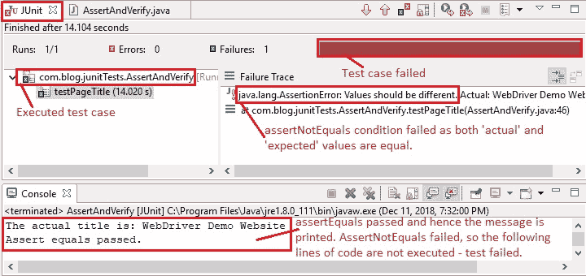

# 9 河 WebDriver – 断言和验证

> 原文： [https://javabeginnerstutorial.com/selenium/9r-webdriver-assert-and-verify/](https://javabeginnerstutorial.com/selenium/9r-webdriver-assert-and-verify/)

Hiya 超级巨星！ 我们已经定位元素很多天了。 让我们今天换一下话题，谈谈“确认和验证”。

### 要记住，

当断言或验证**条件/检查失败**时，两者之间的主要区别是：

*   **断言**将使测试失败，并且 ***中止*** 当前测试用例的执行。 跳过该特定代码行之后的所有其他测试步骤
*   **验证**将记录故障，但 ***继续执行*** 测试用例。

## 何时使用断言和验证？

最简单的答案是 – 由您决定，换句话说，就是您的愿望！ 您可以根据情况使用断言或验证，即是希望测试中止还是在检查失败后继续进行。

### 使用断言的好处

大多数情况下，我们希望在检查失败时停止测试执行，而这正是我们通过断言得到的结果。 测试用例失败，并且清楚地突出显示为“失败”。 这将立即向我们显示哪些测试用例没有通过完整测试套件中的检查。 然后，我们可以直接转到那些失败的案例，并检查检查/条件未通过的原因。 那不是很方便吗？ 由于此*立即反馈*的可用性，因此断言更为常用。

### 断言的缺点

当第一个断言条件失败时，将不再执行以下代码行。 可能还要执行其他检查，我们永远不会知道他们的结果。

### 使用验证的优势

即使条件之一失败，我们希望继续执行测试时，通常使用此方法。 故障将被记录或打印到控制台。 因此，无论测试是通过还是失败，我们都会获得测试用例中所有检查的结果。

### **使用验证**的缺点

验证不提供立即反馈，因为条件失败后不会终止测试用例的执行。 因此，每次执行测试时，我们都必须花费大量时间在控制台中查看日志或打印的语句，以确定哪些检查失败。 例如，如果要针对不同的数据集多次执行数百个测试用例，则可能不可行。

## 示例场景

让我们获得为本教程系列创建的[示例网页](https://chandanachaitanya.github.io/selenium-practice-site/)的标题。 这将是我们使用 WebDriver 的`getTitle()`方法获得的**实际标题**。 **的预期标题**是“ WebDriver 演示网站”。

### 情况 1：通过`assertEquals`通过测试用例

实际标题与预期标题相同，因此条件`Assert.assertEquals("WebDriver Demo Website", pageTitle);`的输出将是*成功。* 将执行此行之后的代码，并且将*传递给*测试用例。

### 情况 2：使用`assertNotEquals`使测试用例失败

实际标题与预期标题相同，因此条件`Assert.assertNotEquals("WebDriver Demo Website", pageTitle);`的输出将是*故障*。 此行之后的代码将执行*而不是*。 测试执行*被中止*，并且测试用例将失败*。*

**代码段**

```java
// Making the test fail
Assert.assertNotEquals("WebDriver Demo Website", pageTitle);

// Following lines will not be executed as above assert condition fails
System.out.println("Assert not equals failed");
```


<noscript><p>上图中的控制台显示<code>assertEquals</code>条件成功，因此将打印检查后的语句，“ <strong>声明等于通过。 </strong>”，而<code>assertNotEquals</code>条件失败，因此将不执行此检查之后的行。 打印语句“ <strong>声明不等于失败</strong>”不会打印到控制台。</p><h3>情况 3：尽管 assertNotEquals 条件失败，但通过测试用例</h3><p>要仅验证实际值和预期值是否不相等，请使用<code>try-catch</code>块。</p><p><strong>Code snippet</strong></p><pre><code class="language-java">//Verify title not equal using try-catch block try { // Making the test fail Assert.assertNotEquals("WebDriver Demo Website", pageTitle); } catch(Error e){ // Following lines will be printed when the assert condition fails System.out.println("Assert not equals failed. But test execution is not aborted."); System.out.println("Error message: " + e.toString()); }</code></pre><p>即使<code>assertNotEquals</code>条件失败，catch 块中的语句也将被执行，并且错误消息将被打印到控制台。</p><p></p><noscript><p>如图所示，测试用例执行成功，并且错误被打印到控制台。</p><h2>完整的代码</h2><pre><code class="language-java">import java.util.concurrent.TimeUnit; import org.junit.After; import org.junit.Assert; import org.junit.Before; import org.junit.Test; import org.openqa.selenium.WebDriver; import org.openqa.selenium.firefox.FirefoxDriver; public class AssertAndVerify { // Declaring variables private WebDriver driver; private String baseUrl; @Before public void setUp() throws Exception { // Selenium version 3 beta releases require system property set up System.setProperty("webdriver.gecko.driver", "E:\\Softwares\\" + "Selenium\\geckodriver-v0.10.0-win64\\geckodriver.exe"); // Create a new instance for the class FirefoxDriver // that implements WebDriver interface driver = new FirefoxDriver(); // Implicit wait for 5 seconds driver.manage().timeouts().implicitlyWait(5, TimeUnit.SECONDS); // Assign the URL to be invoked to a String variable baseUrl = "https://chandanachaitanya.github.io/selenium-practice-site/"; } @Test public void testPageTitle() throws Exception { // Open baseUrl in Firefox browser window driver.get(baseUrl); // Get the page title String pageTitle = driver.getTitle(); // Print the title to console System.out.println("The actual title is: " + pageTitle); // Check if actual and expected values are equal Assert.assertEquals("WebDriver Demo Website", pageTitle); // Printing success message System.out.println("Assert equals passed."); // Making the test fail //Assert.assertNotEquals("WebDriver Demo Website", pageTitle); // Following lines will not be executed as above assert condition fails //System.out.println("Assert not equals failed"); //Verify title not equal using try-catch block try { // Making the test fail Assert.assertNotEquals("WebDriver Demo Website", pageTitle); } catch(Error e){ // Following lines will be printed when the assert condition fails System.out.println("Assert not equals failed. But test execution is not aborted."); System.out.println("Error message: " + e.toString()); } } // End of @Test @After public void tearDown() throws Exception { // Close the Firefox browser driver.close(); } }</code></pre><p>所有代码文件都放置在<a href="https://github.com/JBTAdmin/Selenium/tree/master/WebDriver"> GitHub 存储库</a>中，以方便访问。 您可以为存储库加注星标和分支以方便使用。 请仔细阅读“ README.md”文件以获取明确说明。</p><p>总结了断言和验证的这一部分。 祝你有美好的一天！</p><div class="sticky-nav" style="font-size: 15px;"><div class="sticky-nav-image"></div><div class="sticky-nav-holder"><div class="sticky-nav_item"><h6 class="heading-sm">下一篇文章</h6></div><h5 class="sticky-nav_heading " style="font-size: 15px;"><a href="https://javabeginnerstutorial.com/selenium/9s-webdriver-handling-text-boxes-images/" title="9s. WebDriver – Handling text boxes and images"> 9 秒。 WebDriver – 处理文本框和图像</a></h5></div></div> </body> </html></noscript>