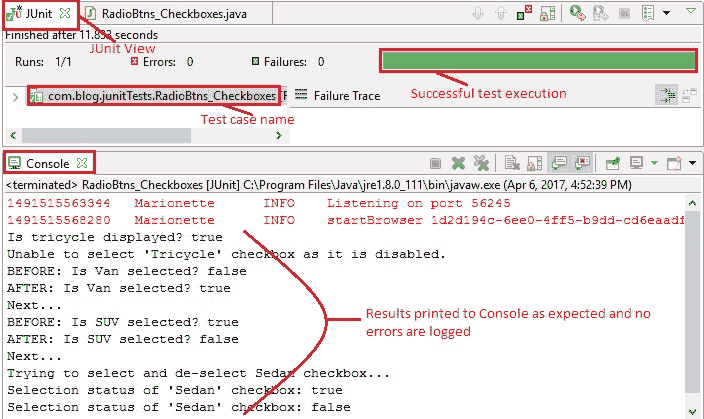
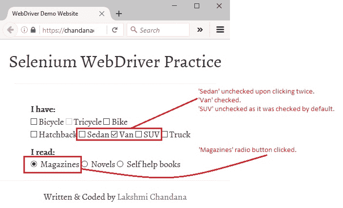

# 9T WebDriver – 处理单选按钮和复选框

> 原文： [https://javabeginnerstutorial.com/selenium/9t-webdriver-handling-radio-buttons-checkboxes/](https://javabeginnerstutorial.com/selenium/9t-webdriver-handling-radio-buttons-checkboxes/)

嗨呀超级巨星！ 我知道您现在是[处理文本框和图像](https://javabeginnerstutorial.com/selenium/9s-webdriver-handling-text-boxes-images/)的专家，但是还有很多东西要学习。 让我们成为铁杆！ 让我们了解如何处理单选按钮，复选框，下拉菜单，表格，警报等，但我们一次只能看到一个。 在本文中，我们将专注于处理单选按钮和复选框。 最后，WebDriver 将使您表现出前所未有的表现力。

*准备开始*

**单选按钮**：在一组单选按钮中，一次只能选择一个。 在 HTML 中，它们使用`<input>`标签表示，并带有`type`属性，称为“`radio`。

**复选框**：在一组复选框中，每个复选框都单独运行，用户可以根据需要选择多个复选框。 在 HTML 中，使用`<input>`标签并将`type`属性称为“`checkbox`”来表示复选框。

现在我们对单选按钮和复选框的工作方式有了一些清晰的了解，让我们使用 Selenium WebDriver 进行一些有趣的操作。

1.  使用各种定位策略定位单选按钮和复选框
2.  检查是否显示单选按钮/复选框【提示：`isDisplayed()`方法】
3.  检查单选按钮/复选框是否已启用，以便可以选择它【提示：`isEnabled()`方法】
4.  检查默认情况下是否选中单选按钮/复选框【提示：`isSelected()`方法】
5.  选择/单击单选按钮或复选框【提示：`click()`】

这五个操作将与[演示站点](https://chandanachaitanya.github.io/selenium-practice-site/)中的示例一起进行说明。 它没有世界上最好的 UI，但目前已达到目的。

## 1.使用各种定位策略定位单选按钮和复选框

是时候再利用[定位策略](https://javabeginnerstutorial.com/selenium/9j-webdriver-locating-elements-1/)的功能了！

**示例**：让我们按 ID 定位“`Bicycle`”复选框，按名称定位“`Tricycle`”复选框，按 xPath 定位“`Sedan`”复选框，并按“`Magazines`”单选按钮定位`cssSelector`。

右键单击所需元素，然后选择检查元素，将给出相应的 HTML 代码，如下所示，

```java
<input id="bicycle-checkbox" type="checkbox" name="vehicle1" value="Bicycle">&nbsp;Bicycle  
<input id="tricycle-checkbox" type="checkbox" name="vehicle2" value="Tricycle" disabled>&nbsp;Tricycle
<input id="sedan-checkbox" type="checkbox" name="vehicle5" value="Sedan">&nbsp;Sedan
<input id="magazines-radio-btn" type="radio" name="books" value="Magazines"> &nbsp;Magazines
```

*代码：*

```java
driver.findElement(By.id("bicycle-checkbox"));
driver.findElement(By.name("vehicle2"));
driver.findElement(By.xpath("//input[@name='vehicle5']"));
driver.findElement(By.cssSelector("input[value='Magazines']"));
```

## 2\. **检查单选按钮/复选框是否显示**

使用 Selenium WebDriver，检查特定的单选按钮或复选框是否按预期显示在网页上是小菜一碟！ 我们有`isDisplayed()`方法来进行救援。 此方法返回一个布尔值（`true` – 元素显示，`false` – 元素不显示）。

**示例**：让我们检查网页上是否显示了“`Tricycle`”复选框。

各自的 HTML 代码供参考，

```java
<input id="tricycle-checkbox" type="checkbox" name="vehicle2" value="Tricycle" disabled>&nbsp;Tricycle
```

*代码：*

```java
driver.findElement(By.name("vehicle2")).isDisplayed();
```

## 3\. **检查单选按钮/复选框是否已启用，以便可以选择它**

同样，为了验证是否启用了特定的单选按钮或复选框，我们有`isEnabled()`方法。 这还会返回一个布尔值（ `true` – 元素已启用，`false` – 元素已禁用）。

**示例**：让我们检查是否启用了“Tricycle”复选框。 如果是的话，让我们检查一下，否则我们只会在控制台上打印一条消息。

Respective HTML code for reference,

```java
<input id="tricycle-checkbox" type="checkbox" name="vehicle2" value="Tricycle" disabled>&nbsp;Tricycle
```

*代码：*

```java
WebElement tricycleCheckbox = driver.findElement(By.name("vehicle2"));
// Check if tricyle is enabled to select
if (tricycleCheckbox.isEnabled()) {
// Click if enabled
	tricycleCheckbox.click();
} else {
	// Print message to console if disabled
	System.out.println("Unable to select 'Tricycle' checkbox as it is disabled.");
}
```

## 4\. **检查默认情况下是否选中单选按钮/复选框**

为了验证默认情况下是否选中了特定的单选按钮或复选框，我们有`isSelected()`方法。 这还会返回一个布尔值（`true` – 元素已选择，`false` – 未选择元素）。

**示例**：让我们检查一下默认情况下是否选中了“杂志”单选按钮。 如果是，请让我们将该消息打印到控制台，否则我们将单击它以选择“杂志”选项。

Respective HTML code for reference,

```java
<input id="magazines-radio-btn" type="radio" name="books" value="Magazines"> &nbsp;Magazines
```

*代码：*

```java
// Locate 'Magazines' radio button using cssSelector
WebElement magazinesRadioBtn = driver.findElement(By
				.cssSelector("input[value='Magazines']"));
// Check if radio button is selected by default
if (magazinesRadioBtn.isSelected()) {
        // Print message to console
	System.out.println("Magazines radio button is selected by default");
} else {
	// Click the radio button
	magazinesRadioBtn.click();
}
```

## 5\. **选择/单击单选按钮或复选框**

您为什么认为 Selenium WebDriver 中有`click()`？ 你懂我！ 选中单选按钮非常容易，对于复选框，可以使用相同的`click()`在选中和取消选中之间切换！

**示例**：让我们选中并取消选中“轿车”复选框。

Respective HTML code for reference,

```java
<input id="sedan-checkbox" type="checkbox" name="vehicle5" value="Sedan">&nbsp;Sedan
```

*代码：*

```java
// Locate 'Sedan' checkbox using xPath: contains() and text()
WebElement sedanCheckbox = driver.findElement(By.xpath("//input[@name='vehicle5']"));
for (int i = 0; i < 2; i++) {
// Click the checkbox
	sedanCheckbox.click();
	// Print current status to console
	System.out.println("Selection status of 'Sedan' checkbox: "
					+ sedanCheckbox.isSelected());
} 
```

此代码将在第一个迭代中选中“轿车”复选框，然后在第二个迭代中取消选中它。 选择状态消息将相应地打印到控制台。

## 概览

让我们来看一个测试案例，该案例实现了迄今为止本文中涵盖的所有操作，

*场景*

1.  打开 Firefox 浏览器。
2.  导航到[演示站点](https://chandanachaitanya.github.io/selenium-practice-site/)
3.  按名称找到“三轮车”复选框
4.  检查是否显示“三轮车”复选框，并将相应消息打印到控制台
5.  检查“三轮车”复选框是否已启用
6.  如果是，请单击复选框，如果否，则将相应消息打印到控制台
7.  根据“货车”和“SUV”复选框的当前选择状态，选中或取消选中并在执行`click()`动作之前和之后打印状态
8.  使用 XPath 找到“轿车”复选框
9.  使用两次迭代在选择状态和取消选择状态之间切换
10.  使用`cssSelector`找到“杂志”单选按钮
11.  检查是否默认选中
12.  如果是，则将相应消息打印到控制台，否则，选择单选按钮
13.  验证 Eclipse IDE 控制台输出屏幕和 JUnit 窗格是否成功

此方案的 JUnit 代码是，

```java
package com.blog.junitTests;

import java.util.List;
import java.util.concurrent.TimeUnit;

import org.junit.After;
import org.junit.Before;
import org.junit.Test;
import org.openqa.selenium.By;
import org.openqa.selenium.WebDriver;
import org.openqa.selenium.WebElement;
import org.openqa.selenium.firefox.FirefoxDriver;

public class RadioBtns_Checkboxes {
    // Declaring variables
    private WebDriver driver;
    private String baseUrl;

    @Before
    public void setUp() throws Exception {
        // Selenium version 3 beta releases require system property set up
        System.setProperty("webdriver.gecko.driver", "E:\\Softwares\\
Selenium\\geckodriver-v0.10.0-win64\\geckodriver.exe");
        // Create a new instance for the class FirefoxDriver
        // that implements WebDriver interface
        driver = new FirefoxDriver();
        // Implicit wait for 5 seconds
        driver.manage().timeouts().implicitlyWait(5, TimeUnit.SECONDS);
        // Assign the URL to be invoked to a String variable
        baseUrl = "https://chandanachaitanya.github.io/selenium-practice-site/";
    }

    @Test
    public void testPageTitle() throws Exception {
        // Open baseUrl in Firefox browser window
        driver.get(baseUrl);

        // Locate 'Tricycle' checkbox using name
        WebElement tricycleCheckbox = driver.findElement(By.name("vehicle2"));
        // Check if tricyle is displayed
        System.out.println("Is tricycle displayed? "+ tricycleCheckbox.isDisplayed());

        // Check if tricyle is enabled to select
        if (tricycleCheckbox.isEnabled()) {
            // Click if enabled
            tricycleCheckbox.click();
        } else {
            // Print message to console if disabled
            System.out.println("Unable to select 'Tricycle' checkbox as it is disabled.");
        }

        //Get all checkbox elements in a list
        List<WebElement> list = driver.findElements(By
                .cssSelector("input[type='checkbox']"));

        // Loops through all checkboxe elements
        for (int i = 0; i < list.size(); i++) {
            // Checking if the checkbox is a 'Van' or 'SUV'
            if ((list.get(i).getAttribute("value").trim()
                    .equalsIgnoreCase("van"))
                    || (list.get(i).getAttribute("value").trim()
                            .equalsIgnoreCase("suv"))) {
                // Print selection status to console
                System.out.println("BEFORE: Is "
                        + list.get(i).getAttribute("value") + " selected? "
                        + list.get(i).isSelected());
                // Check if the checkbox is selected
                if (!(list.get(i).isSelected())) {
                    // Click the checkbox
                    list.get(i).click();
                    System.out.println("AFTER: Is "
                            + list.get(i).getAttribute("value") + " selected? "
                            + list.get(i).isSelected());
                } else {
                    // Uncheck the checkbox
                    list.get(i).click();
                    System.out.println("AFTER: Is "
                            + list.get(i).getAttribute("value") + " selected? "
                            + list.get(i).isSelected());
                }
                System.out.println("Next...");
            }
        }
        // Locate 'Sedan' checkbox using xPath
        WebElement sedanCheckbox = driver.findElement(By
                .xpath("//input[@name='vehicle5']"));
        System.out.println("Trying to select and de-select Sedan checkbox...");
        for (int i = 0; i < 2; i++) {
            // Click the checkbox
            sedanCheckbox.click();
            // Print current status to console
            System.out.println("Selection status of 'Sedan' checkbox: "
                    + sedanCheckbox.isSelected());
        }
        // Locate 'Magazines' radio button using cssSelector
        WebElement magazinesRadioBtn = driver.findElement(By
                .cssSelector("input[value='Magazines']"));
        // Check if radio button is selected by default
        if (magazinesRadioBtn.isSelected()) {
            // Print message to console
            System.out.println("Magazines radio button is selected by default");
        } else {
            // Click the radio button
            magazinesRadioBtn.click();
        }

    } //End of @Test

    @After
    public void tearDown() throws Exception {
        // Close the Firefox browser
        driver.close();
    }
}
```

*执行结果：*

除一个片段外，部分代码将作为本文讨论的每种技术的一部分进行解释。

所有类型为复选框的 Web 元素均在列表中获得，

```java
//Get all checkbox elements in a list
List<WebElement> list = driver.findElements(By.cssSelector("input[type='checkbox']")); 
```

如果列表中的所有复选框元素的属性值均与“范”和“SUV”相匹配，则将对其进行验证。 他们的当前选择状态被打印到控制台作为一条消息，提示“之前”。

```java
// Loops through all checkboxe elements
for (int i = 0; i < list.size(); i++) {
	// Checking if the checkbox is a 'Van' or 'SUV'
	if ((list.get(i).getAttribute("value").trim().equalsIgnoreCase("van"))
||(list.get(i).getAttribute("value").trim().equalsIgnoreCase("suv"))) 
{
		// Print selection status to console
		System.out.println("BEFORE: Is "
			+ list.get(i).getAttribute("value") + " selected? "
				+ list.get(i).isSelected()); 
```

使用`isSelected()`方法，检查是否已选中“货车”或“SUV”复选框。 如果未选中复选框，则将其选中，然后将其选择状态打印到控制台，显示“之后”。 如果已经选择了它们，然后再次单击以取消选择它们并将相应的消息打印到控制台。

```java
// Check if the checkbox is selected
if (!(list.get(i).isSelected())) {
// Click the checkbox								         list.get(i).click();
System.out.println("AFTER: Is "+ list.get(i).getAttribute("value") + " selected? "+ list.get(i).isSelected());
} else {
	// Uncheck the checkbox
	list.get(i).click();
	System.out.println("AFTER: Is "+ list.get(i).getAttribute("value") + " selected? "+ list.get(i).isSelected());
			}
	System.out.println("Next...");
	}
}
```

在 JUnit 窗口中，绿色条显示测试用例已成功执行。 控制台窗口显示没有任何错误。 它还按预期显示所有打印的消息。



下图显示了成功执行测试脚本后获得的 Firefox 输出。



是时候尝试今天的技能了。 是的，戴上安全帽，以免遇到任何异常！

再见。 祝你有美好的一天！

