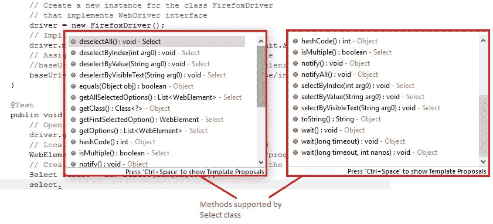
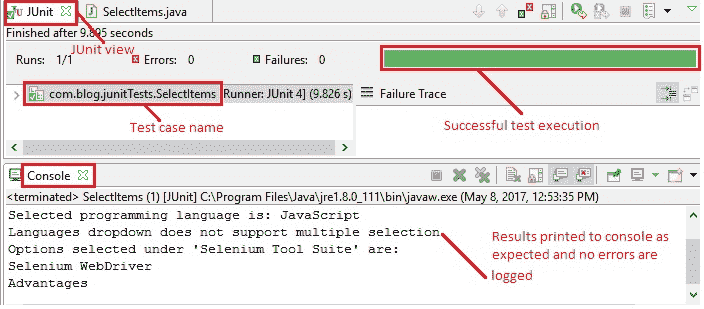
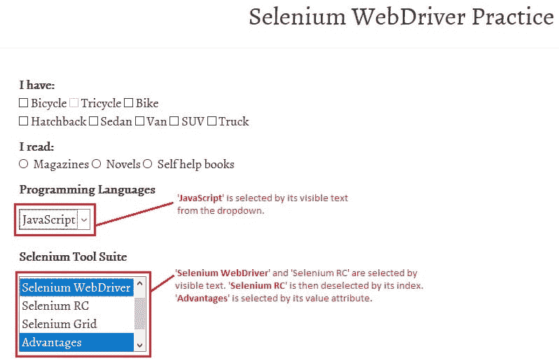

# 9U WebDriver – 通过两种方式选择项目（下拉菜单和多项选择）

> 原文： [https://javabeginnerstutorial.com/selenium/9u-webdriver-select-items-two-ways/](https://javabeginnerstutorial.com/selenium/9u-webdriver-select-items-two-ways/)

嗨呀摇滚明星（虽然不包括吉他和音乐）！ 在本文中，我们将深入研究下拉菜单以及如何以两种方式选择项目。 是的，我们还讨论了多个选择！ 所有概念都将与[演示站点](https://chandanachaitanya.github.io/selenium-practice-site/)中的示例一起进行说明。

# 方法 1：

使用可用定位策略之一使用相同年代的传统元素定位方法。 首先，我们找到下拉列表元素，然后找到需要选择的项目。 由于选项没有唯一的标识符，因此这并不困难。

**示例**：让我们通过 ID 查找“编程语言”下拉列表。 要从可用的下拉菜单中找到“C++”，我们将必须找到标记名称为“`options`”的所有元素，并将其放在列表中。 遍历列表，或者如果知道其索引，则相应地检索元素并执行单击操作。

右键单击所需元素，然后选择检查元素，将给出相应的 HTML 代码，如下所示，

```java
<select id="programming-languages" class="input-xlarge" name="languages">
			<option value="Java">Java</option>
			<option value="C++">C++</option>
```

*代码：*

```java
// Locate 'Programming Languages' dropdown using id
WebElement progLanguages = driver.findElement(By.id("programming-languages"));
//Get all options in a list
List<WebElement> options = progLanguages.findElements(By.tagName("option"));
//Iterate thorough options
for (WebElement option : options) {
	if("C++".equals(option.getText()))
	option.click();
} 
```

（或者）

```java
WebElement progLanguages = driver.findElement(By.id("programming-languages"));
List<WebElement> options = progLanguages.findElements(By.tagName("option"));
//Selecting “C++” based on its index
options.get(1).click();
```

0、1、2、3 是下拉列表的索引值。

# 方法 2：使用`Select`类。

让我们深入研究并了解`Select`类的工作原理，并看一下它是否具有魔力。 以及为什么您首先要使用它？

使用方法 1 具有主要缺点。 由于没有唯一标识符，因此选择特定选项变得非常困难。 另外，要选择多个选项，请取消选择特定的项目，这会变得很复杂。 Selenium Webdriver 再次为我们解救！ 它为`Select`类提供了预定义的方法，专门用于处理下拉菜单和多选方案。

**步骤 1**：该选择类在“`org.openqa.selenium.support.ui.Select`”包中可用。 因此，必须将此包导入我们的测试脚本中。

```java
import org.openqa.selenium.support.ui.Select;
```

**步骤 2**：通过传递所需的下拉标识符为`Select`类创建一个实例。

```java
Select languages = new Select(driver.findElement(By.id("element_ID")));
```

可以使用前面讨论的任何定位策略（<https://javabeginnerstutorial.com/selenium/9j-webdriver-locating-elements-1/>）来定位下拉列表。

**步骤 3**：找到下拉 Web 元素并创建`Select`类的对象后，就可以访问其所有方法来执行选择和取消选择。

**注意：**

*`Select`类仅适用于具有`<select>`标签的 Web 元素。*

下面是`Select`类中所有可用方法的快照。



这里有很多要讨论和讨论的要点。 让我们通过示例和代码片段介绍一些常用的方法。

**注意：**

*如果找不到匹配的选项，则所有`select`和`deselect`方法可能会碰到`NoSuchElementException`。*

### 1\. `selectByVisibleText(String arg0)`和`deselectByVisibleText(String arg0)`

这些方法选择和取消选择一个显示的文本与传递的`String`参数完全匹配的选项。

**语法**：`selectObject.selectByVisibleText("displayed_option_text")`

`selectObject.deselectByVisibleText("displayed_option_text")`

**示例**：让我们从“编程语言”下拉菜单中选择“JavaScript”。

*代码：*（选择）

```java
// Locate 'Programming Languages' dropdown using id
WebElement languagesDD = driver.findElement(By.id("programming-languages"));
// Create an instance of 'Select' class by passing the dropdown web element
Select languages = new Select(languagesDD);
// Select 'JavaScript' language by its visible text
languages.selectByVisibleText("JavaScript");
```

（取消选择）

```java
languages.deselectByVisibleText("JavaScript");
```

### 2\. `selectByValue(String arg0)`和`deselectByValue(String arg0)`

这些方法选择和取消选择其`value`属性与传递的`String`参数匹配的选项。

**语法**：`selectObject.selectByValue("value_attribute_text")`

`selectObject.deselectByValue("value_attribute_text")`

**示例**：让我们从 Selenium 工具套件多选选项中选择“Selenium RC”。

右键单击所需的 Web 元素，然后选择检视元素，将给出相应的 HTML 代码，如下所示，

```java
<select id="selenium_suite" multiple="multiple" name="selenium_suite">
	<option value="IDE">Selenium IDE</option>
	<option value="WebDriver">Selenium WebDriver</option>
	<option value="RC">Selenium RC</option> 
```

`value`属性的值“`RC`”将作为参数传递给`selectByValue`方法。

*代码：*

```java
multiSelect.selectByValue("RC");
```

### 3\. `selectByIndex(int arg0)`和`deselectByIndex(int arg0)`

这些方法选择和取消选择指定索引值处的选项。 重要的是要注意，索引值始终以零开头。

**语法**：`selectObject.selectByIndex("option_index");`

`selectObject.deselectByIndex("option_index");`

**示例**：让我们从 Selenium 工具腰间多选选项中取消选择“Selenium RC”。

基于 HTML 代码，Selenium IDE 的索引为 0，Selenium WebDriver 的索引为 1，Selenium RC 的索引为 2。

*代码：*

```java
multiSelect.deselectByIndex(2);
```

### 4\. `deselectAll()`

此方法清除选择。 没有传递参数。

**注意：**

*此方法仅适用于多选方案，即`<select>`标签应具有值为“`multiple`”的`multi`属性。 否则抛出`NotImplementedError`。*

**语法**：`selectObject.deselectAll()`

**示例**：让我们取消选择在 Selenium 工具套件多重选择框中选择的所有选项。

*代码：*

```java
multiSelect.deselectAll();
```

### 5\. `isMultiple()`

当您想知道 Web 元素是否允许多选时，此方法很方便。 它返回`true`或`false`。 没有传递参数。

**语法**：`selectObject.isMultiple()`

### 6\. `getOptions()`

此方法作为 Web 元素返回在多重选择框中可用的所有选项的列表。

**语法**：`selectObject.getOptions()`

*代码：*

```java
List<WebElement> allOptions = multiSelect.getOptions();
```

### 7\. `getFirstSelectedOption()`

此方法在多重选择框中返回第一个选定的选项。 如果在仅允许单个选择的下拉菜单中使用此选项，则将所选选项作为 Web 元素返回。

**语法**：`selectObject.getFirstSelectedOption().getText()`

这将返回所选的选项文本。

### 8\. `getAllSelectedOptions()`

此方法返回作为多选框的一部分而被选择为 Web 元素的所有选项的列表。

**语法**：`selectObject.getAllSelectedOptions()`

*代码：*

```java
List<WebElement> allSelectedOptions = multiSelect.getAllSelectedOptions();
```

## 概览

让我们来看一个测试案例，该案例实现了迄今为止本文中涵盖的所有操作，

*场景*

1.  打开 Firefox 浏览器
2.  导航到[演示站点](https://chandanachaitanya.github.io/selenium-practice-site/)
3.  使用 ID 找到“编程语言”下拉菜单
4.  为`Select`类创建一个对象
5.  通过可见的文本选择“JavaScript”语言
6.  将选定的选项打印到控制台
7.  检查“编程语言”下拉列表是否支持多项选择并将相应消息打印到控制台
8.  使用名称找到“Selenium Tool Suite”多选框
9.  使用多选 Web 元素创建`Select`类的实例
10.  根据其值选择“Selenium RC”和“优势”
11.  通过索引取消选择“Selenium RC”
12.  通过可见的文本选择“Selenium WebDriver”
13.  在列表中获取所有选定的选项，并将它们打印到控制台
14.  验证 Eclipse IDE 控制台输出屏幕和 JUnit 窗格是否成功

此方案的 JUnit 代码是，

```java
package com.blog.junitTests;
import java.util.List;
import java.util.concurrent.TimeUnit;

import org.junit.After;
import org.junit.Before;
import org.junit.Test;
import org.openqa.selenium.By;
import org.openqa.selenium.WebDriver;
import org.openqa.selenium.WebElement;
import org.openqa.selenium.firefox.FirefoxDriver;
import org.openqa.selenium.support.ui.Select;

public class SelectItems {
	// Declaring variables
	private WebDriver driver;
	private String baseUrl;

	@Before
	public void setUp() throws Exception {
		// Selenium version 3 beta releases require system property set up
		System.setProperty("webdriver.gecko.driver", "E:\\ Softwares\\"
			+ "Selenium\\geckodriver-v0.10.0-win64\\geckodriver.exe");
		// Create a new instance for the class FirefoxDriver
		// that implements WebDriver interface
		driver = new FirefoxDriver();
		// Implicit wait for 5 seconds
		driver.manage().timeouts().implicitlyWait(5, TimeUnit.SECONDS);
		// Assign the URL to be invoked to a String variable
		// baseUrl = "https://chandanachaitanya.github.io/selenium-practice-site/";
		baseUrl = "file:///E:/Chandu/My%20Blog/githubDemoSite/index.html";
	}

	@Test
	public void testPageTitle() throws Exception {
		// Open baseUrl in Firefox browser window
		driver.get(baseUrl);

		// Locate 'Programming Languages' dropdown using id
		WebElement languagesDD = driver.findElement(By.id("programming-languages"));
		// Create an instance of 'Select' class by passing the dropdown web element
		Select languages = new Select(languagesDD);
		// Select 'JavaScript' language by its visible text
		languages.selectByVisibleText("JavaScript");
		// Prints the selected option to console
		System.out.println("Selected programming language is: " + languages.getFirstSelectedOption().getText());
		// Check if languages dropdown supports multiple selection and print the result to console
		if(languages.isMultiple()){
			System.out.println("Languages dropdown supports multiple selection");
		}else {
			System.out.println("Languages dropdown does not support multiple selection");
		}

		// Locate multi select element using name
		WebElement toolSuite = driver.findElement(By.name("selenium_suite"));
		// Create an instance of 'Select' class by passing the multi select element
		Select multiSelect = new Select(toolSuite);
		// Select 'Selenium RC' by its value
		multiSelect.selectByValue("RC");
		// Select 'Advantages' by its value
		multiSelect.selectByValue("Adv");
		// De-select 'Selenium RC' by its index
		multiSelect.deselectByIndex(2);
		// Select "Selenium WebDriver" by its visible text
		multiSelect.selectByVisibleText("Selenium WebDriver");
		// Get all selected options in a list
		List<WebElement> suiteItems = multiSelect.getAllSelectedOptions();
		// Prints all selected options
		System.out.println("Options selected  under 'Selenium Tool Suite' are:");
		for (WebElement option : suiteItems) {
			System.out.println(option.getText());
		}

	} // End of @Test

	@After
	public void tearDown() throws Exception {
		// Close the Firefox browser
		driver.close();
	}
}
```

*执行结果：*

每行代码都带有不言自明的注释，并且部分代码作为帖子中涉及的每个概念的一部分进行了说明。

在 JUnit 窗口中，绿色条显示测试用例已成功执行。 控制台窗口显示没有任何错误。 它还按预期显示所有打印的消息。



下图显示了成功执行测试脚本后获得的 Firefox 输出。



这个概念并不难缠您的头。 因此，开始大量练习。 我很快会在另一篇文章中再见。 祝你有美好的一天！

