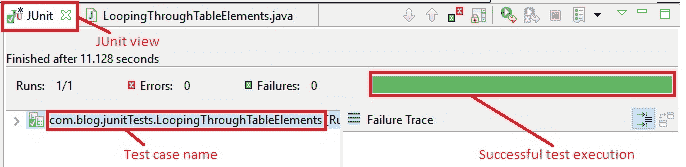
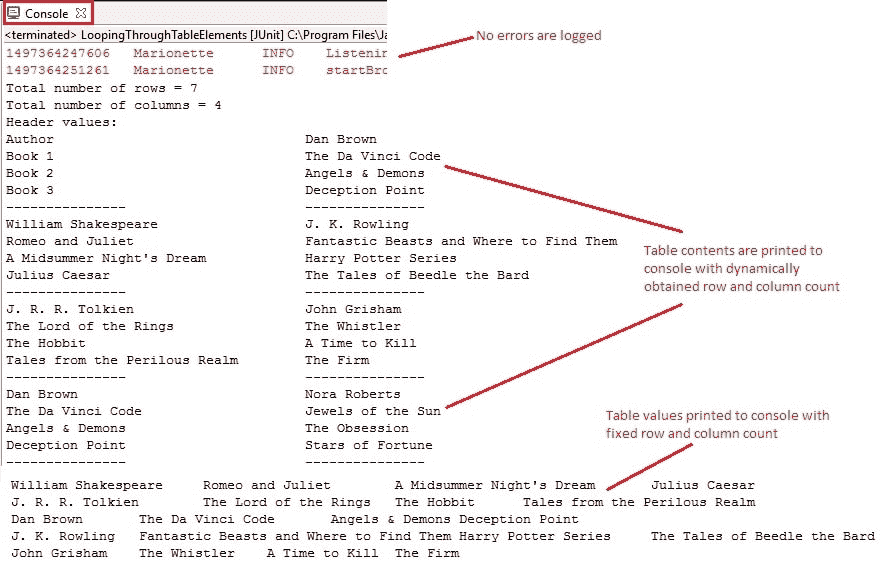

# 9W WebDriver – 遍历表元素

> 原文： [https://javabeginnerstutorial.com/selenium/9w-webdriver-looping-table-elements/](https://javabeginnerstutorial.com/selenium/9w-webdriver-looping-table-elements/)

欢迎回来，勇士们！ 我们刚刚看到了如何检查使用和不使用 XPath 的表的特定单元格中是否存在特定的[数据](https://javabeginnerstutorial.com/selenium/9v-webdriver-handling-tables-two-ways/)。 是时候遍历每个元素并可视化 Selenium WebDriver 的功能了。 让我们回到我们的[演示站点](https://chandanachaitanya.github.io/selenium-practice-site/)并关注“**书籍&作者”**表以了解这一概念。

## 步骤 1：

使用其 ID “`BooksAuthorsTable`”找到“图书&作者”表。 HTML 代码如下：

```java
<table id="BooksAuthorsTable" class="table table-bordered">
```

*代码：*

```java
WebElement BooksTable = driver.findElement(By.id("BooksAuthorsTable"));
```

## 步骤 2：

**使用 XPath 计算行和列的总数**。

让我们使用绝对 XPath 查找总行数。 请注意，XPath 以标签名称“`tr`”结尾。 `size()`方法给出使用 XPath 由`findElements()`返回的元素数。

*代码：*

```java
int rowNum = driver.findElements(By.xpath("/html/body/form/div[5]/div/div/table/tbody/tr")).size();
```

让我们稍微切换一下齿轮，并使用相对 XPath 查找总列数。

*代码：*

```java
int colNum = driver.findElements(By.xpath("//table[@id='BooksAuthorsTable']/tbody/tr[1]/th")).size();
```

这种查找行和列总数的方法在表的行和列动态变化的情况下很有用。

## 步骤 3：

**遍历表元素**

如果表的行和列号固定为，那么遍历每个表元素将变得非常容易。 可以使用两个`for()`循环，一个用于行，另一个用于访问列值。

*代码：*

```java
for(int i=2; i<=6; i++){
for(int j=1; j<=4; j++){
	System.out.print(driver.findElement(By.
xpath("//table[@id='BooksAuthorsTable']/tbody/tr[" + i +"]/td[" + j + "]")).getText() + "\t");
	}
	System.out.println("");
}
```

有一天，如果幸运的话，您可能会偶然发现一个表，该表在每次页面刷新时都会动态加载，因此行数通常会有所不同。 因此，每执行一次测试便要计算行数。

首先，让我们获取所有标签名称为“”的元素，并将它们放在名为“`rowVals`”的列表中。

```java
List<WebElement> rowVals = BooksTable.findElements(By.tagName("tr"));
```

要从第一行获取标头元素，请找到所有标签名称为“`th`”的元素，并将其放在名为“`colHeader`”的列表中。

```java
List<WebElement> colHeader = rowVals.get(0).findElements(By.tagName("th"));
```

要将每个标题文本打印到控制台，请遍历`colHeader`列表中的标题值并使用`getText()`方法。

```java
for(int i=0; i<colHeader.size(); i++){
System.out.println(colHeader.get(i).getText());
}
```

要将表内容打印到控制台，请遍历每一行。 对于每一行，遍历每一列，并使用相同的`getText()`方法打印值。

```java
for(int i=1; i<rowNum; i++){
List<WebElement> colVals = rowVals.get(i).findElements(By.tagName("td"));
for(int j=0; j<colNum; j++){
		System.out.println(colVals.get(j).getText());
	}
}
```

您有能力集中精力下坡吗？ 如果是，让我们看看 BrainBell！

**BrainBell – 可视化！** *我们大多数人都知道，为我们希望记住的概念创建心理图片比单词更清晰，更容易记住。 我们不知道或做的是仔细观察它几秒钟。 这将有助于轻松调用它。*

话虽如此，让我们看一下到目前为止讨论的整体情况！

### 场景

1.  打开 Firefox 浏览器
2.  导航到[演示站点](https://chandanachaitanya.github.io/selenium-practice-site/)
3.  使用 ID 定位“图书&作者”表
4.  使用绝对 XPath 获取总行数
5.  使用相对 XPath 获取总列数
6.  将行数和列数打印到控制台
7.  通过标签名称“`tr`”获取所有行值
8.  通过标签名称“`th`”获取列表中的列标题值
9.  循环浏览标题值并将其打印到控制台
10.  遍历表内容（每一行的所有列）并获取其文本
11.  将值打印到控制台
12.  使用固定的行号和列号将表内容打印到控制台

此方案的 JUnit 代码是，

```java
package com.blog.junitTests;

import java.util.List;
import java.util.concurrent.TimeUnit;

import org.junit.After;
import org.junit.Before;
import org.junit.Test;
import org.openqa.selenium.By;
import org.openqa.selenium.WebDriver;
import org.openqa.selenium.WebElement;
import org.openqa.selenium.firefox.FirefoxDriver;

public class LoopingThroughTableElements {
	// Declaring variables
		private WebDriver driver;
		private String baseUrl;

		@Before
		public void setUp() throws Exception {
			// Selenium version 3 beta releases require system property set up
			System.setProperty("webdriver.gecko.driver", "E:\\Softwares\\"Selenium\\geckodriver-v0.10.0-win64\\geckodriver.exe");
			// Create a new instance for the class FirefoxDriver
			// that implements WebDriver interface
			driver = new FirefoxDriver();
			// Implicit wait for 5 seconds
			driver.manage().timeouts().implicitlyWait(5, TimeUnit.SECONDS);
			// Assign the URL to be invoked to a String variable
			baseUrl = " https://chandanachaitanya.github.io/selenium-practice-site/";
		}

		@Test
		public void testPageTitle() throws Exception {
			// Open baseUrl in Firefox browser window
			driver.get(baseUrl);

			// Locate 'Books & Authors' table using id
			WebElement BooksTable = driver.findElement(By.id("BooksAuthorsTable"));
			//Get all web elements by tag name 'tr'
			List<WebElement> rowVals = BooksTable.findElements(By.tagName("tr"));

			//Get number of rows and columns
			//using absoulute xpath
			int rowNum = driver.findElements(By.xpath("/html/body/form/div[5]/div/div/table/tbody/tr")).size();
			//using relative xpath
			int colNum = driver.findElements(By.xpath("//table[@id='BooksAuthorsTable']/tbody/tr[1]/th")).size();
			System.out.println("Total number of rows = " + rowNum);
			System.out.println("Total number of columns = " + colNum);

			//Get column header values from first row
			List<WebElement> colHeader = rowVals.get(0).findElements(By.tagName("th"));
			//Loop through the header values and print them to console
			System.out.println("Header values:");
			for(int i=0; i<colHeader.size(); i++){
				System.out.println(colHeader.get(i).getText());
			}
			System.out.println("---------------");
			//Loop through the remaining rows
			for(int i=1; i<rowNum; i++){
				//Get each row's column values by tag name
				List<WebElement> colVals = rowVals.get(i).findElements(By.tagName("td"));
				//Loop through each column
				for(int j=0; j<colNum; j++){
					//Print the coulumn values to console
					System.out.println(colVals.get(j).getText());
				}
				//Just a separator for each row
				System.out.println("---------------");
			}			

			//Printing table contents to console for fixed row and column numbers
			for(int i=2; i<=6; i++){
				for(int j=1; j<=4; j++){
					System.out.print(driver.findElement(By.
							xpath("//table[@id='BooksAuthorsTable']/tbody/tr[" + i +"]/td[" + j + "]")).getText() + "\t");
				}
				System.out.println("");
			}

		} //End of @Test

		@After
		public void tearDown() throws Exception {
			// Close the Firefox browser
			driver.close();
		}
	} 
```

### 执行结果：

到目前为止，每行代码都作为概念的一部分进行了很好的解释。

注意到 Eclipse IDE 的 JUnit 视图后，绿色条显示测试用例已成功执行。



控制台窗口显示没有任何错误。 它还按预期显示固定和动态计算的行数和列数的打印表内容。



希望我总是给你一些东西来思考！ 稍后再见。

祝你今天愉快！

