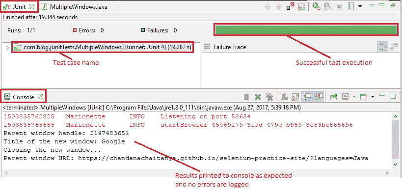

# 9Y WebDriver – 处理多个窗口

> 原文： [https://javabeginnerstutorial.com/selenium/9y-webdriver-handling-multiple-windows/](https://javabeginnerstutorial.com/selenium/9y-webdriver-handling-multiple-windows/)

大家好！ 测试涉及多个窗口的工作流已成为生活的一部分。 借助 Selenium WebDriver，在这些打开的窗口之间进行平滑切换已成为小菜一碟。 如果您像我一样，那么您可能会急切希望看到所有这些在我们的代码中如何真正起作用。 因此，让我们继续深入探讨吧……

每当实例化一个新的 WebDriver 对象时，就会向每个打开的唯一窗口分配一个唯一的字母数字 ID。 这个独特的 ID 被称为“窗口句柄”- 这是 *Selenium Ville* 拥挤的街道上的另一个新名词。 因此，使用这些唯一的 ID，我们可以轻松地在窗口之间切换控件并执行所需的活动。

1\. `String getWindowHandle()`：

此方法用于获取当前窗口的窗口句柄。

*语法：*

```java
// Get current window handle
String parentWinHandle = driver.getWindowHandle();
```

2\. `Set<String> getWindowHandles()`：

此方法用于获取`Set`中所有打开的窗口的窗口句柄。

*语法*：

```java
// Get the window handles of all open windows
Set<String> winHandles = driver.getWindowHandles();
```

可以使用分配给每个打开的窗口的唯一句柄的引用，使用相同的`switchTo()`方法从一个窗口切换到另一窗口。 为了更好地了解`switchTo()`，[请单击此处](https://javabeginnerstutorial.com/selenium/9x-webdriver-handling-alerts-popup-box/)。
。
## 场景

让我们看一个实现这些方法的测试案例，以更深入地了解这些概念，

1.  打开 Firefox 浏览器
2.  导航到[演示站点](https://chandanachaitanya.github.io/selenium-practice-site/)
3.  获取当前的窗口句柄并将其打印到控制台
4.  使用 ID 找到“点击以打开新的浏览器窗口！”按钮
5.  点击按钮打开新窗口
6.  获取两个打开的窗口的窗口句柄
7.  通过两个句柄循环
8.  切换到带有句柄参考的新窗口
9.  获取标题并将其打印到控制台
10.  关闭新窗口
11.  将控件切换回父窗口，然后将 URL 打印到控制台
12.  验证 Eclipse IDE 控制台输出屏幕和 JUnit 窗格是否成功

此方案的 JUnit 代码是，

```java
package com.blog.junitTests;

import java.util.Set;
import java.util.concurrent.TimeUnit;

import org.junit.After;
import org.junit.Before;
import org.junit.Test;
import org.openqa.selenium.By;
import org.openqa.selenium.WebDriver;
import org.openqa.selenium.WebElement;
import org.openqa.selenium.firefox.FirefoxDriver;

public class MultipleWindows {
    // Declaring variables
    private WebDriver driver;
    private String baseUrl;

    @Before
    public void setUp() throws Exception {
        // Selenium version 3 beta releases require system property set up
        System.setProperty("webdriver.gecko.driver", "E:\\Softwares\\"
                + "Selenium\\geckodriver-v0.10.0-win64\\geckodriver.exe");
        // Create a new instance for the class FirefoxDriver
        // that implements WebDriver interface
        driver = new FirefoxDriver();
        // Implicit wait for 5 seconds
        driver.manage().timeouts().implicitlyWait(5, TimeUnit.SECONDS);
        // Assign the URL to be invoked to a String variable
        baseUrl = "https://chandanachaitanya.github.io/selenium-practice-site/";
    }

    @Test
    public void testPageTitle() throws Exception {
        // Open baseUrl in Firefox browser window
        driver.get(baseUrl);

        // Get current window handle
        String parentWinHandle = driver.getWindowHandle();
        System.out.println("Parent window handle: " + parentWinHandle);
        // Locate 'Click to open a new browser window!' button using id
        WebElement newWindowBtn = driver.findElement(By.id("win1"));
        // Click the button to open a new window
        newWindowBtn.click();
        // Get the window handles of all open windows
        Set<String> winHandles = driver.getWindowHandles();
        // Loop through all handles
        for(String handle: winHandles){
            if(!handle.equals(parentWinHandle)){
            driver.switchTo().window(handle);
            Thread.sleep(1000);
            System.out.println("Title of the new window: " +
driver.getTitle());
            System.out.println("Closing the new window...");
            driver.close();
            }
        }
        // Switching the control back to parent window
        driver.switchTo().window(parentWinHandle);
        // Print the URL to the console
        System.out.println("Parent window URL: " + driver.getCurrentUrl());

    } // End of @Test

    @After
    public void tearDown() throws Exception {
        // Close the Firefox browser
        driver.close();
    }
}
```

*执行结果：*

代码是不言自明的，因为同时提供了注释。

在“Eclipse IDE 中 -> JUnit 窗格 -> 绿色条”显示测试用例已成功执行。 控制台窗口显示没有任何错误。 它还按预期显示所有打印的消息。



有了这个，我很快就会在另一篇文章中见。 祝你有美好的一天！
