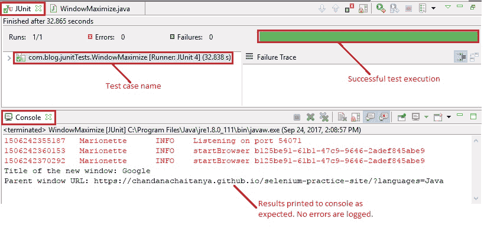

# 9Z WebDriver – 最大化窗口

> 原文： [https://javabeginnerstutorial.com/selenium/9z-webdriver-window-maximize/](https://javabeginnerstutorial.com/selenium/9z-webdriver-window-maximize/)

嗨冠军！ 事情并非总是以我们希望的方式运作，这就是挑战的形式。 使用 Selenium Webdriver，我们的测试工作变得比我们期望的要容易得多。 一种这样的情况是最大化浏览器窗口。

屏幕截图可以节省生命，为了在抓取时查看所有 Web 元素，最大化浏览器窗口非常重要。 因此，与其向下滚动到特定元素，不如最大化窗口并完成手头的任务。

```java
// Maximize the new window
driver.manage().window().maximize();
```

你相信吗？ 这一条线就是您想要的！ 很难消化？ 别担心。 让我们看一个示例，看看这段代码的实际效果。

## 场景

1.  打开 Firefox 浏览器
2.  导航到[演示站点](https://chandanachaitanya.github.io/selenium-practice-site/)
3.  获取当前的窗口句柄
4.  使用 ID 定位“单击以打开一个小窗口！”按钮
5.  点击按钮打开小窗口
6.  获取两个打开的窗口的窗口句柄
7.  通过两个句柄循环
8.  切换到带有句柄参考的新窗口
9.  获取标题并将其打印到控制台
10.  将小窗口最大化到全屏尺寸
11.  关闭新窗口
12.  将控件切换回父窗口，然后将 URL 打印到控制台
13.  验证 Eclipse IDE 控制台输出屏幕和 JUnit 窗格是否成功

此方案的 JUnit 代码是，

```java
package com.blog.junitTests;

import java.util.Set;
import java.util.concurrent.TimeUnit;
import org.junit.After;
import org.junit.Before;
import org.junit.Test;
import org.openqa.selenium.By;
import org.openqa.selenium.WebDriver;
import org.openqa.selenium.WebElement;
import org.openqa.selenium.firefox.FirefoxDriver;

public class WindowMaximize {
    // Declaring variables
    private WebDriver driver;
    private String baseUrl;

    @Before
    public void setUp() throws Exception {
        // Selenium version 3 beta releases require system property set up
        System.setProperty("webdriver.gecko.driver", "E:\\Softwares\\"
                + "Selenium\\geckodriver-v0.10.0-win64\\geckodriver.exe");
        // Create a new instance for the class FirefoxDriver
        // that implements WebDriver interface
        driver = new FirefoxDriver();
        // Implicit wait for 5 seconds
        driver.manage().timeouts().implicitlyWait(5, TimeUnit.SECONDS);
        // Assign the URL to be invoked to a String variable
        baseUrl = "https://chandanachaitanya.github.io/selenium-practice-site/";
    }

    @Test
    public void testPageTitle() throws Exception {
        // Open baseUrl in Firefox browser window
        driver.get(baseUrl);        
        // Get current window handle
        String parentWinHandle = driver.getWindowHandle();
        // Locate 'Click to open a small window!' button using id
        WebElement newWindowBtn = driver.findElement(By.id("win2"));
        // Click the button to open a new window
        newWindowBtn.click();
        // Get the window handles of all open windows
        Set<String> winHandles = driver.getWindowHandles();
        // Loop through all handles
        for (String handle : winHandles) {
            if (!handle.equals(parentWinHandle)) {
                driver.switchTo().window(handle);
                System.out.println("Title of the new window: " + driver.getTitle());
                // Maximize the new window
                driver.manage().window().maximize();
                driver.close();
            }
        }
        // Switching the control back to parent window
        driver.switchTo().window(parentWinHandle);
        // Print the URL to the console
        System.out.println("Parent window URL: " + driver.getCurrentUrl());

    } // End of @Test
```

## 执行结果：

清晰的注释使代码不言自明。

在“Eclipse IDE 中 -> JUnit 窗格 -> 绿色条”显示测试用例已成功执行。 控制台窗口显示没有任何错误。 它还按预期显示所有打印的消息。



如有任何疑问，请不要在评论部分大喊大叫！

我很快会在另一篇文章中再见。 祝你有美好的一天！
