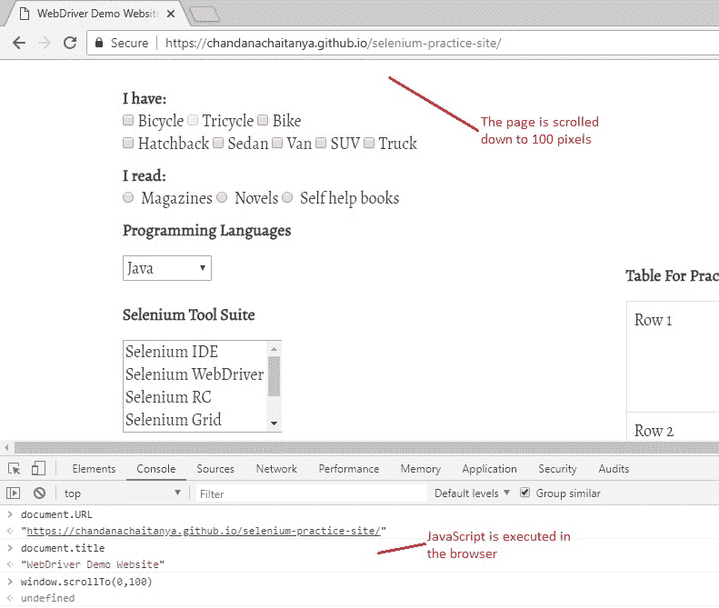
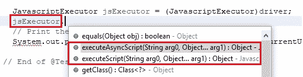
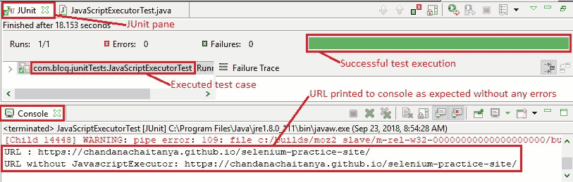

# 9aa。 WebDriver – 执行 JavaScript 代码

> 原文： [https://javabeginnerstutorial.com/selenium/9aa-webdriver-executing-javascript-code/](https://javabeginnerstutorial.com/selenium/9aa-webdriver-executing-javascript-code/)

嗨冠军！ 今天就与浏览器进行一些高质量的互动！！ 因此，您能猜出浏览器首选的语言吗？ 是的，你说对了。 确实是 **JavaScript** 。 如果您使用的是 Chrome，则单击“F12”将打开“开发人员工具”，这有助于我们直接从浏览器执行 JavaScript。 某些动作（例如滚动，显示警报等）变得更易于使用 JavaScript 进行管理。

<noscript>
除此之外，在其他情况下，我们可能找不到合适的 Selenium API 来执行特定操作。 但是我们可以通过执行 JavaScript 代码来执行该操作。 Selenium WebDriver 提供了一个界面，可以帮助我们做到这一点！

<strong> JavascriptExecutor </strong>…您听说过，就像那些名人一样。 好吧，现在是我们该去见那颗璀璨的星星的时候了。 JavascriptExecutor 不需要添加任何外部 JAR 文件或插件。 只需导入一个包即可完成工作，“导入<strong> org.openqa.selenium.JavascriptExecutor” </strong>。 它有两种重要的方法可以执行我们的 Selenium 测试中的 JavaScript 代码，以自动化测试中的应用，即
<li><strong> executeScript </strong>（脚本，参数）</li><li><strong> executeAsyncScript </strong>（脚本，参数）</li>

<noscript>
让我们通过几个简单的步骤来理解这一点。
<h2><strong>步骤 1：</strong></h2>
导入以下包，<code data-enlighter-language="java">import org.openqa.selenium.JavascriptExecutor;</code>

创建一个 JavascriptExecutor 对象，并通过将其类型转换为 JavascriptExecutor 来分配驱动程序对象。
<pre><code class="language-java">// Typecast driver to JavascriptExecutor JavascriptExecutor jsExecutor = (JavascriptExecutor)driver;</code></pre><h2><strong>步骤 2：</strong></h2>
这样创建的 JavascriptExecutor 对象允许我们从 Selenium 测试中执行 JavaScript 代码。
<pre><code class="language-java">// Scroll down by 100 pixels jsExecutor.executeScript("window.scrollBy(0,100)");</code></pre>
     此“excuteScript”方法采用两个参数。 第一个是 JavaScript 代码，第二个是 Java 脚本代码所需的可选参数列表。
<h2><strong> 总体图片 </strong></h2>
让我们看一个测试案例，实现到目前为止所介绍的技术，
<h3><em>场景</em></h3><ol><li>打开 Firefox 浏览器</li><li>导航到演示站点（<a href="https://chandanachaitanya.github.io/selenium-practice-site/"> https://chandanachaitanya.github.io/selenium-practice-site/ </a>）</li><li>使用和不使用 JavaScript 代码打印页面 URL 进行控制台</li><li>垂直向下滚动页面 100 像素</li><li>刷新页面</li><li>导航到 Google 主页</li><li>使用 JavaScript 代码执行上述三个操作</li><li>验证 Eclipse IDE 控制台输出屏幕和 JUnit 窗格是否成功</li></ol>
此方案的 JUnit 代码是，
<pre><code class="language-java">import java.util.concurrent.TimeUnit; import org.junit.After; import org.junit.Before; import org.junit.Test; import org.openqa.selenium.JavascriptExecutor; import org.openqa.selenium.WebDriver; import org.openqa.selenium.firefox.FirefoxDriver; public class JavaScriptExecutorTest { // Declaring variables private WebDriver driver; private String baseUrl; @Before public void setUp() throws Exception { // Selenium version 3 beta releases require system property set up System.setProperty("webdriver.gecko.driver", "E:\\Softwares\\" + "Selenium\\geckodriver-v0.10.0-win64\\geckodriver.exe"); // Create a new instance for the class FirefoxDriver // that implements WebDriver interface driver = new FirefoxDriver();53 // Implicit wait for 5 seconds driver.manage().timeouts().implicitlyWait(5, TimeUnit.SECONDS); // Assign the URL to be invoked to a String variable baseUrl = "https://chandanachaitanya.github.io/selenium-practice-site/"; } @Test public void testPageTitle() throws Exception { // Open baseUrl in Firefox browser window driver.get(baseUrl); Thread.sleep(5000); // Typecast driver to JavascriptExecutor JavascriptExecutor jsExecutor = (JavascriptExecutor)driver; // Execute JavaScript code and assign it to a String String pageURL = (String)jsExecutor.executeScript("return document.URL;"); // Print the URL to the console System.out.println("URL : " + pageURL); // Print the URL without JavaScript to the console System.out.println("URL without JavascriptExecutor: " + driver.getCurrentUrl()); // Scroll down by 100 pixels jsExecutor.executeScript("window.scrollBy(0,100)"); // Refresh the page jsExecutor.executeScript("history.go(0)"); // Navigating to a different page jsExecutor.executeScript("window.location = 'https://www.google.com/';"); } // End of @Test @After public void tearDown() throws Exception { // Close the Firefox browser driver.close(); } }</code></pre><h3><em>执行结果：</em></h3>
为每行代码提供了注释，使其易于说明。

在 JUnit 窗格中，绿色条显示测试用例已成功执行。 控制台窗口显示没有任何错误。 它还按预期显示所有打印的消息。

<noscript>
是时候尝试今天的技能了。 是的，戴上安全帽，以免遇到任何异常！

所有代码文件都放置在<a href="https://github.com/JBTAdmin/Selenium"> GitHub 存储库</a>中，以方便访问。 您可以为存储库加注星标和分支以方便使用。 请仔细阅读“README.md”文件以获取明确说明。

祝你有美好的一天！

 

<h6 class="heading-sm">下一篇文章</h6>
<h5 class="sticky-nav_heading " style="font-size: 15px;"><a href="https://javabeginnerstutorial.com/selenium/9bb-webdriver-actions-class/" title="9ab. WebDriver – Using Actions Class"> 9ab。 WebDriver – 使用动作类</a></h5>

 </body> </html></noscript>