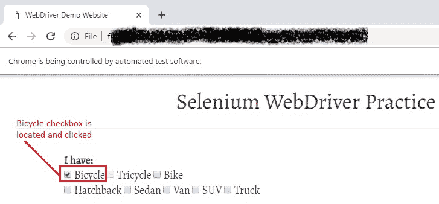
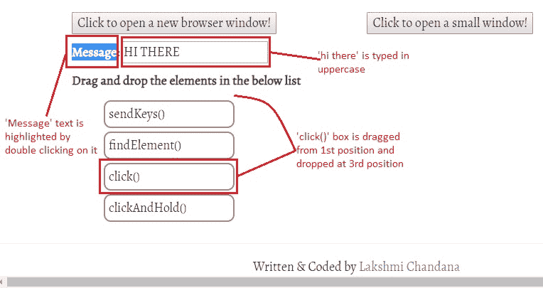

# 9ab。 WebDriver – 使用动作类

> 原文： [https://javabeginnerstutorial.com/selenium/9bb-webdriver-actions-class/](https://javabeginnerstutorial.com/selenium/9bb-webdriver-actions-class/)

灯光，摄像头，动作！ 是的，今天所有有关动作的内容。 哦，我不是在谈论您在电影中观看的那些战斗顺序，而是在谈论键盘和鼠标的动作。 Selenium WebDriver 提供了一个面向用户的 API，用于执行复杂的用户手势。 我们到处都希望自动化！ 因此，除了直接使用键盘和鼠标，我们还可以使用 Actions 类来执行基本的`click`，`sendKeys`和复杂的操作，例如`dragAndDrop`等。

## 一些可用的键盘和鼠标方法是，

### 1.单击（WebElement 目标）

参数：*目标* – 要单击的元素。

说明：单击给定目标的中间。

### 2\. clickAndHold（）

说明：单击当前鼠标位置不会释放。

### 3\. doubleClick（WebElement 目标）

Parameter: *target* – element to click.

说明：在给定目标元素的中间双击。 等效于：`Actions.moveToElement(element).doubleClick();`

### 4\. dragAndDrop（WebElement 源，WebElement 目标）

参数：

*来源* – 要拖动的元素，即模拟按钮按下的位置

*目标* – 在以下位置移动并释放鼠标的元素

说明：在源元素的位置单击并按住，移至目标元素的位置，然后释放鼠标。

### 5\. dragAndDropBy（WebElement 源，int xOffset，int yOffset）

Parameters:

*源* – 模拟按钮按下的元素。

*xOffset* -水平移动偏移。

*yOffset* -垂直移动偏移。

说明：在源元素的位置单击并按住，在 x 轴上移动给定的 xOffset，在 y 轴上移动给定的 yOffset，然后释放鼠标。

### 6\. keyDown（java.lang.CharSequencemodifier_key）

Parameters:

*Modifier_key* -可以是`Keys.SHIFT`，`Keys.ALT`或`Keys.CONTROL`。 如果提供的密钥都不是，则抛出`IllegalArgumentException`。

说明：执行修改键，但不释放键。 随后的交互可以假定按键被按下。 请注意，修饰键永远不会隐式释放-必须调用`keyUp(theKey)`或`sendKeys(Keys.NULL)`才能释放修饰键。

### 7\. moveByOffset（int xOffset，intyOffset）

Parameters:

*xOffset* -水平偏移。 负值表示将鼠标左移。

*xOffset* -垂直偏移。 负值表示向上移动鼠标。

说明：将鼠标从其当前位置（或 0,0）移动 x 轴上的给定 xOffset 和 y 轴上的 yOffset。

### 8\. moveToElement（WebElement 目标）

Parameters:

*目标*-要移动的元素。

说明：将鼠标移到目标元素的中间。

### 9\. perform（）

描述：执行或执行所有动作。

### 10\. release（）

说明：在当前鼠标位置释放按下的鼠标左键。

## <u>总体图片</u>

让我们看一个测试案例，实现我们刚才讨论的一些方法，

### *场景*

1.  开启 Chrome 浏览器
2.  导航到[演示站点](https://chandanachaitanya.github.io/selenium-practice-site/)
3.  使用 Actions 类执行以下键盘和鼠标操作，
    1.  找到并点击“自行车”复选框
    2.  找到文本“消息”，然后双击以突出显示它
    3.  在大写文本框中输入“ hi there”
    4.  将`click()`从第一位置拖放到可排序列表的第三位置
4.  在 Chrome 浏览器中验证输出
5.  验证 Eclipse IDE 控制台输出屏幕上是否有任何已打印的消息，并验证 JUnit 窗格是否成功

此方案的 JUnit 代码是，

```java
import java.util.concurrent.TimeUnit;
import org.junit.After;
import org.junit.Before;
import org.junit.Test;
import org.openqa.selenium.By;
import org.openqa.selenium.Keys;
import org.openqa.selenium.WebDriver;
import org.openqa.selenium.WebElement;
import org.openqa.selenium.chrome.ChromeDriver;
import org.openqa.selenium.interactions.Actions;

public class TestActions {
	// Declaring variables
	private WebDriver driver;
	private String baseUrl;

	@Before
	public void setUp() throws Exception {
		// System property set up for Chrome driver
		System.setProperty("webdriver.chrome.driver", "browser-drivers\\chromedriver.exe");
		// Create a new instance for the class ChromeDriver
		// that implements WebDriver interface
		driver = new ChromeDriver();
		// Implicit wait for 5 seconds
		driver.manage().timeouts().implicitlyWait(5, TimeUnit.SECONDS);
		// Assign the URL to be invoked to a String variable
		baseUrl = "https://chandanachaitanya.github.io/selenium-practice-site/";
	}

	@Test
	public void testKeyboardAndMouseActions() throws Exception {
		// Open baseUrl in Chrome browser window
		driver.get(baseUrl);

		// Locate 'Bicycle' checkbox using name
		WebElement bicyle = driver.findElement(By.name("vehicle1"));
		// Locate 'Message' textbox using id
		WebElement messageTextBox = driver.findElement(By.id("enterText"));
		// Locate 'click()' using id
		WebElement element = driver.findElement(By.id("click"));

		//Create an instance of the Actions Class
		Actions actions = new Actions(driver);

                // Perform multiple actions
		// Type 'hi there' in uppercase in the text box
		actions
			.moveToElement(messageTextBox)
			.keyDown(Keys.SHIFT)
			.sendKeys(messageTextBox, "hi there")
			.keyUp(Keys.SHIFT)
			.perform();
		// Click 'Bicycle' checkbox
		actions
			.click(bicyle)
			.perform();
		// Print a message to console
		System.out.println("Bicylce checkbox clicked.");
		// Double click/highlight the text, 'Message'
		actions
			.moveToElement(driver.findElement(By.id("labelText")))
			.doubleClick()
			.perform();
		// Print the text of the element that will be dragged and dropped
		System.out.println("Element that is dragged : " + element.getText());
		// Drag and drop 'click()' using Actions class
		actions
			.dragAndDropBy(element, 50, 100)
			.perform();

	} // End of @Test

	@After
	public void tearDown() throws Exception {
		// Close the Chrome browser
		driver.close();
		System.out.println("Closing the driver");
	}
}
```

### 说明：

让我们破译一些复杂的动作。

#### 1.突出显示“消息”文本：

```java
actions
.moveToElement(driver.findElement(By.id("labelText")))
	.doubleClick()
	.perform();
```

将焦点移至“消息”文本，然后双击以突出显示。 使用`perform()`方法执行操作。

#### 2.在文本框中以大写字母键入“ hi there”

```java
actions
.moveToElement(text)
	.keyDown(Keys.SHIFT)
	.sendKeys(text, "hi there")
	.keyUp(Keys.SHIFT)
	.perform();
```

首先将焦点移至文本框，按住`SHIFT`键，键入文本“ hi there”，使其大写，然后在`keyup`方法的帮助下释放`SHIFT`键。

### 3.拖放“ click（）”

这可以通过两种方式完成：

```java
actions
	.dragAndDropBy(element, 50, 100)
	.perform(); 
```

最简单的方法是使用`dragAndDropBy`方法，在该方法中，我们可以指定要拖动的元素以及 xOffset 和 yOffset。

如果您想走复杂路线，看起来像忍者，

```java
actions
	.clickAndHold(element)
	.moveByOffset(50, 100)
	.release()
	.perform(); 
```

单击目标元素，在本例中为`html()`，并确保不要释放该喀哒声。 移动给定的 xOffset 和 yOffset，然后释放鼠标单击，以便将元素放置在新位置。 结果，该元素被拖放。

### *执行结果：*

为每行代码提供了注释，使其其余部分不言自明。 散布演示站点输出的一些视觉效果，


<noscript><p>自行车复选框位于并按预期检查。</p><p></p><noscript><p>双击文本<code>Message</code>，结果将突出显示。 在文本框中，“ hi there”用大写字母键入。 从可排序列表中将<code>click()</code>从其默认的第一位置拖动到第三位置。</p><p>在 JUnit 窗格中，绿色条显示测试用例已成功执行。 同样，控制台窗口显示没有错误以及所有打印的消息如预期的那样。</p><p></p><noscript><p>是时候把忍者带出来了。 尝试使用尽可能多的动作类方法，并从中获得乐趣！</p><p>上面讨论的所有代码都可以在<a href="https://github.com/JBTAdmin/Selenium"> GitHub 存储库</a>的“ WebDriver”文件夹中找到。 您可以为存储库加注星标和分支以方便使用。 请仔细阅读<code>README.md</code>文件以获取明确说明。</p><p>祝你有美好的一天！</p><div class="sticky-nav" style="font-size: 15px;"><div class="sticky-nav-image"></div><div class="sticky-nav-holder"><div class="sticky-nav_item"><h6 class="heading-sm">下一篇文章</h6></div><h5 class="sticky-nav_heading " style="font-size: 15px;"><a href="https://javabeginnerstutorial.com/selenium/9ac-webdriver-unable-to-locate-an-element-easily-read-on/" title="9ac. WebDriver – Unable to locate an element easily? Read on…"> 9ac。 WebDriver – 无法轻松定位元素？ 继续阅读…</a></h5></div></div> </body> </html></noscript>