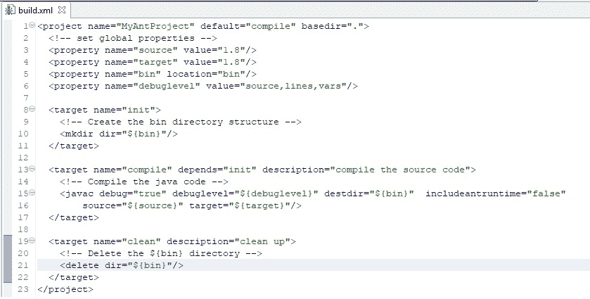
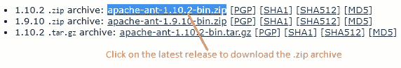
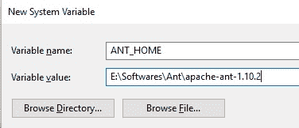
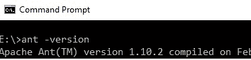
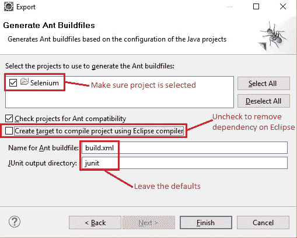

# 10A 高级 WebDriver – 使用 Apache ANT

> 原文： [https://javabeginnerstutorial.com/selenium/10a-advanced-webdriver-apache-ant/](https://javabeginnerstutorial.com/selenium/10a-advanced-webdriver-apache-ant/)

大家好！ 您的构建中是否有 ANT？ 开玩笑！ 其实我不是。 同意这听起来很怪异，但不要害怕，因为我在这里！ （现在，这就是我所说的，押韵。）

今天，让我们考虑一下这个 Apache ANT 到底是什么，以及为什么它将它作为 WebDriver 框架构建中的重要构建块。 到本文结束时，您一般应该可以处理任何 ANT 项目。

*起步*：

由 Apache Software Foundation 提供的 ANT 工具是用 **Java** 编写的构建工具。 它已经很老了（Maven 在这个领域赢得了胜利，Gradle 在相处中），非常受欢迎，并且在大多数项目中仍然可以找到。 Apache ANT 的优点在于，它仅执行被告知要做的事情。 引擎盖下没有太多魔术发生。 （*请注意，有时这可能是一把双刃剑！*）

创建可执行文件意味着

*   在`src`文件夹下编译所需的`.java`文件
*   为 JAR 创建清单文件
*   将所有`.class`文件和清单文件一起压缩
*   使用 jar 命令创建可执行文件

但是，使用 Apache ANT 可以通过简单的目标处理所有这些步骤（我们将在一分钟内看到 Target 是什么！）。

要完成的所有工作都以结构化和模块化的方式在 XML 文件中指定，从而很容易识别是否有问题。 这个文件被称为著名的“`build.xml`”。

Apache ANT 带有一个名为`build.xml`的默认构建文件。 我们总是可以编辑或创建一个新的 XML 文件来满足我们的需求。 这基本上是**命令行工具**。 因此，使用命令“`ant build_file_name.xml`”从命令提示符运行 Apache ANT 非常容易。 最好的部分是，如果您没有重命名`build.xml`（只需修改提供的默认值或创建您自己的名称并将其命名为`build.xml`），那么只有命令“`ant`”会自动知道要查找`build.xml`并执行它的作用！

Apache ANT 具有强大的功能，足以超越“谢谢”的门槛！ 我们可以，

*   清理项目
*   编译源代码
*   生成可分发的 JAR 或 WAR
*   处理来自版本控制系统（例如 CVS，SVN 等）的代码
*   向指定级别的记录器和监听器回显消息（错误，警告，信息，详细信息，调试信息）
*   创建或删除目录
*   复制，移动，删除文件
*   可以压缩，解压缩，tar，untar，unjar，unwar 文件
*   执行 JUnit 测试，测试脚本等。
*   通过 JDBC 对数据库执行一系列 SQL 语句
*   生成 JUnit 测试报告

*还有很多其他事情…*

听起来很吓人，但到目前为止，我刚才提到的每件事都可以通过构建文件来实现。

是时候忙于大肆宣传的构建文件的元素了。 这些都是用 XML 编写的。

**注意**： *以下信息足以使您熟悉 Apache ANT 构建文件。 有关深入的知识，请访问 Apache ANT 用户手册（<http://ant.apache.org/manual/>）。*

每个构建文件都有

1.  项目 – 至少包含一个目标
2.  目标 – 执行工作单元的一组任务
3.  任务 – 可以执行的一段代码

示例`build.xml`文件如下，



让我们一次将构建文件提取一个标签。

**项目**：这具有三个属性。

1.  `name` – 项目名称
2.  `default` – 如果未提供任何内容，则应执行的默认目标
3.  `baseDir` – 从中计算文件中相对路径的基本目录。 “`.`” 指执行的当前目录

**目标**：如示例构建文件中所示，一个项目可以具有一个或多个目标。 目标是一组任务。 我们可以选择希望 ANT 执行的目标，并用逗号分隔它们的名称。 如果未指定目标，则将执行默认目标。

这里要注意的重要属性是“依赖”。 这指定了它所依赖的目标名称。 例如，编译目标将仅在其依赖的初始化目标执行后执行。 因此，`depends`属性指定执行目标的顺序。

**任务**：这是一段可以执行的代码。 每个任务可以具有一个或多个属性作为键值对。

句法：

```xml
<name attribute1=”value1” attribute2=”value2” … />
```

`name`是任务的名称，`attributeN`和`valueN`分别是属性名称和值名称。

这是现成的[内置任务](https://ant.apache.org/manual/tasklist.html)的长长列表。 我们也可以编写自己的任务。 （还记得吗？都是用 Java 编写的）。

您一定想知道，为什么要深入研究构建文件，而不是立即安装并开始执行操作！ 传递这么多 ANT 知识是有原因的。 随着我们在旅途中的进一步发展，您将对此表示赞赏。 请稍等...

现在开始营业！

**步骤 1** ：转到“https://ant.apache.org/bindownload.cgi”，然后单击“`apache-ant-1.10.2-bin.zip`”以在下面下载`.zip`文件 “蚂蚁的当前版本”。



**步骤 2：**下载`.zip`存档后，将所有文件提取到本地计算机上的目录中。

**步骤 3** ：如下设置环境变量`ANT_HOME`和`PATH`，

右键点击“计算机 -> 属性 -> 高级系统设置 -> ‘高级’标签 -> 环境变量”，在系统变量下单击“新建”。

`ANT_HOME`设置为提取 Apache ANT 文件的文件夹的路径。



类似地，编辑`Path`变量以包含`%ANT_HOME%\bin`。

**步骤 4** ：通过在“命令提示符”中键入以下命令来验证是否已安装 Apache ANT

`ant version`



**步骤 5：**下一个任务是打开 Eclipse IDE，

*   右键单击“Java 项目 -> 导出”
*   在“常规”下，选择“蚂蚁构建文件”，然后点击“下一步”
*   确保已选择所需的项目
*   取消选中“创建目标以使用 Eclipse 编译器编译项目”，以删除对 Eclipse 的任何依赖



单击“完成”以查看自动生成的 eclipse 文件。

就是这样！ 您已经准备好将所有项目作为 ANT 构建运行。 这很简单，不是吗？

**注意**： *Eclipse 与 ANT 集成在一起。 为了确保 Eclipse 的“ANT Home”指向最新版本的 ANT，请单击 “Windows -> 首选项 -> Ant -> 运行时”。 点击“类路径”标签。 展开“ANT Home Import”并验证路径。 如果指向的是其他版本，请单击“ANT Home”并浏览用于提取 Apache ANT 文件的文件夹的位置。*

在我们的下一篇文章中，让我们做到这一点，并在 ANT 目标的帮助下生成 JUnit 报告。

安装愉快！
