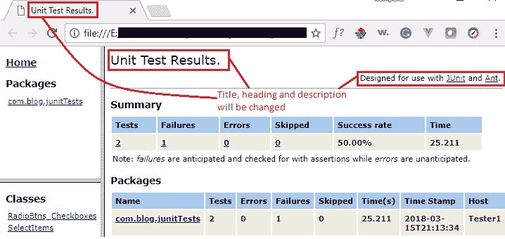
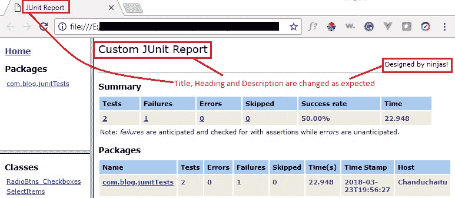
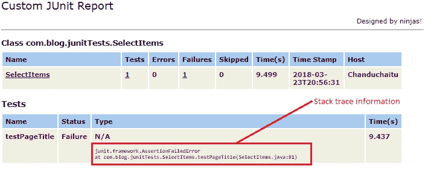
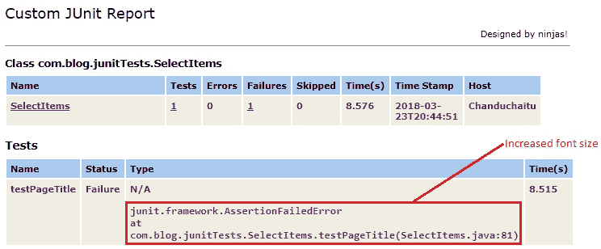

# 10 分。 先进的 WebDriver – JUnit 报表定制

> 原文： [https://javabeginnerstutorial.com/selenium/10c-advanced-webdriver-junit-report-customization/](https://javabeginnerstutorial.com/selenium/10c-advanced-webdriver-junit-report-customization/)

定制！ 谁不喜欢自己作品中的某些独特之处？ 让我们在[上添加一些糖霜，Apache ANT 生成的 JUnit 报告](https://javabeginnerstutorial.com/selenium/10b-advanced-webdriver-generating-junit-reports/)通过引入一些优点使其看起来更漂亮。

作为自定义自动生成报告的第一步，让我们了解其背后的代码（来自 Build.xml），

```java
<junitreport todir="junit">
    <fileset dir="junit">
        <include name="TEST-*.xml"/>
    </fileset>
    <report format="frames" todir="junit/report"/>
</junitreport>
```

Apache ANT 的 JunitReport 任务通过执行以下步骤来生成报告，

*   JUnit 任务生成的所有单个 XML 文件都被合并并命名为 TESTS-TestSuites.xml
*   CSS 样式应用于合并后的文档
*   最终的可浏览报告以 HTML 格式提供

`<junitreport todir="junit">`

属性“ todir”指定了将合并的 XML 文件保存到的目录。 如果未指定任何内容，则默认为当前目录。

```java
<fileset dir="junit">
    <include name="TEST-*.xml"/>
</fileset> 
```

***便笺*** ****： *所有单独的 JUnit 测试都是通过“ junit” ANT 任务执行的，生成的 XML 文件为 生成的名称使用“ outfile”属性指定。 如果未提及名称，则默认值为“ TEST-name”（其中 name 是在 junit task 的 name 属性中指定的测试名称）。*

使用<文件集>元素，junitreport 会从“ dir”中提到的给定目录中收集所有单个 XML 文件，并根据上述代码段考虑所有以“ TEST-”开头的文件。

`<report format="frames" todir="junit/report"/>`

这是从合并文件生成可浏览报告的确切任务。

属性“格式”指定可用于生成报告的两种可用格式之一。 它们必须是“框架”或“无框架”。 如果未指定任何内容，则默认为“帧”格式。 “ todir”属性指定生成的报告必须保存到的目录。

*   “ **框架”** 格式将生成一个报告，该报告将包含具有重定向功能的多个文件，并使用样式表来实现此效果。 这是一种更具可读性的格式。
*   “ **noframes”** 格式会生成一个名为“ junit-noframes.html”的文件，没有任何框架，并且不使用任何类型的重定向。 这种类型更适合作为电子邮件附件发送或生成 pdf 文件。

既然您已经了解了事物的内在运作方式，那么让我们进入有趣的部分（可能比拥有圣代冰淇淋更有趣）！

与那些无聊的自动生成的报告说再见，并欢迎**定制！** 这意味着，我们将要编写或编辑某些内容。 那就是一个 XSL 文件，它位于下载的 apache-ant-1.10.2-bin.zip 的“ etc”目录中。 让我们走简单的路线，就是编辑！

还记得吗，我们有两种格式？ 因此，要自定义：

*   框架 – 编辑 junit-frames.xsl
*   noframes – 编辑 junit-noframes.xsl

就我而言，这两个 XSL 文件都位于“ E：\ apache-ant-1.10.2 \ etc”路径中。 作为本文的一部分，让我们研究“框架”格式。 这意味着我们将编辑“ **junit-frames.xsl** ”文件。 复制此文件并将其粘贴到项目路径中。 不要重命名文件。 为了使所有更改都能正常进行，请向报告任务添加属性**'styledir'**，如下所示。 这指定了定义的样式表 junit-frames.xsl 的位置。 **“。”** 指定此样式表位于当前目录中（与构建文件的目录相同）。

`<report styledir="." format="frames" todir="junit/report"/>`

今天我们将深入探讨以下内容，

*   更改标题和描述
*   增加栈跟踪字体大小

在下面的文章中，我们还将介绍

*   添加或删除列
*   改变风格
*   在标题部分添加徽标
*   修改静态文字

***即时贴**：* *因此，所有更改都是对放置在项目目录“ E：\ Selenium \”（其中 Selenium 中的“ junit-frames.xsl”）进行的 在我的情况下是项目名称）。*

## 更改报告标题和描述

在项目位置的“ junit-frames.xsl”样式表中，

1.将参数名称的文本（标题为 TITLE）更改为“ JUnit Report”。

#### 之前的

`<xsl:param name="TITLE">Unit Test Results.</xsl:param>`

#### 之后

`<!-- <xsl:param name="TITLE">Unit Test Results.</xsl:param> -->
<xsl:param name="TITLE">JUnit Report</xsl:param>`

2.“页眉”部分负责显示标题和右侧显示的说明。 将它们分别更改为“自定义 JUnit 报告”和“由忍者设计！”。

#### BEFORE

```java
<!-- Page HEADER -->
<xsl:template name="pageHeader">
    <h1><xsl:value-of select="$TITLE"/></h1>
    <table width="100%">
    <tr>
        <td align="left"></td>
        <td align="right">Designed for use with <a href="http://www.junit.org/">JUnit</a> and <a href="http://ant.apache.org/">Ant</a>.</td>
    </tr>
    </table>
    <hr size="1"/>
</xsl:template>
```


<noscript><h4><em>AFTER</em></h4><pre><code class="language-xml">&lt;xsl:template name="pageHeader"&gt; &lt;!-- &lt;h1&gt;&lt;xsl:value-of select="$TITLE"/&gt;&lt;/h1&gt; --&gt; &lt;h1&gt;Custom JUnit Report&lt;h1&gt; &lt;table width="100%"&gt; &lt;tr&gt; &lt;td align="left"&gt;&lt;/td&gt; &lt;!-- &lt;td align="right"&gt;Designed for use with &lt;a href="http://www.junit.org/"&gt;JUnit&lt;/a&gt; and &lt;a href="http://ant.apache.org/"&gt;Ant&lt;/a&gt;.&lt;/td&gt; --&gt; &lt;td align="right"&gt;Designed by ninjas!&lt;/td&gt; &lt;/tr&gt; &lt;/table&gt; &lt;hr size="1"/&gt; &lt;/xsl:template&gt;</code></pre><p>保存更改并从 eclipse 生成 JUnit 报告。</p><p></p><noscript><h2><strong>增加栈跟踪字体大小</strong></h2><p>我们在发生故障时看到的栈跟踪信息非常小，很难读取。 为了增加其字体大小，只需在模板中添加几行名称为 stylesheet.css 的行即可。</p><pre><code class="language-xml">&lt;xsl:template name="stylesheet.css"&gt; .StackTrace { font-size: 100%; }</code></pre><p>然后将该类添加到“ display-failures”模板的“ code”标签中，该模板负责显示栈跟踪信息。</p><h4><em>BEFORE</em></h4><pre><code class="language-xml">&lt;code &lt;xsl:call-template name="br-replace"&gt; &lt;xsl:with-param name="word" select="."/&gt; &lt;/xsl:call-template&gt; &lt;/code&gt;</code></pre><p></p><noscript><h4>之后<i></i></h4><pre><code class="language-xml">&lt;code class="StackTrace"&gt; &lt;xsl:call-template name="br-replace"&gt; &lt;xsl:with-param name="word" select="."/&gt; &lt;/xsl:call-template&gt; &lt;/code&gt;</code></pre><p></p><noscript><p>现在是时候戴上帽子了。 愿 ANT 的力量与您同在。</p><p>在另一篇文章中再见。 定制愉快！</p><div class="sticky-nav" style="font-size: 15px;"><div class="sticky-nav-image"></div><div class="sticky-nav-holder"><div class="sticky-nav_item"><h6 class="heading-sm">下一篇文章</h6></div><h5 class="sticky-nav_heading " style="font-size: 15px;"><a href="https://javabeginnerstutorial.com/selenium/10d-advanced-webdriver-junit-report-customization-part2/" title="10d. Advanced WebDriver – JUnit Report Customization Contd."> 10d。 高级 WebDriver – JUnit 报告自定义续。 </a></h5></div></div> </body> </html></noscript>