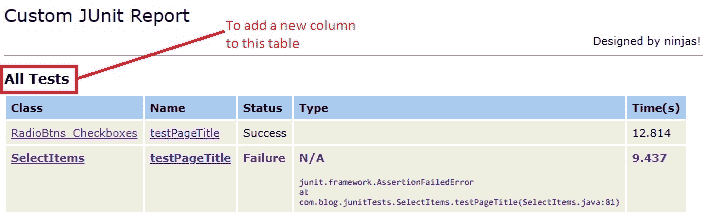
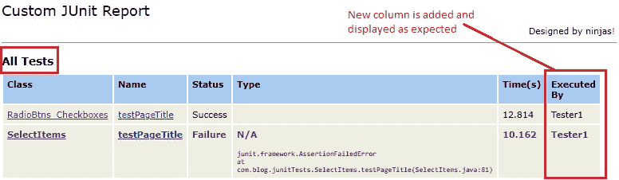
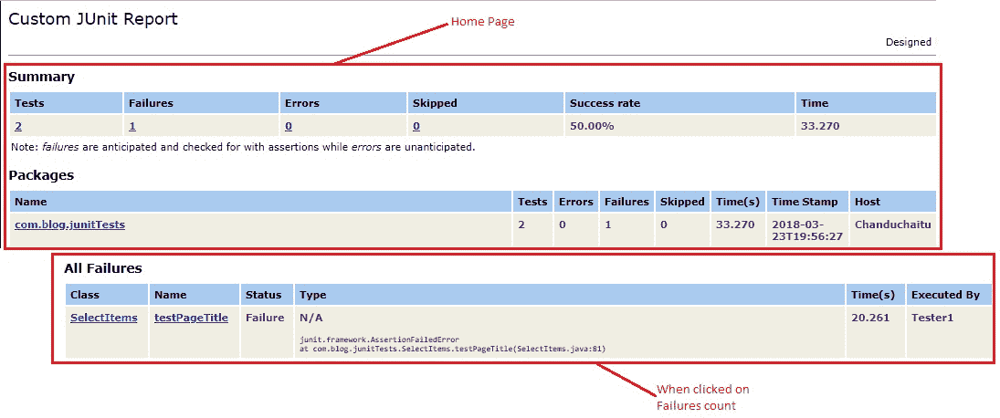
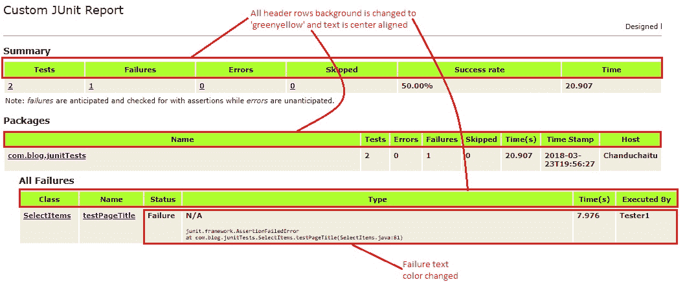
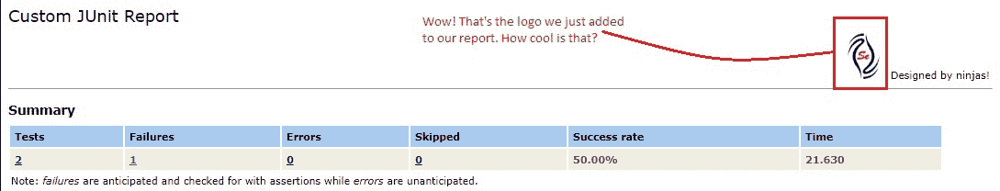
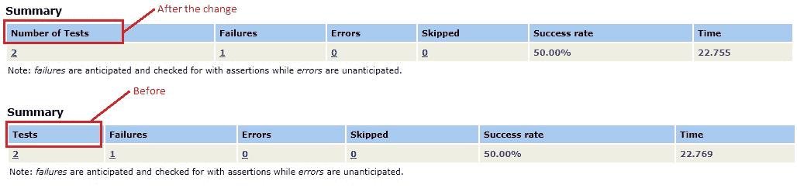

# 10D 高级 WebDriver – JUnit 报告自定义续

> 原文： [https://javabeginnerstutorial.com/selenium/10d-advanced-webdriver-junit-report-customization-part2/](https://javabeginnerstutorial.com/selenium/10d-advanced-webdriver-junit-report-customization-part2/)

嗨冠军！ 如果您没有让[之前的文章](https://javabeginnerstutorial.com/selenium/10c-advanced-webdriver-junit-report-customization/)发挥您的想象力，那么我今天将帮助您做到这一点。

我们将成为，

*   添加或删除列
*   改变风格
*   在标题部分添加徽标
*   修改静态文字

## 添加或删除列

这真是小菜一碟。 添加或删除`<th>`和`<td>`标签可实现此任务。 让我们来看一个场景，在“`All Tests`”表中，添加`Executed By`列。

```java
<!-- method header -->
<xsl:template name="testcase.test.header">
    <xsl:param name="show.class" select="''"/>
    <tr valign="top">
    <xsl:if test="boolean($show.class)">
        <th>Class</th>
    </xsl:if>
        <th>Name</th>
        <th>Status</th>
        <th width="60%">Type</th>
        <th nowrap="nowrap">Time(s)</th>
        <th>Executed By</th>
    </tr>
</xsl:template>
```

在此模板下，`<xsl:template match="testcase" mode="print.test">`

连同现有的栏一起为新创建的“执行者”栏添加一个值。

```java
 <td>
            <xsl:call-template name="display-time">
                <xsl:with-param name="value" select="@time"/>
            </xsl:call-template>
        </td>
        <td>Tester1</td>
    </tr>
</xsl:template> 
```

### 之前



### 之后



## 改变风格

努力思考如何更改生成的报告中的样式？ 无需为此费心！ 因为和其他网页一样，我们也有一个 CSS 样式表来处理此报告的样式。 只需在“`junit-frames.xsl`”文件中搜索名称为“`stylesheet.css`”的模板即可。

```xml
<!-- this is the stylesheet css to use for nearly everything --> 
<xsl:template name="stylesheet.css">
```

主体，表，标题，栈跟踪，错误，失败，段落，属性的样式均在此模板中指定。 继续前进，戴上帽子！ 对 CSS 的每一行进行试验，并查看呈现的更改。 是的，您也可以添加自己的 CSS！

让我们来看一个入门的小示例。 表的详细信息和失败样式如下所示，

```css
table.details tr th{
    font-weight: bold;
    text-align:left;
    background:#a6caf0;
}
.Failure {
    font-weight:bold; color:purple;
}
```

让我们将这些更改如下：

1.  所有表格标题均居中对齐
2.  表格标题行的背景颜色为“绿色黄色”（`#ADFF2F`）
3.  失败文字颜色变为栗色

```css
table.details tr th{
    font-weight: bold;
    text-align:center;
    background:#ADFF2F;
}
.Failure {
    font-weight:bold; color:maroon;
}
```

### 之前



### 之后



我知道，它看起来并不吸引眼球，但我们证明了我们想要的。 所以，你去了！

## 在标头部分中添加徽标

我们大多数人都喜欢生成的报告上的徽标。 谁不喜欢个性化和一点营销？ 如果您懂一点 HTML，就非常简单。 在名为“`pageHeader`”的模板上，添加一个图像标签，并在`src`属性中指定路径。 我已将徽标图像放置在生成`index.html`文件的项目的“`junit`”文件夹中。

```xml
<xsl:template name="pageHeader">
   <!-- <h1><xsl:value-of select="$TITLE"/></h1>  -->
   <h1>Custom JUnit Report</h1>
    <table width="100%">
    <tr>
        <td align="left"></td>
        <td align="right"> Designed by ninjas!</td>
    </tr>
    </table>
    <hr size="1"/>
</xsl:template>
```

### 结果



**修改静态文本**

这是锦上添花（哦！您现在已经知道了）。 要修改报告中显示的任何静态文本，您只需在“`junit-frames.xsl`”文件中进行更改。 是的，你没看错。 就这么简单！

假设在报告的摘要表中，而不是“测试”，我希望它是“测试数量”。 只需在`h2`标签上显示“摘要”的正文部分更改文本，

```xml
<table class="details" border="0" cellpadding="5" cellspacing="2" width="95%">
        <tr valign="top">
            <th>Number of Tests</th>
            <th>Failures</th>
            <th>Errors</th>
            <th>Skipped</th>
            <th>Success rate</th>
            <th>Time</th>
        </tr>
```

### 结果



是时候对我们到目前为止所学到的东西进行反思。

在另一篇文章中再见。 自定义愉快！
