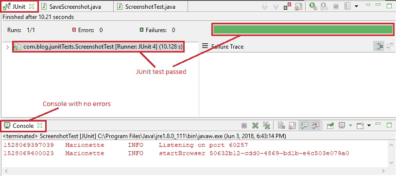
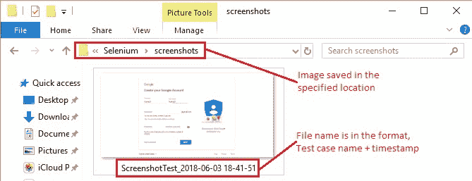
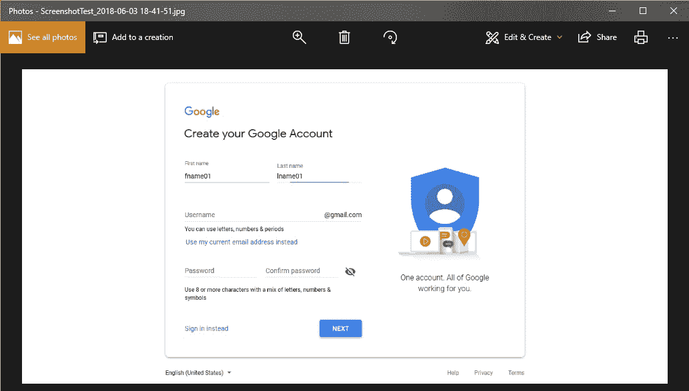

# 10F 高级 WebDriver – 截屏

> 原文： [https://javabeginnerstutorial.com/selenium/10f-advanced-webdriver-taking-screenshot/](https://javabeginnerstutorial.com/selenium/10f-advanced-webdriver-taking-screenshot/)

嗨冠军！ 屏幕截图。 在软件测试的拥挤街道上，另一个经常听到的术语。 如果您的环境中出现错误，而开发中没有错误，则无法用截图来证明，这是一个好测试！ 因此，现在是时候该了解如何使用 Selenium WebDriver 来抓取了。

我知道您想到了几个问题。 最重要的是，“如果是手动测试，那么我只要按一下键盘上的`PrntScr`按钮，然后抓取一个漂亮的屏幕截图即可。 但是，当我实现自动化时，如何获得相同的结果？”

猜猜看，这很简单！ 只需按照 3 个步骤进行操作，您就可以使用屏幕截图。 如果您像我一样，可能会急切地想看看它在代码中是如何工作的。 我的目标是取悦，所以请不要再拖延……

## 步骤 1：

使用 Selenium WebDriver 提供的`TakesScreenshot`接口。 将 WebDriver 对象强制转换为`TakesScreenshot`类型。

当您在`TakesScreenshot`下面看到一条弯曲的线时，只需单击`import org.openqa.selenium.TakesScreenshot;`包，您将没有任何错误。

```java
// Cast driver object to TakesScreenshot
TakesScreenshot screenshot = (TakesScreenshot) driver;
```

## 步骤 2：

要将屏幕截图获取为图像文件，请调用“`getScreenshotAs`”方法。

波浪线？ - 点击：

```java
import org.openqa.selenium.OutputType;
import java.io.File;
```

```java
// Get the screenshot as an image File
File src = screenshot.getScreenshotAs(OutputType.FILE);
```

## 步骤 3：

将生成的图像文件复制到您选择的目标位置。 使用`FileUtils`类的`copyFile`方法可以轻松完成此操作。 重要的是要注意，此方法将引发`IOException`。 因此，作为一种好习惯，请将这段代码包装在`try-catch`块中。

线条更弯曲？ - 点击：

```java
import java.io.IOException;
import org.apache.commons.io.FileUtils;
import java.text.SimpleDateFormat;
import java.util.Date;
```

确保完全按照指定的方式导入包。 通常，您可能需要下载`org.apache.commons.io` jar（在撰写本文时为[下载位置](https://jar-download.com/explore-java-source-code.php?a=commons-io&g=commons-io&v=2.5&downloadable=1)）并将其添加到项目的构建路径中。 之前，我们已经多次看到此过程，因此，我不再重复（请参阅[本文第 3 步](https://javabeginnerstutorial.com/selenium/9b-webdriver-eclipse-setup/)）。

另外，请注意，我们在代码中将图像另存为`.jpg`文件。 也可以将其另存为`.png`文件。

它可以很简单，

```java
// Copy the screenshot to destination
FileUtils.copyFile(src, new File(“\\screenshot\\test.jpg”));
```

还是一样复杂

```java
try {
    // Specify the destination where the image will be saved
    File dest = new File("\\Selenium\\screenshots\\" + testCaseName + "_" + timestamp() + ".jpg");
    // Copy the screenshot to destination
    FileUtils.copyFile(src, dest);
} catch (IOException ex) {
    System.out.println(ex.getMessage());
}

public static String timestamp() {
    // Timestamp to make each screenshot name unique
    return new SimpleDateFormat("yyyy-MM-dd HH-mm-ss").format(new Date());
}
```

在我们的示例中，我们将使用复杂的版本。 因为我们要将所有与屏幕快照相关的代码放在一个单独的方法中（在新类中），并在每次我们希望捕获屏幕快照时调用它。 否则，我们将不得不为每种情况做相同的歌舞。

## 概览

使用两种方法创建一个名为“`SaveScreenshot.java`”的新类。

1.  `public static void capture(String testCaseName, WebDriver driver)` – 具有捕获屏幕快照并将其保存到所需位置的所有代码。
2.  `public static String timestamp()` – 用于生成时间戳并将其提供给上述方法，以使每个保存的屏幕截图都是唯一的。

## 示例场景

1.  打开 Firefox 浏览器。
2.  导航到 Google 帐户创建页面
3.  通过 ID 找到名字文本框
4.  输入“`fname01`”作为名字
5.  按名称找到姓氏文本框
6.  输入“`lname01`”作为姓氏
7.  截取页面截图并将其保存到某个位置。

## JUnit 代码：

1.  ### `SaveScreenshot.java`类

```java
package com.blog.junitTests;

import java.io.File;
import java.io.IOException;
import java.text.SimpleDateFormat;
import java.util.Date;

import org.apache.commons.io.FileUtils;
import org.openqa.selenium.OutputType;
import org.openqa.selenium.TakesScreenshot;
import org.openqa.selenium.WebDriver;

public class SaveScreenshot {

  public static void capture(String testCaseName, WebDriver driver) {
    // Cast driver object to TakesScreenshot
    TakesScreenshot screenshot = (TakesScreenshot) driver;
    // Get the screenshot as an image File
    File src = screenshot.getScreenshotAs(OutputType.FILE);
    try {
      // Specify the destination where the image will be saved
      File dest = new File("\\Selenium\\screenshots\\" + testCaseName + "_" + timestamp() + ".jpg");
      // Copy the screenshot to destination
      FileUtils.copyFile(src, dest);
    } catch (IOException ex) {
      System.out.println(ex.getMessage());
    }
  }

  public static String timestamp() {
    // Timestamp to make each screenshot name unique
    return new SimpleDateFormat("yyyy-MM-dd HH-mm-ss").format(new Date());
  }

}
```

### 2\. `Screenshot.java`类（执行示例方案部分中详细介绍的步骤）

```java
package com.blog.junitTests;

import java.util.concurrent.TimeUnit;

import org.junit.After;
import org.junit.Before;
import org.junit.Test;
import org.openqa.selenium.By;
import org.openqa.selenium.WebDriver;
import org.openqa.selenium.WebElement;
import org.openqa.selenium.firefox.FirefoxDriver;

public class ScreenshotTest {
  //Declaring variables
  private WebDriver driver; 
  private String baseUrl;
  private String testCaseName = "ScreenshotTest";

  @Before
  public void setUp() throws Exception{
    // Selenium version 3 beta releases require system property set up
    System.setProperty("webdriver.gecko.driver", "E:\\Softwares\\"
        + "Selenium\\geckodriver-v0.10.0-win64\\geckodriver.exe");
    // Create a new instance for the class FirefoxDriver
    // that implements WebDriver interface
    driver = new FirefoxDriver();
    // Implicit wait for 5 seconds
    driver.manage().timeouts().implicitlyWait(5, TimeUnit.SECONDS);
    // Assign the URL to be invoked to a String variable
    baseUrl = "https://accounts.google.com/SignUp";
  }

  @Test
  public void testPageTitle() throws Exception{
    // Open baseUrl in Firefox browser window
    driver.get(baseUrl);
    // Locate First Name text box by id and
    // assign it to a variable of type WebElement
    WebElement firstName = driver.findElement(By.id("firstName"));
    // Clear the default placeholder or any value present
    firstName.clear();
    // Enter/type the value to the text box
    firstName.sendKeys("fname01");
    // Locate last name text box by name
    WebElement lastName = driver.findElement(By.name("lastName"));
    // Clear and enter a value
    lastName.clear();
    lastName.sendKeys("lname01");
    //Take a screenshot
    SaveScreenshot.capture(testCaseName, driver);
  }

   @After
    public void tearDown() throws Exception{
    // Close the Firefox browser
    driver.close();
  }
}
```

为每行代码提供了注释，因此它是不言自明的。



在 Eclipse IDE 中，“JUnit”窗格清楚地显示了测试用例“`ScreenshotTest.java`”已通过，并且控制台没有错误。

如代码中所指定，屏幕快照以上述格式的名称保存在“`E:/Selenium/screenshots`”路径中。



这是捕获的屏幕截图，



现在是时候在您的测试过程中实现这一点并为自己可视化魔术了。

祝屏幕截图愉快！😉