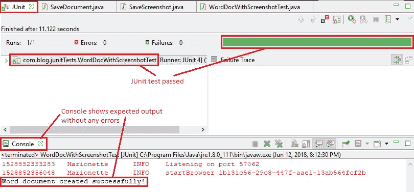
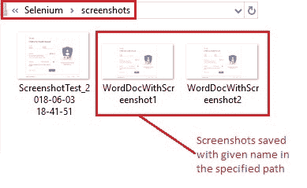
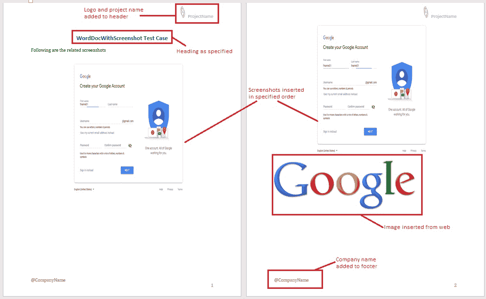

# 10G 高级 WebDriver – 将屏幕截图保存到 Word 文档

> 原文： [https://javabeginnerstutorial.com/selenium/10g-advanced-webdriver-saving-screenshots-to-word-document/](https://javabeginnerstutorial.com/selenium/10g-advanced-webdriver-saving-screenshots-to-word-document/)

嗨冠军！ 希望您度过愉快的时光[截屏并将其保存在本地](https://javabeginnerstutorial.com/selenium/10f-advanced-webdriver-taking-screenshot/)。 今天，让我们看看如何创建 Word 文档，并将在测试用例中捕获的所有图像插入其中。 每个测试用例都有一个单独的文档，不仅可以帮助我们保持工作空间井井有条，而且搜索特定的屏幕快照也很容易。 最好的部分是，我们将编写代码，以便所有这些事情自动发生而无需任何人工干预。

请允许我直截了当。

## 步骤 1：

下载几个 JAR，使我们的工作更加轻松。

**`java2word-3.3.jar`** - 帮助我们创建 Word 文档并以所需方式对其进行操作。

**`xstream-1.3.1.jar`** – 处理图片

让我们继续从 [https://code.google.com/archive/p/java2word/downloads](https://code.google.com/archive/p/java2word/downloads) （在撰写本文时的下载位置）下载这两个 JAR 文件。 我还将这些 JAR 以及本文中处理的所有其他代码文件一起放在我们的 [GitHub 仓库](https://github.com/JBTAdmin/Selenium)中。

## 步骤 2：

将这些 JAR 添加到我们的项目构建路径中。

之前，我们已经多次看到此过程，因此，我不再重复（有关详细说明，请参阅[文章](https://javabeginnerstutorial.com/selenium/9b-webdriver-eclipse-setup/)的步骤 3）。

## 步骤 3：

创建一个类“`SaveDocument.java`”。

将以下代码添加到类文件中，

```java
import java.io.File;
import java.io.FileNotFoundException;
import java.io.PrintWriter;

import word.api.interfaces.IDocument;
import word.w2004.Document2004;
import word.w2004.Document2004.Encoding;
import word.w2004.elements.BreakLine;
import word.w2004.elements.Heading1;
import word.w2004.elements.Heading3;
import word.w2004.elements.Image;
import word.w2004.elements.Paragraph;
import word.w2004.style.HeadingStyle.Align;

public class SaveDocument {

  public static void createDoc(String testCaseName, String[] imgFileNames) {
    // Create a document object
    IDocument myDoc = new Document2004();
    myDoc.encoding(Encoding.UTF_8);
    // Inserts one breakline
    myDoc.addEle(BreakLine.times(1).create()); 
    // Add client logo to document header
    myDoc.getHeader().addEle(Image.from_FULL_LOCAL_PATHL("/Selenium/Logo.png")
        .setHeight("30")
        .setWidth("20")
        .getContent());
    // Add Project name to document header
    myDoc.getHeader().addEle(Heading3.with(" ProjectName").withStyle().align(Align.RIGHT).create());
    // Specify Test case name as document heading
        myDoc.addEle(Heading1.with(testCaseName + " Test Case").withStyle().align(Align.CENTER).create());
        myDoc.addEle(BreakLine.times(1).create());
        // Add a description paragraph
        myDoc.addEle(Paragraph
                .with("Following are the related screenshots")
                .create());
        myDoc.addEle(BreakLine.times(1).create());
        // Add company name to document footer
        myDoc.getFooter().addEle(
                Paragraph.with("@CompanyName").create());
        // Loop through all the image files
        for(String file:imgFileNames){
        	// Insert each image file to the document
        	myDoc.addEle(Image.from_FULL_LOCAL_PATHL(
                                "/Selenium/screenshots/" + file + ".png") 
                                .setHeight("350")
                                .setWidth("500")
                                .getContent());
        	// Insert 2 linebreaks at the end of each inserted image
        	myDoc.addEle(BreakLine.times(2).create());
        }
        // Insert an image from web
        myDoc.addEle(Image
                .from_WEB_URL("http://www.google.com/images/logos/ps_logo2.png"));

        // Create the word document specifying a location
        File fileObj = new File("\\Selenium\\" + testCaseName + ".doc");
        PrintWriter writer = null;
        try {
         writer = new PrintWriter(fileObj);
        } catch (FileNotFoundException e) {
         e.printStackTrace();
        }

        String myWord = myDoc.getContent();

        writer.println(myWord);
        writer.close();
        // Print a confirmation image to console
        System.out.println("Word document created successfully!");
       }
}
```

每行都提供了注释，以使代码易于说明。

`public static void createDoc(String testCaseName, String[] imgFileNames)` -此方法有两个参数。 第一个是一个字符串，它指定测试用例的名称。 这将是将要创建的单词文档的名称。 第二个参数是作为该测试用例的一部分捕获的所有屏幕快照名称的数组。

在这种方法中，我们将创建一个文档对象并执行诸如

*   添加标题，段落
*   在标题中添加客户徽标和公司名称
*   在页脚中添加公司名称
*   插入作为特定测试用例一部分捕获的所有屏幕截图
*   从网上插入图片（只是为了证明这种情况也是可行的）
*   将单词文档和测试用例的名称保存在特定位置

## 步骤 4：

对“`SaveScreenshot.java`”文件进行了一些修改。

对我们在[先前文章](https://javabeginnerstutorial.com/selenium/10f-advanced-webdriver-taking-screenshot/)中创建的“`SaveScreenshot.java`”类进行了一些更改。

1.  删除生成时间戳的函数，并
2.  文件扩展名从“`.jpg`”更改为“`.png`”

现在的代码看起来像这样，

```java
import java.io.File;
import java.io.IOException;

import org.apache.commons.io.FileUtils;
import org.openqa.selenium.OutputType;
import org.openqa.selenium.TakesScreenshot;
import org.openqa.selenium.WebDriver;

public class SaveScreenshot {

  public static void capture(String screenshotName, WebDriver driver) {
    // Cast driver object to TakesScreenshot
    TakesScreenshot screenshot = (TakesScreenshot) driver;
    // Get the screenshot as an image File
    File src = screenshot.getScreenshotAs(OutputType.FILE);
    try {
      // Specify the destination where the image will be saved
      File dest = new File("\\Selenium\\screenshots\\" + screenshotName + ".png");
      // Copy the screenshot to destination
      FileUtils.copyFile(src, dest);
    } catch (IOException ex) {
      System.out.println(ex.getMessage());
    }
  }
}
```

## 示例场景

1.  打开 Firefox 浏览器。
2.  导航到 Google 帐户创建页面
3.  通过 ID 找到名字文本框
4.  输入“`fname01`”作为名字
5.  截取屏幕截图，并将其命名为“`testCaseName+1`”
6.  按名称找到姓氏文本框
7.  输入“`lname01`”作为姓氏
8.  截取屏幕截图并将其命名为“`testCaseName+2`”
9.  在指定位置创建一个 word 文档，并将这两个屏幕截图都插入其中。

### JUnit 代码：

`WordDocWithScreenshotTest.java`类

```java
import java.util.concurrent.TimeUnit;

import org.junit.After;
import org.junit.Before;
import org.junit.Test;
import org.openqa.selenium.By;
import org.openqa.selenium.WebDriver;
import org.openqa.selenium.WebElement;
import org.openqa.selenium.firefox.FirefoxDriver;

import com.blog.utilities.SaveDocument;
import com.blog.utilities.SaveScreenshot;

public class WordDocWithScreenshotTest {
  //Declaring variables
  private WebDriver driver; 
  private String baseUrl;
  private String testCaseName = "WordDocWithScreenshot";

  @Before
  public void setUp() throws Exception{
    // Selenium version 3 beta releases require system property set up
    System.setProperty("webdriver.gecko.driver", "E:\\Softwares\\"
        + "Selenium\\geckodriver-v0.10.0-win64\\geckodriver.exe");
    // Create a new instance for the class FirefoxDriver
    // that implements WebDriver interface
    driver = new FirefoxDriver();
    // Implicit wait for 5 seconds
    driver.manage().timeouts().implicitlyWait(5, TimeUnit.SECONDS);
    // Assign the URL to be invoked to a String variable
    baseUrl = "https://accounts.google.com/SignUp";
  }

  @Test
  public void testPageTitle() throws Exception{
    // Open baseUrl in Firefox browser window
    driver.get(baseUrl);
    // Locate First Name text box by id and
    // assign it to a variable of type WebElement
    WebElement firstName = driver.findElement(By.id("firstName"));
    // Clear the default placeholder or any value present
    firstName.clear();
    // Enter/type the value to the text box
    firstName.sendKeys("fname01");
    //Take a screenshot
    SaveScreenshot.capture(testCaseName + "1", driver);
    // Locate last name text box by name
    WebElement lastName = driver.findElement(By.name("lastName"));
    // Clear and enter a value
    lastName.clear();
    lastName.sendKeys("lname01");
    // Take a screenshot
    SaveScreenshot.capture(testCaseName + "2", driver);
    // Create a word document and include all screenshots
    SaveDocument.createDoc(testCaseName, new String[]{testCaseName + "1",testCaseName + "2"});
  }

   @After
    public void tearDown() throws Exception{
    // Close the Firefox browser
    driver.close();
  }
}
```

如果遵循注释，该代码是不言自明的。 Eclipse 的输出如下，



在 Eclipse IDE 中，“JUnit”窗格清楚地显示了测试用例“`WordDocWithScreenshotTest.java`”已通过，并且控制台没有错误。 按预期打印“Word 文档创建成功”。

按照代码中的指定，屏幕快照将以上述格式的名称保存到“`E:/Selenium/screenshots`”路径中。



还将创建单词文档并将其保存在指定的位置“ `E:/Selenium/`”中。 该文件如下所示，



创建的 Word 文档，所有代码文件和 JAR 文件都放置在 [GitHub 仓库](https://github.com/JBTAdmin/Selenium)中，以便于访问。 您可以为仓库加注星标和分支以方便使用。 请仔细阅读“`README.md`”文件以获取明确说明。

编码愉快！ 祝你今天愉快！
