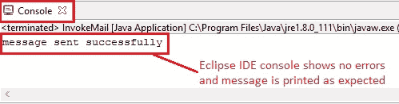
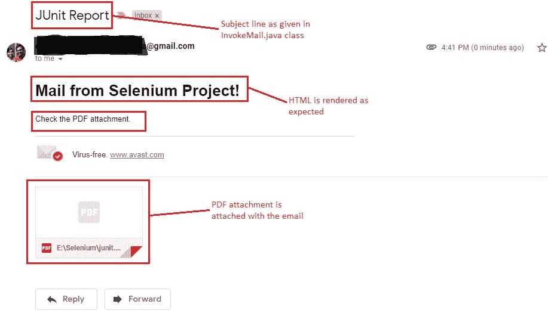

# 10H 高级 WebDriver – 发送带有附件的电子邮件

> 原文： [https://javabeginnerstutorial.com/selenium/10h-advanced-webdriver-sending-email-with-attachments/](https://javabeginnerstutorial.com/selenium/10h-advanced-webdriver-sending-email-with-attachments/)

嗨冠军！ 现在我们已经有了 [PDF 格式](https://javabeginnerstutorial.com/selenium/10e-advanced-webdriver-generating-pdf-report/)的 JUnit 报告，让我们将其附加到电子邮件中并发送给各个项目利益相关者。 因此，今天我们主要将仅使用 Java。 大家都来一杯咖啡（Java）！

我们将研究两个类。

1.  `SendMail.java` – 此类包含用于发送电子邮件的所有代码。
2.  `InvokeMail.java` – 通过提供从地址到地址，主题行和一些文本来调用`SendMail.java`。

## 代码

#### `SendMail.java`

```java
package com.blog.utility;

import java.util.Properties;

import javax.activation.DataHandler;
import javax.activation.DataSource;
import javax.activation.FileDataSource;
import javax.mail.BodyPart;
import javax.mail.Message;
import javax.mail.MessagingException;
import javax.mail.Multipart;
import javax.mail.PasswordAuthentication;
import javax.mail.Session;
import javax.mail.Transport;
import javax.mail.internet.InternetAddress;
import javax.mail.internet.MimeBodyPart;
import javax.mail.internet.MimeMessage;
import javax.mail.internet.MimeMultipart;

/*
 * This class has the main code for sending mail
 */
public class SendMail {

  public static void send(String from, String tos[], String subject,
      String text) throws MessagingException {
    // Get the session object
    Properties props = new Properties();
    props.put("mail.smtp.host", "smtp.gmail.com");
    props.put("mail.smtp.socketFactory.port", "465");
    props.put("mail.smtp.socketFactory.class",
        "javax.net.ssl.SSLSocketFactory");
    props.put("mail.smtp.auth", "true");
    props.put("mail.smtp.port", "465");

    Session session = Session.getDefaultInstance(props,
        new javax.mail.Authenticator() {
          protected PasswordAuthentication getPasswordAuthentication() {
            return new PasswordAuthentication(
            "[[email protected]](/cdn-cgi/l/email-protection)",
            "pass1234");// change accordingly
          }
        });

    // compose message
    try {
      MimeMessage message = new MimeMessage(session);
      message.setFrom(new InternetAddress(from));// change accordingly
      for (String to : tos) {
        message.addRecipient(Message.RecipientType.TO,
            new InternetAddress(to));
      }
      /*
       * for (String cc : ccs)
       * message.addRecipient(Message.RecipientType.CC,new
       * InternetAddress(cc));
       */
      message.setSubject(subject);
      // Option 1: To send normal text message
      // message.setText(text);
      // Option 2: Send the actual HTML message, as big as you like
      // message.setContent("<h1>This is actual message</h1></br></hr>" +
      // text, "text/html");

      // Set the attachment path
      String filename = "E:\\Selenium\\junit.pdf";

      BodyPart objMessageBodyPart = new MimeBodyPart();
      // Option 3: Send text along with attachment
      objMessageBodyPart.setContent(
          "<h1>Mail from Selenium Project!</h1></br>" + text, "text/html");
      Multipart multipart = new MimeMultipart();
      multipart.addBodyPart(objMessageBodyPart);

      objMessageBodyPart = new MimeBodyPart();
      DataSource source = new FileDataSource(filename);
      objMessageBodyPart.setDataHandler(new DataHandler(source));
      objMessageBodyPart.setFileName(filename);
      multipart.addBodyPart(objMessageBodyPart);
      message.setContent(multipart);

      // send message
      Transport.send(message);

      System.out.println("message sent successfully");

    } catch (MessagingException e) {
      throw new RuntimeException(e);
    }
  }// End of SEND method
}
```

#### `InvokeMail.java`

```java
package com.blog.junitTests;

import javax.mail.MessagingException;
import com.blog.utility.SendMail;

/*
 * Invokes SendMail.java 
 */
public class InvokeMail {
  public static void main(String[] args) throws MessagingException {

    //String to[] = {"[[email protected]](/cdn-cgi/l/email-protection)","[[email protected]](/cdn-cgi/l/email-protection)"};
    String to[] = {"[[email protected]](/cdn-cgi/l/email-protection)"};

    SendMail.send("[[email protected]](/cdn-cgi/l/email-protection)", to, "JUnit Report", "Check the PDF attachment.");		

  }
}
```

## 解释

直接看一下代码会使我们感到难以接受。 让我们一次了解一个摘要。

与往常一样，我们的第一步是下载几个 JAR。

1.  `activation.jar`
2.  `javax.mail-1.6.1.jar`

我还将它们都放在了我们的 [**GitHub 仓库**](https://github.com/JBTAdmin/Selenium/tree/master/AdvancedWebDriver/Sending%20Email)中，以及作为本文一部分处理的所有其他代码文件中。

将这些 JAR 添加到我们的项目构建路径中。 我们之前已经多次看到此程序，因此我不再重复（有关详细说明，请参阅此[文章](https://javabeginnerstutorial.com/selenium/9b-webdriver-eclipse-setup/)的步骤 3）。

### 了解`SendMail.java`，

1.编写所有代码的方法，以便我们可以从任何类轻松地调用它。

```java
public static void send(String from, String tos[], String subject,
      String text) throws MessagingException {}
```

2.给定的属性仅适用于 Gmail。 如果您根据项目要求使用 Outlook 或任何其他服务，则应相应地进行更改。

```java
Properties props = new Properties();
props.put("mail.smtp.host", "smtp.gmail.com");
props.put("mail.smtp.socketFactory.port", "465");
props.put("mail.smtp.socketFactory.class",
  "javax.net.ssl.SSLSocketFactory");
props.put("mail.smtp.auth", "true");
props.put("mail.smtp.port", "465");
```

3.获取会话对象并传递您的电子邮件帐户的凭据（您在地址中提到的凭据）。

```java
Session session = Session.getDefaultInstance(props,
        new javax.mail.Authenticator() {
    protected PasswordAuthentication getPasswordAuthentication() {
  return new PasswordAuthentication("[[email protected]](/cdn-cgi/l/email-protection)","pass1234");// change accordingly
    }
}); 
```

4.现在是有趣的部分。 我们将指定“发件人”和“收件人”地址。

```java
message.setFrom(new InternetAddress(from));
for (String to : tos) {
    message.addRecipient(Message.RecipientType.TO,
    new InternetAddress(to));
  } 
```

如果您只想将此电子邮件发送给一个人，请更改以下代码，

```java
message.setFrom(new InternetAddress(from));
message.addRecipient(Message.RecipientType.TO,
    new InternetAddress(to));
```

如果您希望将其发送给抄送给某些人的用户，请按以下所示更改代码，

```java
message.addRecipient(Message.RecipientType.CC,new InternetAddress(cc));
```

5.将主题行设置为`message.setSubject(subject);`

6.要发送，

*   普通短信`message.setText(text);`
*   实际的 HTML 消息尽可能多`message.setContent("<h1>This is actual message</h1></br></hr>" + text, "text/html");`
*   文本和附件（这就是我们想要的），

```java
// Set the attachment path
String filename = "E:\\Selenium\\junit.pdf";
BodyPart objMessageBodyPart = new MimeBodyPart();
objMessageBodyPart.setContent("<h1>Mail from Selenium Project!</h1></br>" + text, "text/html");
Multipart multipart = new MimeMultipart();
multipart.addBodyPart(objMessageBodyPart);
objMessageBodyPart = new MimeBodyPart();
DataSource source = new FileDataSource(filename);
objMessageBodyPart.setDataHandler(new DataHandler(source));
objMessageBodyPart.setFileName(filename);
multipart.addBodyPart(objMessageBodyPart);
message.setContent(multipart);
```

7.用简单的一行发送电子邮件，

```java
Transport.send(message);
```

### 了解`InvokeMail.java`，

此类很容易理解，因为我们只是通过提供所有必需的参数从`SendMail.java`调用“`send`”方法。

```java
String to[] = {"[[email protected]](/cdn-cgi/l/email-protection)"};
SendMail.send("[[email protected]](/cdn-cgi/l/email-protection)", to, "JUnit Report", "Check the PDF attachment.");
```

在“运行方式-> Java 应用”下，Eclipse IDE 控制台的输出如下所示，



该电子邮件将在收件人的收件箱中接收。


显示生成的带有附件的电子邮件，以供您参考。



**注意：** *当心！ 您可能碰到“`javax.mail.AuthenticationFailedException`”。 发生此异常的主要原因是 Google 提供的安全性和保护功能。 一种简单的解决方法是，通过单击链接 [https://www.google.com/settings/security/lesssecureapps](https://www.google.com/settings/security/lesssecureapps) 来打开“允许安全程度较低的应用”的访问以进行测试。*

试试看，让我知道在拍摄电子邮件时是否遇到任何问题。

实验愉快！ 祝你今天愉快！
