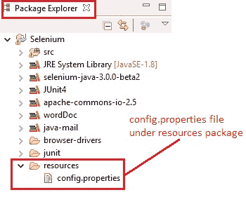
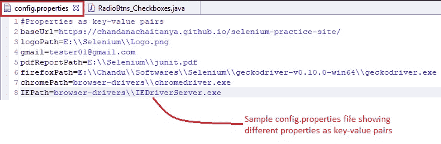
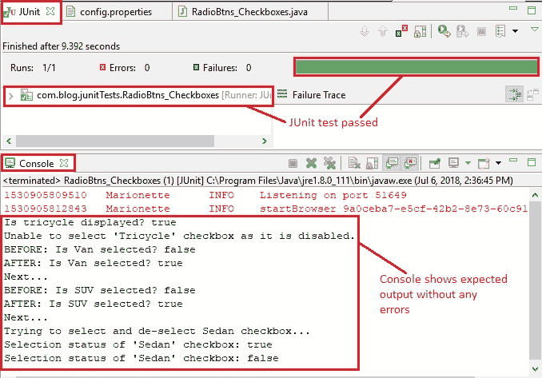

# 10I 高级 WebDriver – 使用属性文件

> 原文： [https://javabeginnerstutorial.com/selenium/10i-advanced-webdriver-property-files/](https://javabeginnerstutorial.com/selenium/10i-advanced-webdriver-property-files/)

嗨呀冠军！ 欢迎回到另一篇有趣的文章，它告诉您为什么**属性文件**首先存在！ 这个特定的概念不仅限于 Selenium WebDriver 项目。 它基本上可以用于任何涉及硬编码内容的 Java 项目中。

假设您有数百个自动化测试用例，并且在每个测试用例中，您都对要测试的应用的 URL 进行了硬编码。 到目前为止，一切都很好。 但是，如果弹出另一个版本，将应用 URL 更改为另一个版本，并且要再次执行相同的测试用例（回归测试），该怎么办？ 您可能会想，“那很简单！ 我只需要再运行一次构建文件。 只需单击一下，我就可以玩超级马里奥了！”。 您是否错过了 URL 部分？ 手动转到每个测试用例并编辑硬编码的 URL 以使其正常工作又会带来多大的痛苦呢？ 不好了！！！

别担心！ 我们有一个解决方案。 财产文件将为我们提供帮助！ 为了使您的测试用例更加动态，请确保不要在其中放入任何硬编码的值。 将这些值抽象到属性文件中，以便每当它们更改时，您都可以在一个位置进行编辑，并且测试用例可以再次完美地工作。

事不宜迟，让我们仅通过三个小步骤就可以了解如何在我们的项目中实现此目标，

## 步骤 1：

右键单击项目->新建->包。 确保“源文件夹”显示您的项目名称，并将包名称设为“资源”。

现在，右键单击“资源包->新建->文件”。 让文件名是“`config.properties`”。



## 步骤 2：

现在是时候从测试用例中提取所有这些硬编码的值了。

在“`config.properties`”文件中，将所有必需的属性作为键值对。 这将帮助我们在测试用例中引用每个属性及其键，该属性将在一分钟内演示。 可以在这个特定文件中对值进行任何更改，并且这些更改将神奇地反映在进行引用的所有测试用例中。



## 步骤 3：

为了在测试案例中使用这些属性，

`Properties props = new Properties();`

声明“属性”类型的“属性”变量。 这将创建一个没有默认值的空属性列表。

这需要从`java.util`包导入`import java.util.Properties;`

`FileInputStream fis = new FileInputStream("resources//config.properties");` –

创建一个连接以从“`resources`”包下的“`config.properties`”文件中读取所有属性。

这也需要从`java.io`包中导入`import java.io.FileInputStream;`

`props.load(fis);` - 使用打开的连接“`fis`”从输入字节流中读取所有属性。

`props.getProperty("baseURL");` – 要获取特定属性的值，请使用“`getProperty`”方法。 将在双引号中提及相应的键作为 `getProperty()`方法的参数。 它使用属性列表中的指定键搜索属性。 如果找不到键，则返回`null`。

## 概览

让我们看一个测试案例，实现到目前为止所涵盖的概念，

### 场景

1.  打开 Firefox 浏览器。
2.  从属性文件中读取 firefox 驱动程序路径和基本 URL。
3.  导航到[演示站点](https://chandanachaitanya.github.io/selenium-practice-site/)
4.  按名称找到“三轮车”复选框，然后将相应的消息打印到控制台
5.  检查“三轮车”复选框是否已启用，并将相应消息打印到控制台
6.  根据“货车”和“SUV”复选框的当前选择状态，选中或取消选中并打印执行`click()`动作前后的状态
7.  使用 XPath 找到“轿车”复选框
8.  使用两次迭代在选择状态和取消选择状态之间切换
9.  使用`cssSelector`找到“杂志”单选按钮
10.  检查是否默认选中
11.  如果是，则将相应消息打印到控制台，如果否，请选择单选按钮

验证 Eclipse IDE 控制台输出屏幕和 JUnit 窗格是否成功

### 此方案的 JUnit 代码

**`Config.properties`**

```java
#Properties as key-value pairs
baseUrl=https://chandanachaitanya.github.io/selenium-practice-site/
logoPath=E:\\Selenium\\Logo.png
gmail=tester01@gmail.com
pdfReportPath=E:\\Selenium\\junit.pdf
firefoxPath=E:\\Softwares\\Selenium\\geckodriver-v0.10.0-win64\\geckodriver.exe
chromePath=browser-drivers\\chromedriver.exe
IEPath=browser-drivers\\IEDriverServer.exe
```

**`RadioBtns_Checkboxes.java`**

```java
package com.blog.junitTests;

import java.io.FileInputStream;
import java.util.List;
import java.util.Properties;
import java.util.concurrent.TimeUnit;

import org.junit.After;
import org.junit.Before;
import org.junit.Test;
import org.openqa.selenium.By;
import org.openqa.selenium.WebDriver;
import org.openqa.selenium.WebElement;
import org.openqa.selenium.firefox.FirefoxDriver;

public class RadioBtns_Checkboxes {
  // Declaring variables
  private WebDriver driver;
  private String baseUrl;
  Properties props; 

  @Before
  public void setUp() throws Exception {
    // Creates an empty property list
    props = new Properties();
    // A connection is created to config.properties file
    FileInputStream fis = new FileInputStream("resources//config.properties");
    // Reads the properties from the input byte stream
    props.load(fis);
    // Get the firefox driver path from property file
    String firefoxPath = props.getProperty("firefoxPath");
    // Assign the URL to be invoked to a String variable
    baseUrl = props.getProperty("baseUrl");

    // Mention the property where required
    System.setProperty("webdriver.gecko.driver", firefoxPath);
    // Create a new instance for the class FirefoxDriver
    // that implements WebDriver interface
    driver = new FirefoxDriver();
    // Implicit wait for 5 seconds
    driver.manage().timeouts().implicitlyWait(5, TimeUnit.SECONDS);
  }

  @Test
  public void testPageTitle() throws Exception {
    // Open baseUrl in Firefox browser window
    driver.get(baseUrl);

    // Locate 'Tricycle' checkbox using name
    WebElement tricycleCheckbox = driver.findElement(By.name("vehicle2"));
    // Check if tricyle is displayed
    System.out.println("Is tricycle displayed? "+ tricycleCheckbox.isDisplayed());
    
    // Check if tricyle is enabled to select
    if (tricycleCheckbox.isEnabled()) {
      // Click if enabled
      tricycleCheckbox.click();
    } else {
      // Print message to console if disabled
      System.out.println("Unable to select 'Tricycle' checkbox as it is disabled.");
    }
    
    //Get all checkbox elements in a list
    List<WebElement> list = driver.findElements(By
        .cssSelector("input[type='checkbox']"));

    // Loops through all checkboxe elements
    for (int i = 0; i < list.size(); i++) {
      // Checking if the checkbox is a 'Van' or 'SUV'
      if ((list.get(i).getAttribute("value").trim()
          .equalsIgnoreCase("van"))
          || (list.get(i).getAttribute("value").trim()
              .equalsIgnoreCase("suv"))) {
        // Print selection status to console
        System.out.println("BEFORE: Is "
            + list.get(i).getAttribute("value") + " selected? "
            + list.get(i).isSelected());
        // Check if the checkbox is selected
        if (!(list.get(i).isSelected())) {
          // Click the checkbox
          list.get(i).click();
          System.out.println("AFTER: Is "
              + list.get(i).getAttribute("value") + " selected? "
              + list.get(i).isSelected());
        } else {
          // Uncheck the checkbox
          list.get(i).click();
          System.out.println("AFTER: Is "
              + list.get(i).getAttribute("value") + " selected? "
              + list.get(i).isSelected());
        }
        System.out.println("Next...");
      }
    }
    // Locate 'Sedan' checkbox using xPath
    WebElement sedanCheckbox = driver.findElement(By
        .xpath("//input[@name='vehicle5']"));
    System.out.println("Trying to select and de-select Sedan checkbox...");
    for (int i = 0; i < 2; i++) {
      // Click the checkbox
      sedanCheckbox.click();
      // Print current status to console
      System.out.println("Selection status of 'Sedan' checkbox: "
          + sedanCheckbox.isSelected());
    }
    // Locate 'Magazines' radio button using cssSelector
    WebElement magazinesRadioBtn = driver.findElement(By
        .cssSelector("input[value='Magazines']"));
    // Check if radio button is selected by default
    if (magazinesRadioBtn.isSelected()) {
      // Print message to console
      System.out.println("Magazines radio button is selected by default");
    } else {
      // Click the radio button
      magazinesRadioBtn.click();
    }
    
  } //End of @Test

  @After
  public void tearDown() throws Exception {
    // Close the Firefox browser
    driver.close();
  }
}
```

## 输出

每行代码都提供了清晰的注释，使其易于说明。 执行测试用例后，eclipse IDE 控制台窗口的输出如下，



属性文件使自动化测试人员的生活成真，梦想成真。 由此证明！ 现在该尝试使用今天的概念了。 请务必戴好安全帽，以免碰到[异常](https://javabeginnerstutorial.com/core-java-tutorial/exception-handling-try-catch-java/)！ 还有一件事，我可以在 [GitHub 仓库](https://github.com/JBTAdmin/Selenium/tree/master/AdvancedWebDriver/Property%20Files)中找到所有代码文件。 去看一下！

再见！ 祝你有美好的一天！
