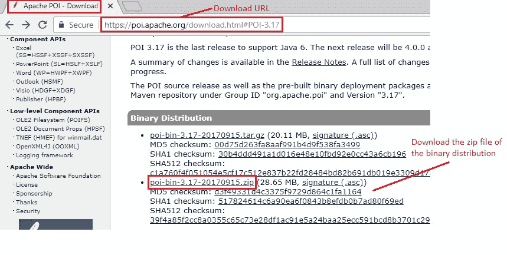
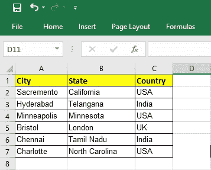
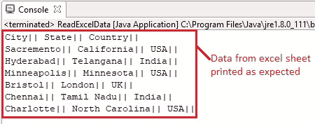

# 10J 高级 WebDriver – 使用 POI 从 excel 读取数据

> 原文： [https://javabeginnerstutorial.com/selenium/10j-advanced-webdriver-reading-data-from-excel-using-poi/](https://javabeginnerstutorial.com/selenium/10j-advanced-webdriver-reading-data-from-excel-using-poi/)

朋友！ 今天，让我们深入研究 excel 表并了解如何从中读取数据。 作为自动化和构建自动化框架的一部分，我们倾向于将数据以预定义的格式（通常遵循模板）存储在 excel 表中。 我们存储的数据主要是测试数据，不同的测试 URL，发布特定的参数等。在这种情况下，知道如何在我们的代码中处理 excel 表就变得非常重要。

这将是另一篇纯 Java 文章。 因此，您该喝一杯咖啡（Java）了！！ 我们将使用 POI jar 来实现此目的。

## 步骤 1：

与往常一样，我们的第一步是下载所需的 POI JAR。 转至 [Apache POI](https://poi.apache.org/download.html#POI-3.17) ，然后下载最新稳定版本的二进制发行版（在撰写本文时，3.17 是最新稳定发行版）。 单击该 zip 文件的二进制版本，重定向到实际的[下载页面](https://www.apache.org/dyn/closer.lua/poi/release/bin/poi-bin-3.17-20170915.zip)。



## 步骤 2：

将这些 JAR 添加到我们的项目构建路径中。 确保选择“`poi-x.xx`”，“`ooxml-lib`”和“`lib`”文件夹下的所有 JAR。 我还将这些以及其他所有代码文件都放在了我们的 [GitHub 仓库](https://github.com/JBTAdmin/Selenium/tree/master/AdvancedWebDriver/Reading%20data%20from%20excel)中。

我们之前已经多次看到这种添加 JAR 来构建路径过程的内容，因此我没有在重复它（有关详细说明，请参阅此[文章](https://javabeginnerstutorial.com/selenium/9b-webdriver-eclipse-setup/)的步骤 3）。

## 步骤 3：

创建一个新类“`ExcelOperationsUsingPOI.java`”。 在此类中，让我们有一种从特定位置读取 excel 文件的特定图纸的方法。

*   通过传递您要打开的 excel 文件的完整文件路径来创建`File`类的对象 - `File file = new File(filePath+"\\"+fileName);`
*   下一步是创建一个`FileInputStream`对象，以获取 excel 文件的输入字节 - `FileInputStream inputStream = new FileInputStream(file);`
*   创建一个工作簿对象 - `Workbook myWorkbook = null;`
*   Excel 文件在大多数情况下可以具有两个扩展名。 “`.xls`”或“`.xlsx`”。 通过使用子字符串方法拆分文件名来找到扩展名，并相应地创建`Workbook`对象。

```java
//indexOf gives the index of . in the file name
//substring method splits the string starting from index of . to the end
String fileExtensionName = fileName.substring(fileName.indexOf("."));
       
//Check condition if the file is xlsx file
if(fileExtensionName.equals(".xlsx")){
//If it is xlsx file then create object of XSSFWorkbook class
myWorkbook = new XSSFWorkbook(inputStream);
}

//Check condition if the file is xls file
else if(fileExtensionName.equals(".xls")){
//If it is xls file then create object of HSSFWorkbook class
  myWorkbook = new HSSFWorkbook(inputStream);
}
```

*   使用传递的确切工作表名称，可以读取特定工作表 - `Sheet mySheet = myWorkbook.getSheet(sheetName);`

现在，使用行和列很容易，它们的交点将为我们提供我们希望读取的单元格内容。

现在让我们来看一下实现到目前为止讨论的全部功能的代码，

### `ExcelOperationsUsingPOI.java`

```java
import java.io.File;
import java.io.FileInputStream;
import java.io.IOException;

import org.apache.poi.hssf.usermodel.HSSFWorkbook;
import org.apache.poi.ss.usermodel.Row;
import org.apache.poi.ss.usermodel.Sheet;
import org.apache.poi.ss.usermodel.Workbook;
import org.apache.poi.xssf.usermodel.XSSFWorkbook;

public class ExcelOperationsUsingPOI {
   public static void readExcel(String filePath,String fileName,String sheetName) throws IOException{

        //Create a object of File class to open xlsx file
        File file = new File(filePath+"\\"+fileName);

        //Create an object of FileInputStream class to read excel file
        FileInputStream inputStream = new FileInputStream(file);

        Workbook myWorkbook = null;

        //Find the file extension by spliting file name in substring and getting only extension name
        //indexOf gives the index of . in the file name
        //substring method splits the string starting from index of . to the end
        String fileExtensionName = fileName.substring(fileName.indexOf("."));
       
        //Check condition if the file is xlsx file
        if(fileExtensionName.equals(".xlsx")){
        //If it is xlsx file then create object of XSSFWorkbook class
        	myWorkbook = new XSSFWorkbook(inputStream);
        }

        //Check condition if the file is xls file
        else if(fileExtensionName.equals(".xls")){
            //If it is xls file then create object of HSSFWorkbook class
        	myWorkbook = new HSSFWorkbook(inputStream);
        }

        //Read sheet inside the workbook by its name
        Sheet mySheet = myWorkbook.getSheet(sheetName);

        //Find number of rows in excel file
        int rowCount = mySheet.getLastRowNum()- mySheet.getFirstRowNum();
        
        //Create a loop over all the rows of excel file to read it
        for (int i = 0; i < rowCount+1; i++) {
            Row row = mySheet.getRow(i);
            //Create a loop to print cell values in a row
            for (int j = 0; j < row.getLastCellNum(); j++) {
                //Print excel data in console
                System.out.print(row.getCell(j).getStringCellValue()+"|| ");
            }
            System.out.println();
        }		    
   }
}
```

### `ReadExcelData.java`

用于调用`readExcel`方法并传递必需的参数。

```java
import java.io.IOException;
import com.blog.utility.ExcelOperationsUsingPOI;

public class ReadExcelData {

  public static void main(String[] args) {
    try {
      ExcelOperationsUsingPOI.readExcel("E:\\Selenium", "ReadUsingPOI.xlsx", "Demographics");
    } catch (IOException e) {
      e.printStackTrace();
    } 
  }
}
```

注释使代码不言自明。 所考虑的 Excel 工作表中的数据如下所示，



使用我们的代码访问此信息将按预期方式打印出所有用管道分隔的值，以便将其控制台。



如果您想检索代码段，请在评论部分留言，

1.  给定条目的从零开始的行和列索引
2.  使用给定的从零开始的行和列索引的值
3.  基于给定条目的列表中的所有行值
4.  基于给定条目的列表中的所有列值

试用这些功能，让我知道您是否遇到颠簸。

祝你今天愉快！
