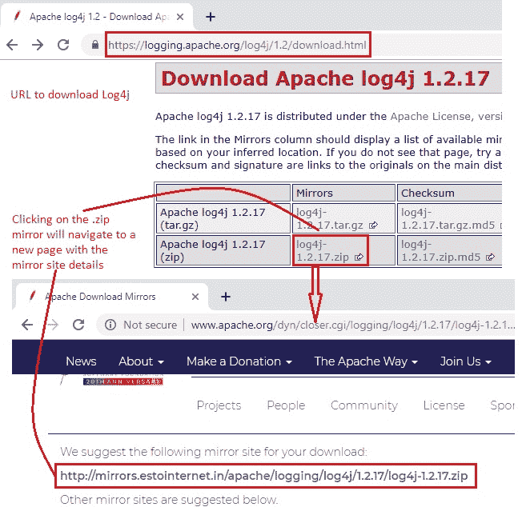
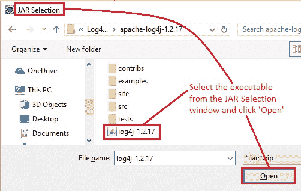
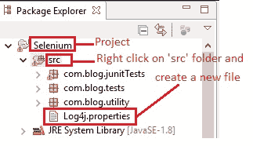

# 10K 高级 WebDriver – 使用 Log4j 第 1 部分

> 原文： [https://javabeginnerstutorial.com/selenium/10k-advanced-webdriver-using-log4j-part-1/](https://javabeginnerstutorial.com/selenium/10k-advanced-webdriver-using-log4j-part-1/)

现在让我来解释一下使用 Apache Log4j 记录 Selenium 的过程！ 因此，事不宜迟，让我们开始吧！

## 为什么我们需要日志？

作为自动化测试人员，我们负责故障排除，调试等。 记录使整个过程变得非常容易！ 它带给我们这些神奇的“眼睛”，让我们看到许多事物，例如，

1.  测试用例实际上在做什么
2.  应用如何响应我们的代码
3.  使用自定义错误消息正确记录时，可以将异常，问题，失败，错误等追溯到其根源
4.  可以作为以后成功执行的证明，因为它们可以轻松地保存到数据库或带有时间戳的外部文件中
5.  所有这些日志都可以在无需人工干预的情况下生成

现在我们了解了将日志语句插入测试用例的重要性，让我们解读一下 Log4j 的全部含义。

## 什么是 Log4j

1.  1996 年开发的基于 Java 的流行日志记录包
2.  根据 Apache Software License 分发，因此它是开源的
3.  具有各种级别的日志记录 – 允许我们控制日志输出的数量
4.  一切都可以通过编辑简单的配置文件来控制-无需理会应用二进制文件

## Log4j 日志级别

以下是 Log4j 附带的内置日志级别。

1.  **`OFF`** – 关闭登录
2.  **`FATAL`** – 严重错误导致应用终止
3.  **`ERROR`** – 意外情况和运行时错误
4.  **`WARN`** – 警告消息
5.  **`INFO`** – 提供有关一些有趣的运行时事件的信息
6.  **`DEBUG`** – 最常用的日志级别，提供有关系统流程的详细信息
7.  **`TRACE`** - 信息的详细程度最高

## Log4j 组件

主要包括三个部分：

1.  ### 记录器

应用中用唯一名称标识的记录器可以有多个。 可以将每个记录器配置为特定级别-调试，信息，错误等。

要求我们创建记录器类的实例并指定日志级别。

2.  ### 附加器

创建记录器实例后，我们必须知道在哪里查看生成的日志。 这就是附加器出现的地方。 它们指定消息要记录到的目的地或输出，例如文件，标准输出或另一台计算机等。一些可用的附加器是`FileAppender`，`RollingFileAppender`，`ConsoleAppender`，`SocketAppender`等。 可以将同一信息记录到多个输出中，即一个记录器可以有多个附加器。

3.  ### 布局

既然我们知道如何生成日志并将其保存到特定的目的地，那么我们可能需要将它们呈现为不同的格式。 每个附加器必须映射到特定布局。 一些常用的布局是

*   **PatternLayout** – 使用模式字符串的一次一行日志文件
*   **HTMLLayout** – 以 HTML 格式呈现日志
*   **XMLLayout** – 生成 XML 格式

## Log4j 配置

可以在 XML，JSON，YAML 或属性文件格式的配置文件中配置这三个组件。 在本文中，我们将看到如何使用属性文件格式定义所有组件和记录消息。

## 环境设定

在 Eclipse IDE 中创建一个 Java 项目，在本例中为“Selenium”。

### 步骤 1：下载 Log4j

第一步（也是第一步）是从[此处](https://logging.apache.org/log4j/1.2/download.html)下载 Apache Log4j JAR。 单击镜像的 zip 文件格式将导航到一个新页面，其中包含实际的镜像站点详细信息，可从该位置将 JAR 下载到本地计算机。

将下载文件夹的内容提取到特定位置。

### 步骤 2：配置 Java 构建路径

将 Log4j JAR 作为外部库添加到项目的构建路径。

让我们导航到本地计算机中提取下载的 JAR 的路径，并将其添加为外部 JAR。

之前，我们已经多次看到此过程，因此，我不再重复（请参阅[文章](https://javabeginnerstutorial.com/selenium/9b-webdriver-eclipse-setup/)的步骤 3）。

### 步骤 3：建立必要的档案

我们将创建 3 个文件。

**`Log4j.properties`**

*   右键单击“`src`文件夹->新建->其他->常规->文件->下一页”
*   提供“文件名”作为“`Log4j.properties`”，然后点击“完成”

结果看起来像这样，

我现在已经忽略了三个额外的包，因为我出于编码目的创建了它们。

**日志文件**

*   右键单击“`src`文件夹->新建->其他->常规->文件夹->下一页”
*   提供“文件夹名称”作为“`resource`”
*   右键点击“`resource`”文件夹并创建两个文件
*   将这些文件命名为“`system.log`”和“`test.log`”

1.  **`system.log`** – 将具有系统生成的所有日志
2.  **`test.log`** – 将包含由于用户提供的手动命令而生成的所有日志

现在，所有环境都已准备就绪，我们可以使用 Log4j 进行一些实验并生成日志。 与往常一样，将 JAR 放置在 GitHub [仓库](https://github.com/JBTAdmin/Selenium/tree/master/AdvancedWebDriver)中。 让我们在即将发布的帖子中详细了解这一点。
