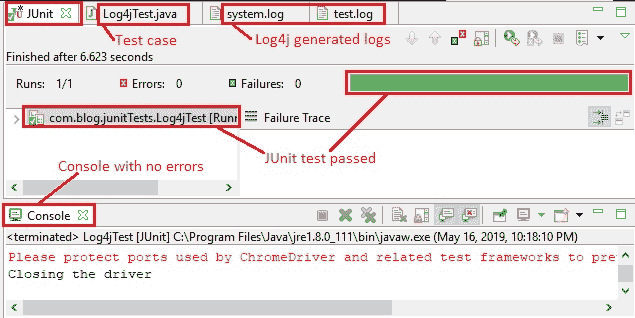

# 10L 高级 WebDriver – 使用 Log4j 第 2 部分

> 原文： [https://javabeginnerstutorial.com/selenium/10l-advanced-webdriver-using-log4j-part-2/](https://javabeginnerstutorial.com/selenium/10l-advanced-webdriver-using-log4j-part-2/)

这是本文的续篇，[使用 Log4j 第 1 部分](https://javabeginnerstutorial.com/selenium/10k-advanced-webdriver-using-log4j-part-1/)，因此，我建议您先阅读第 1 部分，然后再继续进行操作，以掌握发生的情况。

**场景**

1.  配置`Log4j.properties`文件，
    *   日志级别 – 调试
    *   记录器 – `rootLogger`和`SeleniumTestLogger`
    *   附加器 – `RollingFileAppender`
    *   布局 – `PatternLayout`
2.  编写一个 JUnit4 测试用例“`Log4jTest.java`”，
    *   开启 Chrome 浏览器。
    *   导航到[演示站点](https://chandanachaitanya.github.io/selenium-practice-site/)
    *   为`Logger`类创建一个实例
    *   将“打开 Selenium 实践网站”登录到`test.log`
    *   按名称找到“自行车”复选框，然后单击它
    *   记录“选择了自行车复选框”
    *   使用`cssSelector`找到“杂志”单选按钮并选择它
    *   记录“单击了杂志单选按钮”
    *   日志“Log4jTest 成功执行”
3.  校验，
    *   Eclipse IDE 控制台输出屏幕
    *   JUnit 窗格可显示成功结果
    *   日志和`test.log`文件，并检查日志是否按预期更新

现在，我们今天的计划已成问题，让我们开始编写代码。

## 步骤 1：配置属性文件

首先，让我们看看 Log4j 的配置文件`Log4j.properites`文件中包含什么代码。

```java
#Root logger options
log4j.rootLogger=debug,file
log4j.appender.file=org.apache.log4j.RollingFileAppender
log4j.appender.file.File=E:\\Selenium\\resources\\system.log
log4j.appender.file.maxFileSize=900KB
log4j.appender.file.maxBackupIndex=3
log4j.appender.file.layout=org.apache.log4j.PatternLayout
log4j.appender.file.layout.ConversionPattern=%d{ABSOLUTE} %5p %c{1}:%L \u2013 %m%n
log4j.appender.file.Append=false
#Application Logs
log4j.logger.SeleniumTestLogger=DEBUG, dest
log4j.appender.dest.File=E:\\Selenium\\resources\\test.log
log4j.appender.dest=org.apache.log4j.RollingFileAppender
log4j.appender.dest.maxFileSize=500KB
log4j.appender.dest.maxBackupIndex=6
log4j.appender.dest.layout=org.apache.log4j.PatternLayout
log4j.appender.dest.layout.ConversionPattern=%d{dd/MM/yyyy HH:mm:ss} %c %m%n
log4j.appender.dest.Append=false
```

您现在正在寻找所有希腊语和拉丁语吗？ 不用担心，让我们一次看看它。

我们将有两个记录器，

1.  **`rootLogger`** – 处理系统生成的日志，并将它们输出到`system.log`文件，然后
2.  **`SeleniumTestLogger`** – 处理由于用户手动插入代码而生成的日志，并输出到`test.log`文件

这两个记录器都将具有`RollingFileAppender`和`PatterLayout`。

`log4j.rootLogger=debug,file` – 日志级别指定为`debug`，`file`用作引用此特定记录器的标识符。

`log4j.appender.file=org.apache.log4j.RollingFileAppender` – `RollingFileAppender`是使用的附加程序类型，它将指定的文件附加到最大大小。

`log4j.appender.file.File=E:\\Selenium\\resources\\system.log` – `File`用于指定要保存日志的文件的位置，即目的地。

`log4j.appender.file.maxFileSize=900KB` – 一个文件最多可以存储 900KB 的数据，然后创建一个具有相同名称的新文件。 较旧的文件将作为索引添加到最新的文件。

`log4j.appender.file.maxBackupIndex=3` – 最多将保存三个文件作为备份。

`log4j.appender.file.layout=org.apache.log4j.PatternLayout` – `Pattern layout`用于格式化生成的日志。

`log4j.appender.dest.layout.ConversionPattern=%d{dd/MM/yyyy HH:mm:ss} %c %m%n` – 这是用于生成布局的转换模式。

生成的示例测试日志如下（片段），

`16/05/2019 22:18:17 SeleniumTestLogger Log4jTest executed successfully`

*   `dd/MM/yyyy` – 日期
*   `HH:mm:ss` – 执行时间
*   `%c` – 打印作为参数传递给`Logger`实例的名称
*   `%m%n` – 日志消息

`log4j.appender.file.Append=false` – 将此属性设置为`false`将创建一个新文件，而不是更新现有文件。

`log4j.logger.SeleniumTestLogger=DEBUG, dest` – 日志级别为`debug`，`dest`是此处使用的标识符。

`log4j.appender.dest.File=E:\\Selenium\\resources\\test.log` – 借助`File`来指定`dest`标识符的文件位置。

其他属性与我们已经讨论过的相似，因此不言自明。

## 步骤 2：编写测试用例

下面是测试用例“`Log4jTest.java`”，涵盖了开头讨论的场景中列出的所有要求。

```java
package com.blog.junitTests;

import java.util.concurrent.TimeUnit;

import org.apache.log4j.Logger;
import org.junit.After;
import org.junit.Before;
import org.junit.Test;
import org.openqa.selenium.By;
import org.openqa.selenium.WebDriver;
import org.openqa.selenium.WebElement;
import org.openqa.selenium.chrome.ChromeDriver;

public class Log4jTest {
	// Declaring variables
	private WebDriver driver;
	private String baseUrl;
	private Logger log;

	@Before
	public void setUp() throws Exception {
		// System property set up for Chrome driver
		System.setProperty("webdriver.chrome.driver", "browser-drivers\\chromedriver.exe");
		// Create a new instance for the class ChromeDriver
		// that implements WebDriver interface
		driver = new ChromeDriver();
		// Implicit wait for 5 seconds
		driver.manage().timeouts().implicitlyWait(5, TimeUnit.SECONDS);
		// Assign the URL to be invoked to a String variable
		baseUrl = "https://chandanachaitanya.github.io/selenium-practice-site/";

		// Create a logger instance and pass Class name which is Log4jTest in this case
		log = Logger.getLogger("SeleniumTestLogger");
	}

	@Test
	public void testElementsWithLogging() throws Exception {
		// Open baseUrl in Chrome browser window
		driver.get(baseUrl);
		log.debug("opening selenium-practice-site");

		// Locate 'Bicycle' checkbox using name
		WebElement bicycle = driver.findElement(By.name("vehicle1"));
		// Click the checkbox
		bicycle.click();
		log.debug("Bicycle checkbox selected");

		// Locate 'Magazines' radio button using cssSelector
		WebElement magazinesRadioBtn = driver.findElement(By
			.cssSelector("input[value='Magazines']"));
		// Click the radio button
		magazinesRadioBtn.click();
		log.debug("Magazines radio button clicked");
		log.debug("Log4jTest executed successfully");

	} // End of @Test

	@After
	public void tearDown() throws Exception {
		// Close the Firefox browser
		//driver.close();
		System.out.println("Closing the driver");
	}
}
```

`import org.apache.log4j.Logger;` – 记录包已导入。

`log = Logger.getLogger("SeleniumTestLogger");` – 创建一个名为的实例，记录`Logger`类并传递“`SeleniumTestLogger`”作为参数。

`log.debug("opening selenium-practice-site");` – 此语句将记录在`DEBUG`级别中用双引号引起的消息。

每行代码都给出了清晰的注释，使其易于遵循。 如您所见，调试级别的日志语句插入到测试用例的各个位置。

## 步骤 3：验证

Eclipse IDE 输出屏幕显示，

*   “控制台”没有任何错误，并且
*   “JUnit”窗格，带有绿色栏，显示成功执行测试用例

*   system.log 和 test.log 文件都将按预期方式通过属性文件布局中指定的系统日志和带有时间戳的用户编码日志进行更新。


代码文件，日志文件和相关的 JAR 一如既往地放置在 [GitHub 仓库](https://github.com/JBTAdmin/Selenium/tree/master/AdvancedWebDriver)中。 我希望您现在已经了解了如何在 Selenium WebDriver 自动化的测试用例中利用流行的记录器之一。

祝你今天愉快！
