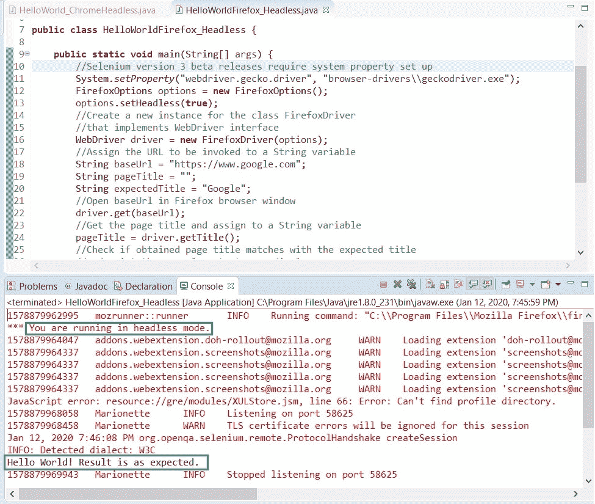

# 10M 高级 WebDriver – 以无头模式运行测试

> 原文： [https://javabeginnerstutorial.com/selenium/10m-advanced-webdriver-running-tests-in-headless-mode/](https://javabeginnerstutorial.com/selenium/10m-advanced-webdriver-running-tests-in-headless-mode/)

我敢肯定，您现在会听说无头，因为 Google 为其 Chrome 浏览器（从 59 版开始）引入了无头选项！ Firefox 紧随其后。 它也可以在无头模式下运行！！ 让我们在没有 Firefox 的情况下在 Firefox 中执行一些自动化的 Selenium 测试！ 😉换句话说，测试在后台运行，并且没有显示（即，浏览器 UI 不显示给用户）。 该代码还将提供给 Chrome 浏览器。

您脑海中可能会出现的第一个问题是，为什么我首先需要一个无头的浏览器？ 我收到你的来信。 不用担心，我有答案并且相信我，这些都是很好的答案。 因此，事不宜迟，以下是您无头的几个原因，

1.  如果您的目标是获得更好的**速度**和**性能**，那么别无所求！ 由于无需为每个测试都启动浏览器 UI，从而避免了加载 JavaScript，CSS 和呈现 HTML 所需的所有时间，因此测试运行速度更快。
2.  通常，在 **CI（连续集成）管道**中，它需要在没有实际 GUI 的服务器或 Linux OS 等系统上运行。 无头模式节省了一天！
3.  如果您所有的测试都运行了几个小时怎么办？ 在这种情况下，用户必须从字面上看屏幕，让系统执行其工作，直到所有测试占据整个屏幕为止。 相反，如果以无头模式执行，则用户可以在后台运行测试时继续执行其他任务。
4.  当脚本被开发并且稳定时，并不需要真正看到它们正在运行。 以更快的方式在无头模式下运行它们似乎很有意义。 借助日志，可以执行所需的调试。
5.  并行执行 – 无头可阻止打开多个浏览器，并让您执行多任务。
6.  无头模式也可以拍摄**截图**。 因此，一旦发生故障，便始终可以以所需的任何方式获取并存储快照。

但是，瞧！ 有时候无头可能不是很有用。 例如，

1.  在开发脚本时，在传统的浏览器中运行它们可以帮助我们直观地查看实际情况，从而使自动化的初始阶段的调试变得容易。
2.  当模拟应用的真实用户时
3.  可能无法捕获某些错误，例如图像崩溃或无法加载

话虽如此，让我们看一些工作代码！

Chrome 无头模式，

```java
import org.openqa.selenium.WebDriver;
import org.openqa.selenium.chrome.ChromeDriver;
import org.openqa.selenium.chrome.ChromeOptions;
public class HelloWorld_ChromeHeadless {
	public static void main(String[] args) {
		// System property set up
		System.setProperty("webdriver.chrome.driver", "browser-drivers\\chromedriver.exe");
		// Add options to Google Chrome
		ChromeOptions options = new ChromeOptions();
		// Setting headless argument
		options.addArguments("--headless");
		// To test responsive websites
		options.addArguments("window-size=1400,600");
		// Create a new instance for the class ChromeDriver
		// that implements WebDriver interface
		WebDriver driver = new ChromeDriver(options);
		// Assign the URL to be invoked to a String variable
		String baseUrl = "https://www.google.com";
		// Open baseUrl in IE browser window
		driver.get(baseUrl);
		// Print messages to console
		System.out.println(driver.getTitle());
		System.out.println("Hello World!"); 	
		// Close the IE browser
		driver.quit();

	}
}
```

Firefox 在无头模式下，

```java
import org.openqa.selenium.WebDriver;
import org.openqa.selenium.firefox.FirefoxDriver;
import org.openqa.selenium.firefox.FirefoxOptions;
public class HelloWorldFirefox_Headless {
	public static void main(String[] args) {
		//Selenium version 3 beta releases require system property set up
		System.setProperty("webdriver.gecko.driver", "browser-drivers\\geckodriver.exe");
		FirefoxOptions options = new FirefoxOptions();
		options.setHeadless(true);
		//Create a new instance for the class FirefoxDriver
		//that implements WebDriver interface
		WebDriver driver = new FirefoxDriver(options);
		//Assign the URL to be invoked to a String variable
		String baseUrl = "https://www.google.com";
		String pageTitle = "";
		String expectedTitle = "Google";
		//Open baseUrl in Firefox browser window
		driver.get(baseUrl);
		//Get the page title and assign to a String variable
		pageTitle = driver.getTitle();
		//Check if obtained page title matches with the expected title
		//and print the console output accordingly
		if(pageTitle.equals(expectedTitle)){
			System.out.println("Hello World! Result is as expected.");
		}else{
			System.out.println("Hello World! Assertion failed!");
		}
		//Close the Firefox browser
		driver.quit();
	}
}
```

### 执行结果：

为每行代码提供了注释，使其易于说明。

控制台窗口显示没有任何错误。 它还显示测试以无头模式运行，并且所有消息均按预期方式打印。

<figure class="wp-block-image">

<figcaption>Eclipse console output – Firefox in headless mode</figcaption>

</figure>

尝试今天的技能，祝您好运。 我坚信这些在您的自动化旅程中的某些时候会很有用。

祝你有美好的一天！

###### 下一篇文章