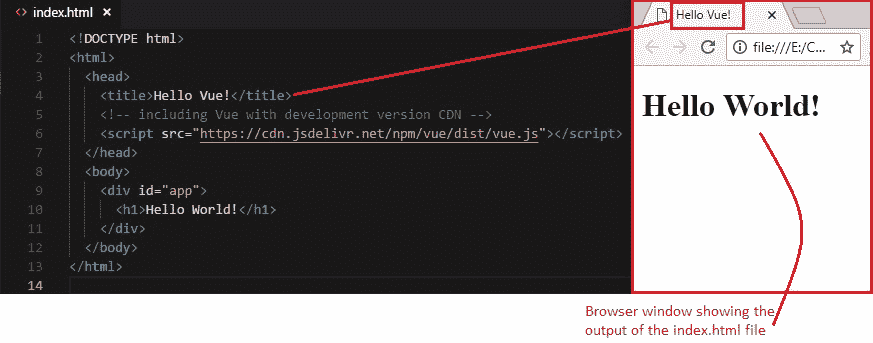

# 1 使用 Vue.js 的 Hello World

> 原文： [https://javabeginnerstutorial.com/js/vue-js/1-hello-world-with-vue-js/](https://javabeginnerstutorial.com/js/vue-js/1-hello-world-with-vue-js/)

嗨，摇滚明星（音乐不包括在内）！ 激动地进入 Vue.js 世界？ 那我们还等什么呢？

*好消息*：入门 Vue 很简单。

今天让我们保持**目标**非常简单。 遵循古老的传统，让我们旨在使用 Vue 在我们的网页上显示消息“`Hello World`”。

## 环境设置

由于我们已决定使一切保持简单，因此为什么不使用 **CDN**，它基本上是从另一台服务器导入 Vue.js 的。 在本教程系列的后面，我们将使用 Vue CLI 和 Webpack 进行更复杂的设置来捆绑所有文件。 但是就目前而言，为了练习，理解和学习 Vue 的基础知识，CDN 会做。 是的，您也可以将这种简单的设置用于非常小的项目。

### 选项 1：

```js
<!-- development version -->
<script src="https://cdn.jsdelivr.net/npm/[[email protected]](/cdn-cgi/l/email-protection)/dist/vue.js"></script>
<!-- production version -->
<script src="https://cdn.jsdelivr.net/npm/[[email protected]](/cdn-cgi/l/email-protection)"></script>
```

### 选项 2：

Vue 也可用于 unpkg，

```js
<script src="https://unpkg.com/[[email protected]](/cdn-cgi/l/email-protection)/dist/vue.js"></script>
```

在撰写本文时，最新的版本是 2.5.16。 建议在 URL 中包含特定的版本号。 您可以手动将版本编辑为使用中的最新版本。

但是，如果您不想提及该版本并使用最新版本，请继续，

```js
<script src="https://cdn.jsdelivr.net/npm/[[email protected]](/cdn-cgi/l/email-protection)/dist/vue.js"></script>
<script src="https://cdn.jsdelivr.net/npm/vue"></script>
<!-- or -->
<script src="https://unpkg.com/vue/dist/vue.js"></script>
```

### 选项 3：

您可以[将 Vue.js 的开发或生产版本](https://vuejs.org/v2/guide/installation.html)下载到本地，并使用 HTML 文件中的`script`标签直接将其包含在内。

**注意**：开发版本包含控制台警告，这些警告对于调试非常有用。 而生产版本主要针对大小（通过使用 vue.js 文件的缩小版本等）和速度进行了优化，这对于在实时环境中发布非常重要。

## 初始代码

我使用 Visual Studio Code 作为 IDE。 您可以使用 Sublime Text，WebStorm，Atom，Notepad ++或您选择的任何其他 IDE。 **我的建议？** 请选择 [**JS Fiddle**](https://jsfiddle.net/) 标签。 这仅仅是锦上添花。 最好的部分是，您可以在一个屏幕上查看 HTML，CSS，JS 和输出。 与必须每次刷新一次以反映更改的浏览器不同，JS 小提琴会检测到更改并在“结果”窗格中自动呈现输出。

使用以下代码创建一个 HTML 文件“`index.html`”，

```js
<!DOCTYPE html>
<html>
  <head>
    <title>Hello Vue!</title>
    <!-- including Vue with development version CDN -->
    <script src="https://cdn.jsdelivr.net/npm/vue/dist/vue.js"></script>
  </head>
  <body>
    <div id="app">
      <h1>Hello World!</h1>
    </div>
  </body>
</html>
```

代码很简单。 我们给页面命名为“`Hello Vue!`”。 以及`<head>`部分中使用带有`<script>`标签的 CDN 的 vue.js 的开发版本。 我们正在显示“`Hello World!`” `<body>`部分中带有`id=”app`的`<div>`元素内`<h1>`标签内的消息。

Chrome 浏览器中的当前输出如下，



到目前为止和我在一起？ 好的，我听到您说我们已经渲染了“`Hello World!`”带有`<h1>`标签，但这与我们使用 Vue.js 进行显示的最初目标不矛盾吗？ **好问题。**

## 让我们现在回答

### 步骤 1：创建新的 Vue 实例

我们已经使用`<script>`标签将 Vue.js 导入了我们的项目，但这并不能解决问题。 这相当于在我们的工作台上有一台笔记本电脑。 要打开它并完成一些工作，我们必须按下电源按钮。 同样，要在我们的项目中使用 Vue，我们必须使用`new`关键字创建 Vue 对象的实例。 这个实例是 Vue 的电源按钮！

```jsscript
new Vue();
```

### 步骤 2：传递选项对象

仅创建实例只会为 Vue 供电。 但是我们想对 Vue 做更多的。 为此，我们必须将选项或配置对象作为参数传递给刚创建的实例。 此选项对象具有 Vue 可以识别的一些保留属性，它们被指定为**键值对**。 顾名思义，并非所有属性都是必需的，可以在需要时指定。 通常，它们用于存储数据和执行某些操作。

**例如**：“`el`”，“`data`”，“`method`”等。

```jsscript
new Vue({ options/config object });
```

### 步骤 3：建立与 DOM 的连接

我们希望以某种方式获取对我们希望操纵的一部分 HTML 代码的控制。 在我们的示例中，它是带有`id`和“`app`”的`<div>`元素，因此我们可以通过 Vue 显示消息“Hello World”。

为了在 Vue 实例和 DOM 的一部分之间建立这种连接，以便可以根据我们的需要对其进行控制，我们有一个名为“`el`”的保留属性，该属性转换为*元素*。 此属性将字符串作为值指定为 CSS 选择器，即`id`的“`#`”和“`.`”对于`class`。

```jsscript
new Vue({ el: "#app" });
```

通过此简单的代码行，我们现在将带有`id`的`<div>`元素，“`app`”及其内容链接到 Vue 实例。 它们现在*不可分割*！

### 步骤 4：指定我们的数据

为了存储我们要在此 Vue 实例及其链接的 DOM 中使用的所有数据/信息，我们还有一个保留的属性，称为“`data`”。 与“`el`”不同，“`data`”将对象作为其值。 由于我们要向 DOM 显示消息“`Hello World`”，因此让我们在“数据”对象中将其指定为键值对。

```jsscript
new Vue({ el: "#app", data: { message: "Hello World" } });
```

### 步骤 5：将此数据呈现到 DOM

只需使用如下所示的两个大括号即可将 Vue 实例的数据对象中指定的值呈现到 DOM。 （有关更多信息，请参阅下一篇文章！）

```html
<div id="app"> <h1>{{ message }}</h1> </div>
```

为了区分上一个输出（没有 Vue），使用 Vue 来显示，请让我们显示“`Hello World!`”而不是“`Hello World!`”。


好极了！ 因此，我们创建了第一个 Vue 应用。 [GitHub 仓库](https://github.com/JBTAdmin/vuejs/tree/master/01_Hello%20World%20with%20Vuejs)中提供了本文讨论的所有代码。

祝你有美好的一天！
