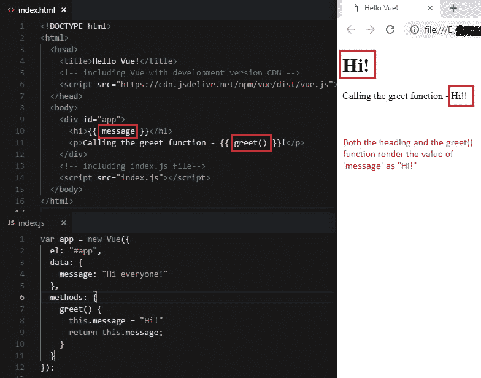
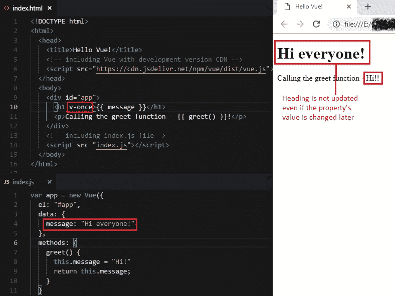

# 3 Vue 指令简介

> 原文： [https://javabeginnerstutorial.com/vue-js/3-vue-directives/](https://javabeginnerstutorial.com/vue-js/3-vue-directives/)

今天，我们将探讨 Vue 指令的全部内容。

首先是第一件事。 什么是指令？ 这些是特殊的说明，它们会在附加到 HTML 元素时更改其行为。 换句话说，这些是附加到 HTML 元素的特殊属性，这些属性可以更改行为并基于 DOM 的表达式值提供对 DOM 的控制。

所有 Vue 指令均以`v-`为前缀。 该前缀用于以下目的：

*   表示它是属于 Vue 的特殊属性
*   帮助保持语法一致
*   为开发人员提供可读性

Vue 带有一些内置指令。 请注意，我们可以编写自己的自定义指令，我们将在以后看到。 这些指令可以在许多情况下为我们提供帮助。

一些示例是，

*   单向和双向**绑定**：`v-bind`和`v-model`
*   **监听 DOM 事件**：`v-on`
*   **条件渲染**：`v-if`，`v-else`，`v-for`
*   **插值**：`v-once`，`v-html`，`v-text`

在我们的教程系列中，我们将详细处理所有这些指令。 现在，让我们看一下`v-once`的工作，并提供一个代码示例，以大致了解指令的工作方式。

## 场景：

*   显示标题
*   显示带有问候消息的段落，例如“嗨！”

### `Index.html`

```js
<html>
  <head>
    <title>Hello Vue!</title>
    <!-- including Vue with development version CDN -->
    <script src="https://cdn.jsdelivr.net/npm/vue/dist/vue.js"></script>
  </head>
  <body>
    <div id="app">
      <h1>{{ message }}</h1>
      <p>Calling the greet function - {{ greet() }}!</p>
    </div>
    <!-- including index.js file-->
    <script src="index.js"></script>
  </body>
</html>
```

### `Index.js`

```js
var app = new Vue({
  el: "#app",
  data: {
    message: "Hi everyone!"
  },
  methods: {
    greet() {
      this.message = "Hi!"
      return this.message;
    }
  }
});
```

你能猜出输出吗？

`greet()`函数返回的标题和值都将为“`Hi!`”。 因为一旦`message`的值更改，所有出现的事件都会被重新渲染。 这是默认行为。



但是，在某些情况下，即使稍后更改属性，您可能仍要显示其初始值。 这是指令生效的地方。 在我们的场景中，我们希望显示`message`属性的初始值“`Hi everyone!`” 作为标题。 因此，通过将指令`v-once`添加到`<h1>`元素，该元素内部的所有内容将仅呈现一次。 稍后通过`<p>`元素中的`greet()`方法对其进行更改时，将不会对其进行更新。



与往常一样，所有代码文件都可以在 [GitHub 仓库](https://github.com/JBTAdmin/vuejs)中找到。 请随意创建您自己的副本，以尝试使用`v-once`指令。 不要忘记让您的想象力疯狂。 再见！
