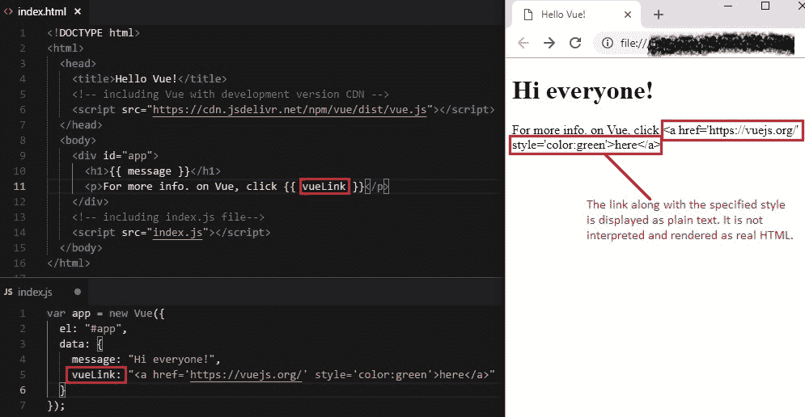
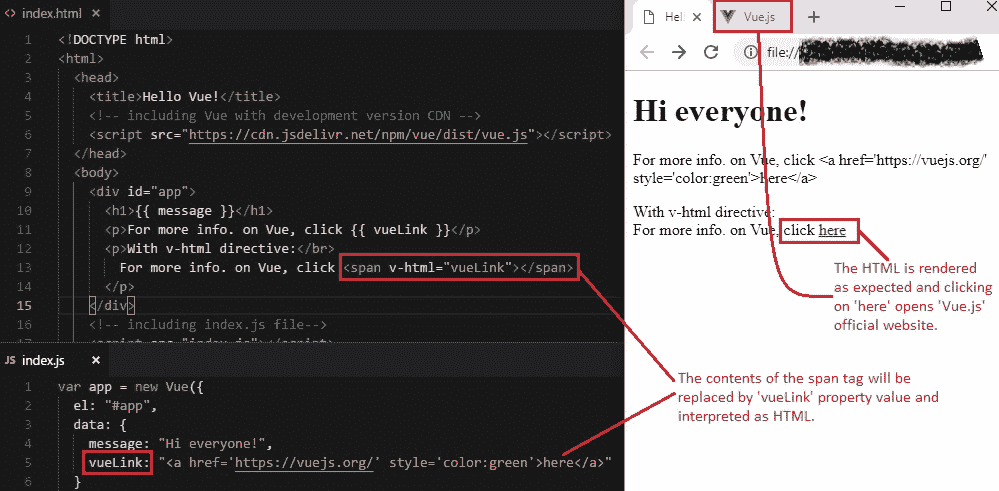
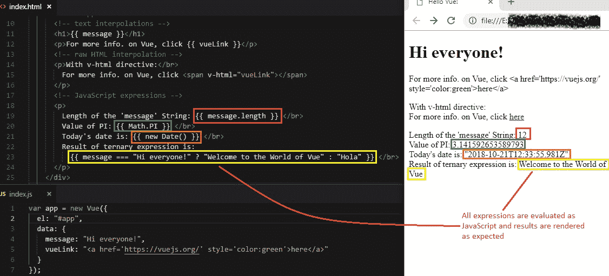

# 5 数据绑定第 1 部分（文本，原始 HTML，JavaScript 表达式）

> 原文： [https://javabeginnerstutorial.com/vue-js/5-data-binding-p1/](https://javabeginnerstutorial.com/vue-js/5-data-binding-p1/)

今天，我非常激动，因为我们将要讨论 Vue.js 中一些最有趣的数据绑定技术。 有必要了解，我们提供了多种将 DOM 与基础 Vue 实例的数据对象绑定的方法。

## 文本插值

还记得我们在[先前文章](https://javabeginnerstutorial.com/js/vue-js/2-template-syntax-reactivity/)之一中讨论的胡须/模板语法`{{ }}`吗？ 这是数据绑定的基本形式，称为“**文本插值**”。 可以使用伪指令`v-once`执行一次插值，尽管稍后会更新该属性的初始值。 单击[此处](https://javabeginnerstutorial.com/vue-js/3-vue-directives/)，以获取有关`v-once`的详细说明以及代码示例和屏幕截图。

## 原始 HTML 插值

默认情况下，Vue 始终将模板语法中的数据视为纯文本。 在大多数情况下，这正是我们想要的。 但是，编码完全是旅途中意外的转折。 如果有一天我们想传递原始 HTML 并相应地在 DOM 中呈现该怎么办？ 当然，您不能使用那些双花括号，因为如果这样做，您将得到。



并不奇怪吗？ 整个 HTML 代码呈现为纯文本。 这就是模板语法的工作方式，并且这种行为可以防止任何第三方将不需要的代码注入您的网站（多么可怕？！）。 因此，切勿在用户无法控制的用户提供的内容上使用此功能。 因此，如果您真的相信提供 HTML 代码的源代码是安全的，并希望将其呈现给 DOM，请使用另一个指令`v-html`。



使用`v-html`指令会将`<span>`标记的内容替换为`vueLink`数据属性的值，并将其解释为纯 HTML。 因此，超链接以指定的绿色显示。

## 使用 JavaScript 表达式

双花括号以及显示纯文本还可以求值**单个** JavaScript 表达式。

请记住，**仅是单个表达式**。 不是语句，不是流控件，不是任何用户定义的全局变量！ 让我们来看一些示例

1.  可以始终在模板语法中访问“`message`”属性的值。 现在，我们可以对其应用任何可用的 JavaScript `String`方法。

```jsscript
{{ message.length }}
```

2.  js 允许访问模板表达式中的几个全局对象，即`Math`和`Date`。 小心，不允许访问用户定义的全局变量。

```jsscript
{{ Math.PI }} {{ new Date() }}
```

3.  流控制语句（如`if-else`，`for`，`while`，`do-while`等）将不起作用，因此剩下的唯一选择是使用三元表达式。 始终建议将复杂的逻辑放入我们将在以后的文章中详细讨论的方法中。

```jsscript
{{ message === "Hi everyone!" ? "Welcome to the World of Vue" : "Hola" }}
```

此外，如前所述，在模板语法内只能使用单个表达式。 即使是一个简单的表达式也无法使用，例如“`let level = 1`”。

完整的代码如下，

### `Index.html`

```html
<!DOCTYPE html>
<html>
  <head>
    <title>Hello Vue!</title>
    <!-- including Vue with development version CDN -->
    <script src="https://cdn.jsdelivr.net/npm/vue/dist/vue.js"></script>
  </head>
  <body>
    <div id="app">
      <!-- text interpolations -->
      <h1>{{ message }}</h1>
      <p>For more info. on Vue, click {{ vueLink }}</p>
      <!-- raw HTML interpolation -->
      <p>With v-html directive:</br>
        For more info. on Vue, click <span v-html="vueLink"></span>
      </p>
      <!-- JavaScript expressions -->
      <p>
        Length of the 'message' String: {{ message.length }} </br>
        Value of PI: {{ Math.PI }} </br>
        Today's date is: {{ new Date() }} </br>
        Result of ternary expression is:
          {{ message === "Hi everyone!" ? "Welcome to the World of Vue" : "Hola" }} </br>
      </p>
    </div>
    <!-- including index.js file -->
    <script src="index.js"></script>
  </body>
</html>
```

### `Index.js`

```jsscript
var app = new Vue({
  el: "#app",
  data: {
    message: "Hi everyone!",
    vueLink: "<a href='https://vuejs.org/' style='color:green'>here</a>"
  }
});
```

输出如下，



上面讨论的所有代码都可以在 [GitHub 仓库](https://github.com/JBTAdmin/vuejs)中找到。

在我请假之前，让我先给您的大脑一个小任务。 我们无法在 HTML 属性中使用此模板/胡子语法。 您能想到其他选择吗？ 我相信你可以！

祝你今天愉快 ？
