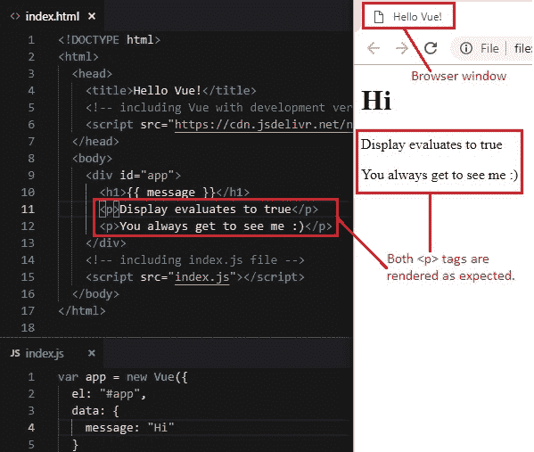
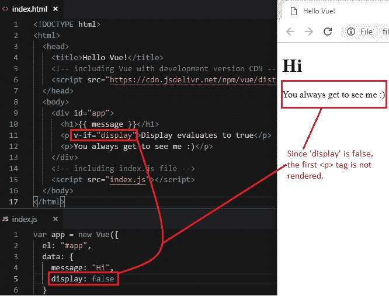
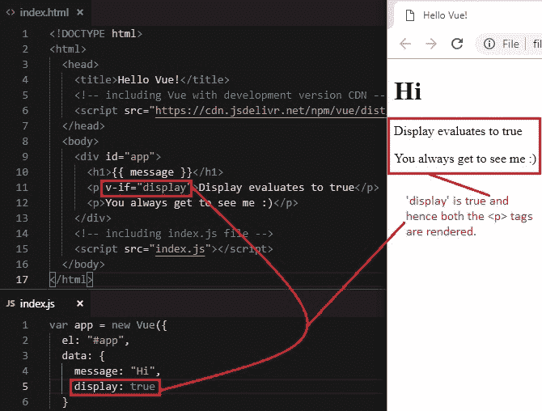
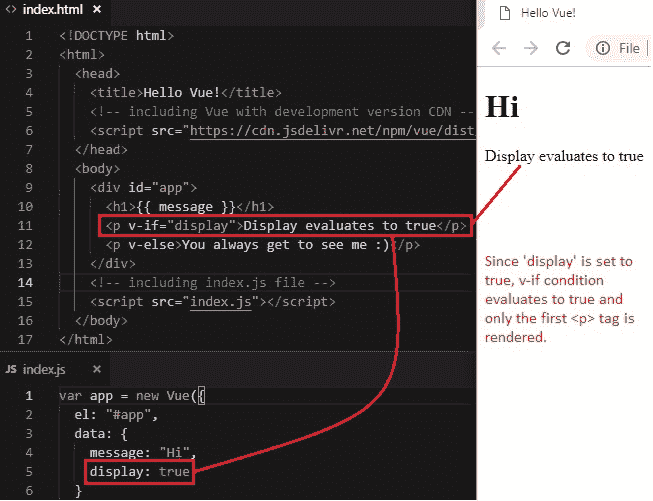
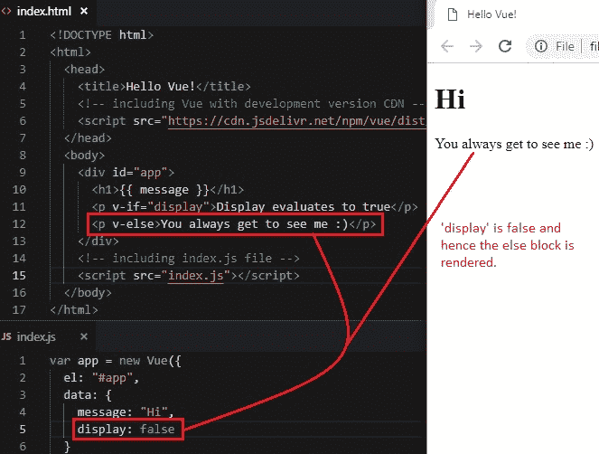
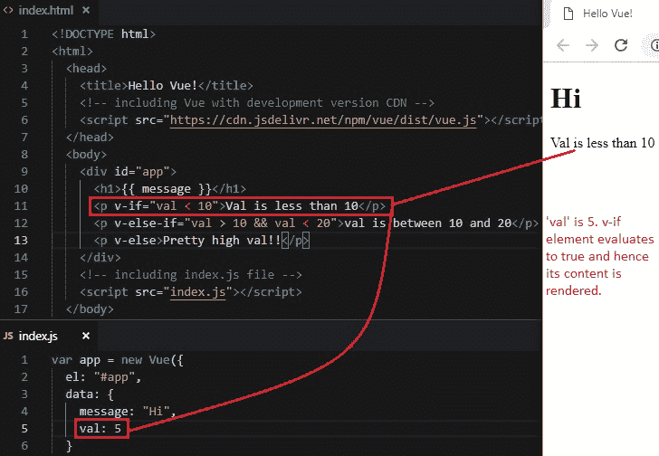
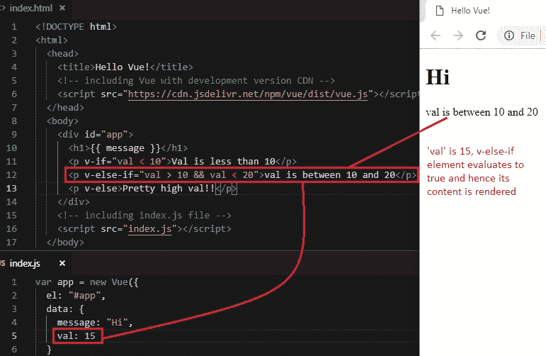
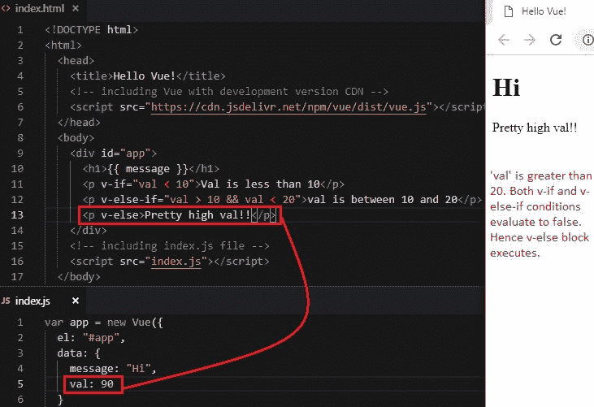

# 7 条件渲染第 1 部分（`v-if`，`v-else`，`v-else-if`）

> 原文： [https://javabeginnerstutorial.com/vue-js/7-conditional-rendering-part-1/](https://javabeginnerstutorial.com/vue-js/7-conditional-rendering-part-1/)

我们并不总是希望将所有内容呈现到我们的网页上。 根据特定条件或特定表达式的值，我们可能希望隐藏/显示/附加或分离元素。 这只不过是条件渲染 – *基于条件*渲染元素。 这可以使用简单的`if-else`语句来实现。 但是，我们将如何使用 Vue？ 现在就纠正一下吧！

Vue **指令**再来一次！ 在这方面，我们有`v-if`，`v-else`和`v-else-if`来帮助我们。 让我们逐一查看示例，以进行深入了解。 我将撒很多视觉效果以简化此过程。

首先，让我们有两个带有一些文本的段落标签，



## 1\. `v-if`指令

使用`v-if`指令的语法如下：

```html
<HTML-tag v-if=”condition or expression that evaluates to true or false”>
```

如果条件为真/求值为真，则将渲染标签。

让我们向 Vue 实例的数据对象添加`display`属性，并为其赋予`false`值。

```jsscript
data: { message: "Hi", display: false } 
```

现在，将`v-if`指令添加到第一段标签中，并指定`display`条件，基于该条件，将不显示标签。

```html
<p v-if="display">Display evaluates to true</p>
```

由于`display`的值现在设置为`false`，因此不会呈现带有文本“**显示求值为真**”的第一个`<p>`标签。



将`display`值更改为`true`将呈现第一个`<p>`标签的内容。



## 2\\. `v-else`指令

假设您要在显示为`true`时显示第一个`<p>`标签，并在显示结果为`false`时显示第二个`<p>`标签。 在这种情况下，我们可以使用`v-else`指令。 它类似于`else`块。

```html
<p v-if="display">Display evaluates to true</p> 
<p v-else>You always get to see me :)</p>
```

将`display`设为`true`时，将在`v-if`指令的条件求值为`true`的情况下呈现第一个`<p>`标签。



将`display`更改为`false`只会使用`v-else`伪指令呈现第二个`<p>`标签，如下所示，



**注意：** *具有`v-else`指令的 HTML 元素必须紧随具有`v-if`的元素。 否则，`v-else`元素将不会被识别。 换句话说，不要在`v-if`元素和`v-else`元素之间添加任何元素。*

可以在`<div>`，`<template>`等帮助下将这些指令添加到单个 HTML 元素或元素块中。考虑一种情况，您希望根据条件显示错误消息。 在这种情况下`if-else`块会派上用场。

## 3\. `v-else-if`指令

它也与`v-if`元素一起使用。 该指令充当“`else-if`”条件。 与其他任何编程语言一样，它可以链接多次。

让我们向数据对象添加`val`属性，并为其提供数值。

```jsscript
data: { message: "Hi", val: 5 }
```

将`v-if`，`v-else-if`和`v-else`伪指令添加到三个`<p>`标签并添加条件。

```html
<p v-if="val < 10">Val is less than 10</p> 
<p v-else-if="val > 10 && val < 20">val is between 10 and 20</p> 
<p v-else>Pretty high val!!</p>
```

现在，让我们更改`val`属性的值，并查看输出如何变化。

首先，将`val`设为`5`。 由于它小于 10，因此`v-if`条件求值为`true`并被渲染。



现在将`val`更改为`15`。 `v-else-if`条件求值为`true`，并将其呈现到 DOM，如下所示。



将`val`更改为`90`会使`v-if`和`v-else-if`表达式均求值为`false`。 因此，将渲染`v-else`元素。



**注意：** *与`v-else`相似，带有`v-else-if`指令的元素必须紧随带有`v-if`或`v-else-if`的元素。 否则，将无法识别。*

上面讨论的所有代码都可以在 [GitHub 仓库](https://github.com/JBTAdmin/vuejs)中找到。

是时候戴上开发人员的帽子，并尝试使用这些指令了！ 祝你今天愉快。
