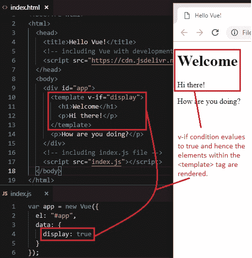
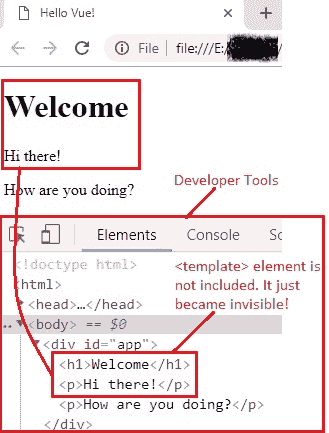
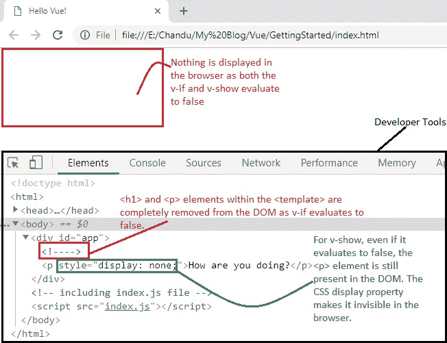

# 8 条件渲染第 2 部分（`v-if`和`v-show`）

> 原文： [https://javabeginnerstutorial.com/vue-js/8-conditional-rendering-part-2/](https://javabeginnerstutorial.com/vue-js/8-conditional-rendering-part-2/)

我们是否没有足够的指令来处理条件渲染？ 我们还需要`v-show`吗？ 还有另一件事困扰我们的大脑吗？

但是该怎么办？ 我们忙于观看 Netflix 时，Evan You（Vue 的创建者）出于某种原因添加了它。 因此，让我们看看为什么该指令首先存在。 *警告*：这篇文章是“[条件渲染第 1 部分](https://javabeginnerstutorial.com/vue-js/7-conditional-rendering-part-1/)”的继续，因此，我建议您在继续进行之前先充分了解这些概念。

我们讨论了`v-if`，`v-else`等不仅可以应用于单个 HTML 元素，而且可以应用于使用`<div>`或`<template>`等的元素块。让我们首先来看一个带有`<template>`元素的示例，并了解它作为*不可见包装器*的行为，以最终结果呈现给 DOM。

## 使用`<template>`元素

让我们在`<template>`元素内包装标题和段落，并使用`v-if`指令为其指定条件。 除此之外，我们还要添加没有任何条件的另一段。

首先，将`display`属性添加到 Vue 实例的数据对象，并为其赋予`true`值。

```js
data: {
    display: true
  }
```

其次，对`index.html`文件进行以下更改，

```js
 <template v-if="display">
        <h1>Welcome</h1>
        <p>Hi there!</p>
      </template>
      <p>How are you doing?</p> 
```

如果由于`display`设置为`true`而看到了输出，则`if`条件求值为`true`，并显示模板块中的元素。



这里有趣的是，如果您打开浏览器的**开发人员工具**（在 Chrome 浏览器中为`Ctrl + Shift + I`或`F12`），然后在元素标签中，`<template>`元素将不包含。 它神奇地变成了**不可见的**！



**注意：** *当`v-if`条件的值为`false`时，整个元素将从 DOM 中分离/删除。 当在我们的应用中不需要某个元素时，这通常是首选的行为，因为 DOM 中包含较少的元素会提高其性能。*

## `v-show`指令

作为开发人员的生活是如此变幻莫测！ 我们经常遇到需要频繁显示和隐藏元素的情况，即在网页上打开和关闭。 在这种情况下，最好使用`v-show`指令。

### 使用`v-show`的原因

该指令将确保 DOM 中始终存在**元素**。 将显示条件是否为真（求值为`true`）。 当条件求值为`false`时，该元素将通过自动添加 CSS 属性`display: none`来隐藏！ 听起来不有趣吗？

这个概念可能很难缠住我们的头脑。 不用担心，我已经覆盖了你。 示例和屏幕截图可为我们提供帮助！

在前面的示例中，让我们将`v-show`指令添加到第二段标签中。

```html
<p v-show="display">How are you doing?</p>
```

当`display`为`true`时，`v-if`和`v-show`的行为类似。 浏览器输出和开发人员工具显示的结果与以前相同（请参阅“使用`template`元素”标题下显示的两个图像）。 这里没有惊喜！

让我们将`display`属性的值更改为`false`。 我们完整的代码如下所示：

#### `Index.js`

```jsscript
var app = new Vue({
  el: "#app",
  data: {
    display: false
  }
});
```

#### `Index.html`

```html
<!DOCTYPE html>
<html>
  <head>
    <title>Hello Vue!</title>
    <!-- including Vue with development version CDN -->
    <script src="https://cdn.jsdelivr.net/npm/vue/dist/vue.js"></script>
  </head>
  <body>
    <div id="app">
      <template v-if="display">
        <h1>Welcome</h1>
        <p>Hi there!</p>
      </template>
      <p v-show="display">How are you doing?</p>
    </div>
    <!-- including index.js file -->
    <script src="index.js"></script>
  </body>
</html>
```

顺便说一句，让我们继续查看浏览器的输出和开发人员工具的结果。



不出所料，由于`v-if`和`v-show`条件都求值为`false`，因此没有任何内容呈现给网页。 这里也没有什么魔术。 但是，当我们打开开发人员工具并仔细查看“元素”窗格时，有很多东西需要解码。

1.  具有`v-if`伪指令的`<template>`元素（包含`<h1>`和`<p>`元素）在求值为`false`时，已从 DOM 中删除了。
2.  仅具有`v-show`指令的第二个`<p>`元素**使用 CSS `display`属性切换元素的可见性**。 元素始终附加到 DOM，并且始终显示。 它只是变得不可见。 就这样！

### 当心！

由于不支持将`v-show`与`<template>`元素一起使用，因此无法使用。 另外，它不适用于`v-else`（`if`和`else`是灵魂伴侣，你知道吗？！不是，`show`和`else`！）

### 那么，我应该使用`v-if`或`v-show`吗？

好问题！ 如果您想**切换**，通常将**经常切换**，因为 DOM 中始终存在该元素，请使用`v-show`，无论初始条件是否为`true`或`false`。 借助 CSS `display`属性只能切换可见性。 因此，初始渲染成本较高。

如果**元素**的状态不经常更改/切换**，尤其是在运行时，请使用`v-if`。 因为在这里附加和分离元素通常会变得昂贵。 另外，请记住，`v-if`是**惰性的**，即，如果条件在初次渲染时求值为`false`，则直到条件变为`true`时，元素或块才会被渲染。

还在头上有雾吗？ 不用担心！ 练习是这里的关键。 抓住巫师的帽子和魔杖，尝试一些咒语（示例场景），您将掌握它！ 顺便说一下，以上讨论的所有代码都可以在 [GitHub 仓库](https://github.com/JBTAdmin/vuejs)中找到。

祝您有美好的一天！
