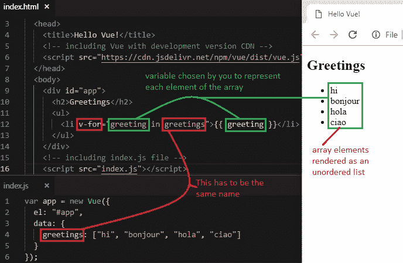
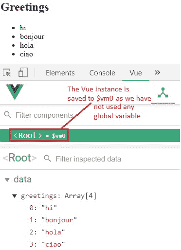
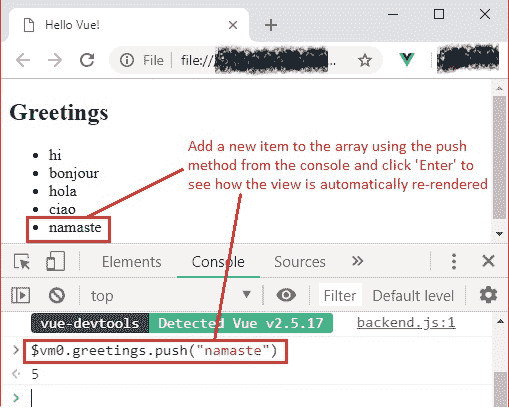
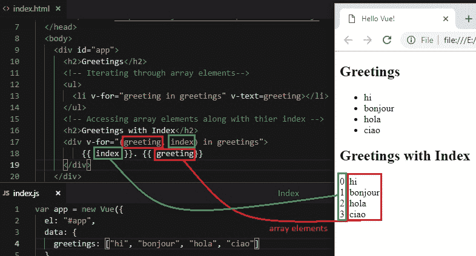

# 9 渲染列表第 1 部分（遍历数组）

> 原文： [https://javabeginnerstutorial.com/vue-js/9-rendering-lists-part-1/](https://javabeginnerstutorial.com/vue-js/9-rendering-lists-part-1/)

我们日复一日地处理清单。 在我们的应用中，我们经常遇到这样的情况，即我们必须将数组显示为列表，其项会动态变化。 因此，在我们的 HTML 中对数组项进行硬编码并不是真正的选择。 重要的是，我们知道如何使用 Vue 处理这些动态变化的数组，这并不奇怪，为此，我们还有另一个指令！ 对，是`v-for`！ 与往常一样，我们将深入研究大量示例，以便于清楚理解。

## 遍历数组

我们面临的最常见和最简单的方案是遍历数组的各项并将它们呈现为列表。 以下是四种不同语言的问候语，我们希望将其显示为网页的无序列表。

```js
data: {
  greetings: ["hi", "bonjour", "hola", "ciao"]
}
```

在我们的`index.html`文件中，让我们将`v-for`指令添加到`<li>`元素中，以动态地呈现`greetings`数组的内容，如下所示：

```js
 
   <li v-for="greeting in greetings">{{ greeting }}</li>
 
```

好吧，不要惊慌！ 我将逐字剖析此信息。

我们为`v-for`指令使用的*特殊语法*是“`greeting in greetings`”。

*   首先， `greeting` – 建议在我们的情况下使用单数名词，`greeting`，作为数组元素的**别名**反复进行。 这可以是您选择的任何名称，然后可以在我们的代码中使用该名称来寻址每个数组项。
*   其次，作为语法一部分的 – **定界符**`in`。 如果您具有 JavaScript 背景，那么所有这些看起来都应该很熟悉，因为在这里我们将`for in`和`for of`用于迭代目的。 即使使用 Vue，我们也可以使用`of`作为分隔符而不是`in`

```js
 <li v-for="greeting of greetings">{{ greeting }}</li>
```

*   最后， `greetings` – 必须与 Vue 实例的`data`对象中的**数组名称**完全相同。

在这里，为简单起见，我们在简单插值中使用变量`greeting`。 但它可以像其他任何属性一样使用，例如将其作为值传递给函数或将其绑定到链接的引用等。输出如下，



使用小胡子语法的另一种方法是使用`v-text`指令。 它将`greeting`设置为文本内容。

```html
<ul> <li v-for="greeting in greetings" v-text=greeting></li> </ul>
```

将呈现相同的结果。

## Vue 是反应式的！

让我们沿着存储通道走一下。 我们了解到 Vue 的美丽在于其[反应式](https://javabeginnerstutorial.com/js/vue-js/2-template-syntax-reactivity/)。

**快速回顾**：使状态和视图保持同步。 换句话说，Vue 不仅在引用的 DOM 中将**呈现为**数据，而且无论何时在数据对象中更改其值，**都会更新**。

让我们再来看一次这种情况。

使用快捷方式`F12`打开 *Chrome DevTools* ，然后点击“**Vue**”。 仅当您已遵循我们的教程系列并安装了 [**Vue Devtools** Chrome 扩展](https://javabeginnerstutorial.com/vue-js/4-vue-devtools-setup/) 后，此面板才会出现。

由于我们没有使用任何全局变量来引用`index.js`文件中的 Vue 实例，因此默认情况下会将其保存到`$vm0`。 如下图所示，单击`<Root>`即可看到。 因此，让我们使用`$vm0`从开发者工具控制台访问 Vue 模型。



让我们转到控制台，使用`push`方法向`greetings`数组添加一个问候，然后查看视图是否进行了动态更新（*神奇地*！）。

```jsscript
$vm0.greetings.push("namaste")
```



这不是魔术吗？

## 访问当前数组项的索引

开发者的生活没有暂停按钮！ 我们期望完成意外的事情，例如访问数组项的索引及其内容。 我们知道如何使用 Vue 渲染数组元素，但是否也可以获得其索引？ 好吧，答案是肯定的！

语法与我们之前看到的非常相似，

```html
<div v-for="(greeting, index) in greetings">{{ index }}. {{ greeting}}</div>
```

我们必须引入一个括号并指定两个用逗号分隔的参数，可以选择它们的名称。 **第一个**参数是指数组元素 – 在我们的示例中是`greeting`。 **第二个**参数是可选的，它引用当前正在循环的项目的索引 – 在我们的示例中为`index`。 此**顺序**是最重要的注意事项。 无论您使用什么名称，第一个始终是数组元素，第二个始终是`v-for`语法中的索引。 然后可以根据需要将其与代码中的这些名称一起使用。



让我们看一下最终代码。

### `Index.html`

```html
<!DOCTYPE html>
<html>
  <head>
    <title>Hello Vue!</title>
    <!-- including Vue with development version CDN -->
    <script src="https://cdn.jsdelivr.net/npm/vue/dist/vue.js"></script>
  </head>
  <body>
    <div id="app">
      <h2>Greetings</h2>
      <!-- Iterating through array elements-->
      <ul>
        <li v-for="greeting in greetings" v-text=greeting></li>
      </ul>
      <!-- Accessing array elements along with thier index -->
      <h2>Greetings with Index</h2>
      <div v-for="(greeting, index) in greetings">
          {{ index }}. {{ greeting}}
      </div>
    </div>
    <!-- including index.js file -->
    <script src="index.js"></script>
  </body>
</html>
```

### `Index.js`

```jsscript
var app = new Vue({
  el: "#app",
  data: {
    greetings: ["hi", "bonjour", "hola", "ciao"]
  }
});
```

[GitHub 仓库](https://github.com/JBTAdmin/vuejs)中也提供了上面讨论的所有代码。 随意分叉仓库并进行一些实验。

在下一篇文章中，我们将研究如何使用`v-for`遍历对象。 在此之前，请继续练习！
