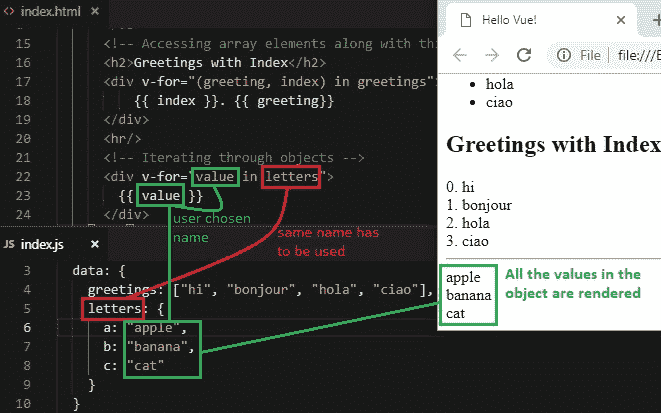
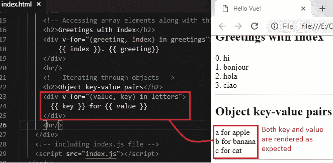
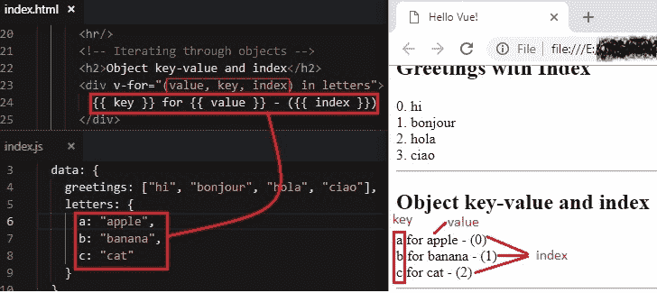
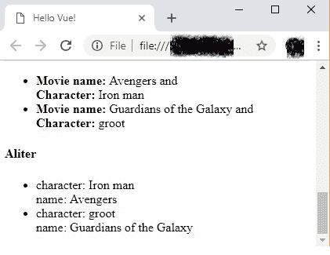
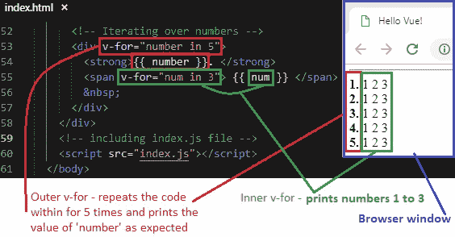

# 10 渲染列表第 2 部分（遍历对象）

> 原文： [https://javabeginnerstutorial.com/vue-js/10-rendering-lists-part-2/](https://javabeginnerstutorial.com/vue-js/10-rendering-lists-part-2/)

希望您已经知道[使用`v-for`指令遍历数组元素](https://javabeginnerstutorial.com/vue-js/9-rendering-lists-part-1/)。 在我们的应用中，我们处理的对象与数组一样多。 因此，不用费劲，让我们了解如何迭代对象的各种属性。 我听到你说：“*那么对象数组呢？*”我懂了。 我们也会处理这种情况！

## 遍历对象

是时候向我们的 Vue 实例的`data`对象添加一个简单的对象了。

```js
var app = new Vue({
  el: "#app",
  data: {
    greetings: ["hi", "bonjour", "hola", "ciao"],
    letters: {
      a: "apple",
      b: "banana",
      c: "cat"
    }
  }
});
```

为了遍历对象的键值对，我们可以使用相同的`v-for`指令。

### 1\. 访问对象的值

访问对象的值非常简单。

```js
<div v-for="value in letters"> {{ value }} </div>
```

这种语法与遍历数组值非常相似吗？ 如果我们只想从每个键值对中获取值，那么就足够了。

*   ‘`value`’– 您可以选择任何名称。 使用相同的名称访问每个值。
*   ‘`letters`’– 必须与`data`对象中的对象名称相同。



### 2\. 获得键和值

如果我们想在`v-for`语法中使用多个参数，则必须使用括号。 **顺序**在这里很重要。

*   **第一个自变量**将始终是**值**
*   **第二个自变量**将是**键**。

参数名称可以是我们选择的任何名称。 为了简单和易于理解，让我们使用`value`和`key`作为参数名称。

```html
<div v-for="(value, key) in letters"> {{ key }} for {{ value }} </div>
```



### 3\. 访问键，值和当前索引

第三个自变量可用于获取正在访问键值对的当前指标。 同样，这些论据的顺序很重要。 第一个参数将始终是值，第二个参数将是键，第三个参数是当前索引。 参数名称可以一如既往地由我们选择。 不要忘记将所有这些参数括在括号中。 为了更好地理解，让我们将“`k`”用作键，将“`v`”用作值，将“`i`”用作当前索引。

```html
<div v-for="(v, k, i) in letters"> {{ k }} for {{ v }} - ({{ i }}) </div>
```

**注意**： *请注意，这些键值对的显示顺序可能会因浏览器而异。 因为顺序基于`Object.keys()`的结果，该结果返回对象的所有键。*

由于参数名称可以是我们喜欢的任何名称，因此以下代码也提供了相同的结果。

```html
<div v-for="(value, key, index) in letters"> {{ key }} for {{ value }} - ({{ index }}) </div>
```



## 遍历对象数组

假设我们的数据对象中有两个简单对象的数组。

```jsscript
movies: [ 
    { character: "Iron man", name: "Avengers" }, 
    { character: "groot", name: "Guardians of the Galaxy" } 
]
```

为了访问数组中每个对象的值，

```html
<li v-for="movie in movies"> 
  <strong>Movie name:</strong> {{ movie.name }} and <br/> 
  <strong>Character:</strong> {{ movie.character }} 
</li>
```

*   `movie in movies` – 从`movie`变量中的`movies`数组中获取每个对象
*   `movie.name`和`movie.character` – 从当前正在循环的单个对象中分别获取键`name`和`character`的值，并将其保存在“`movie`”变量中。

请记住，如果您不想使用点运算符或动态呈现键值对，则可以嵌套另一个`v-for`指令。 当然，您可以在其中嵌套任意数量的`v-for`指令。

因此，使用点运算符的替代代码是

```html
<li v-for="movie in movies"> 
  <div v-for="(value, key) in movie"> 
    {{ key }}: {{ value }} 
  </div> 
</li>
```



## 跟踪独特的“键”属性

在处理简单列表时，我们可以像到目前为止讨论的那样使用`v-for`指令。 但是在处理子组件（我们将在本系列教程的后面部分介绍），更新列表元素等过程中，您可能会遇到一些意外行为。为避免在编码时遇到此类颠簸，始终建议提供**唯一值**并将其绑定到特殊的`key`属性，如下所示，

```html
<li v-for="movie in movies" v-bind:key="movie.name">
```

希望电影的名称是唯一的。 这将有助于 Vue 跟踪每个节点的身份。

## 遍历一个范围

如果遇到仅打印从 **1** 到某些**固定整数**的数字的情况，那么再次说，这只是 Vue 的`v-for`指令。

例如，

```html
<span v-for="num in 3">
```

*   *`num`* – 您选择的任何变量名称，它将在给定范围内循环时代表当前数字
*   *`in`* – 分隔符（根据语法）
*   *3* – 范围，表示循环时要考虑的最后一个数字。

假设我们要打印 5 到 1 到 3 之间的数字。 按照上面的示例很容易，

```html
<div v-for="number in 5"> 
  <strong>{{ number }}. </strong> 
  <span v-for="num in 3"> {{ num }} </span> &nbsp; 
</div>
```

外部`v-for`跟踪`<div>`标签内的代码重复的次数，内部`v-for`生成 1 到 3 的整数范围。



让我们只看完整的代码，而不是看看各个片段。

**`index.html`**

```html
<!DOCTYPE html>
<html>
  <head>
    <title>Hello Vue!</title>
    <!-- including Vue with development version CDN -->
    <script src="https://cdn.jsdelivr.net/npm/vue/dist/vue.js"></script>
  </head>
  <body>
    <div id="app">
      <h2>Greetings</h2>
      <!-- Iterating through array elements -->
      <ul>
        <li v-for="greeting in greetings" v-text=greeting></li>
      </ul>
      <!-- Accessing array elements along with thier index -->
      <h2>Greetings with Index</h2>
      <div v-for="(greeting, index) in greetings">
          {{ index }}. {{ greeting}}
      </div>
      <hr/>
      <!-- Iterating through objects -->
      <h2>Object values</h2>
      <div v-for="value in letters">{{ value }}</div>
      <hr/>
      <h2>Object key-value pairs</h2>
      <div v-for="(value, key) in letters">
        {{ key }} for {{ value }}
      </div>
      <hr/>
      <h2>Object key-value and index</h2>
      <div v-for="(value, key, index) in letters">
        {{ key }} for {{ value }} - ({{ index }})
      </div>
      <hr/>
      <!-- Iterating over an array of objects -->
      <ul>
        <li v-for="movie in movies" v-bind:key="movie.name">
          <strong>Movie name:</strong> {{ movie.name }} and <br/>
          <strong>Character:</strong> {{ movie.character }}
        </li>
      </ul>
      <!-- Alternative method -->
      <h4> Aliter </h4>
      <ul>
        <li v-for="movie in movies">
          <div v-for="(value, key) in movie">
            {{ key }}: {{ value }}
          </div>
        </li>
      </ul>
      <hr/>
      <!-- Iterating over numbers -->
      <div v-for="number in 5">
        <strong> {{ number }}. </strong>
        <span v-for="num in 3"> {{ num }} </span> 
        &nbsp;
      </div>
    </div>
    <!-- including index.js file -->
    <script src="index.js"></script>
  </body>
</html>
```

**`index.js`**

```js
var app = new Vue({
  el: "#app",
  data: {
    greetings: ["hi", "bonjour", "hola", "ciao"],
    letters: {
      a: "apple",
      b: "banana",
      c: "cat"
    },
    movies: [
      { character: "Iron man", name: "Avengers" },
      { character: "groot", name: "Guardians of the Galaxy" }
    ]
  }
});
```

[GitHub 仓库](https://github.com/JBTAdmin/vuejs)中也提供了上面讨论的所有代码。

故事的寓意，`v-for` – 一个统治所有人的指令！ ？

祝你有个美好的一天。
