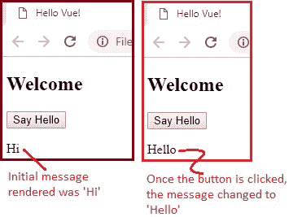
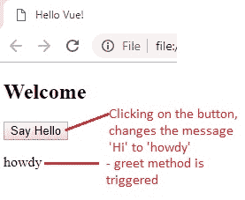
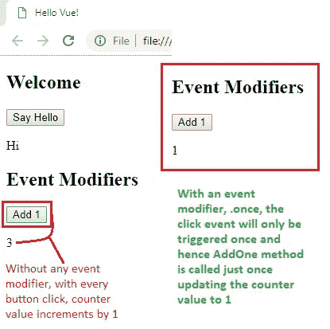

# 11 监听 DOM 事件和事件修饰符

> 原文： [https://javabeginnerstutorial.com/vue-js/11-listening-to-dom-events-and-event-modifiers/](https://javabeginnerstutorial.com/vue-js/11-listening-to-dom-events-and-event-modifiers/)

我们在事件方面一直处于停滞状态。 现在，让我们学习如何收听 DOM 事件，即`click`事件。 看一下起始代码，

#### `Index.html`

```js
<!DOCTYPE html>
<html>
  <head>
    <title>Hello Vue!</title>
    <!-- including Vue with development version CDN -->
    <script src="https://cdn.jsdelivr.net/npm/vue/dist/vue.js"></script>
  </head>
  <body>
    <div id="app">
      <h2>Welcome</h2>
      <button>Say Hello</button>
      <p> {{ message }} </p>
    </div>
    <!-- including index.js file -->
    <script src="index.js"></script>
  </body>
</html>
```

#### `Index.js`

```js
var app = new Vue({
  el: "#app",
  data: {
    message: "Hi"
  }
});
```

地球上最著名的按钮事件是`click`事件。 假设我们要在单击“说你好”按钮时将消息“嗨”更改为“你好”。 知道我们如何通过 Vue 实现这一目标吗？

亲们，人民，Vue 为此又有另一个指令，`v-on`！ 我们始终可以使用`v-on`监听 DOM 事件，例如，

*   鼠标事件 – `click`，`dblclick`，`mousemove`，`mouseover`等。
*   键盘事件 - `keypress`，`keyup`，`keydown`等。
*   表单事件 – `submit`，`focus`，`blur`等
*   还有很多

## 监听点击事件

因此，我们现在的任务是监听按钮“Say Hello”上发生点击事件时，将消息文本从“`Hi`”更改为“`Hello`”。 一件事很清楚。 我们必须将`v-on`指令添加到将要监听`click`事件的`button`元素中。

```js
<button v-on:click="message='Hello'">Say Hello</button>
```

剖析语法，

*   `v-on` – Vue 知道我们正在使用此指令来监听事件
*   `click` – 指定在冒号之后我们正在监听的事件的类型
*   `=` – 在等号后，指定触发事件时我们要执行的方法名称或 JavaScript 代码。

我们正在从 Vue 实例的数据对象访问`message`属性，并将其设置为“`Hello`”。 输出如下，



酷！ 但是在实际的应用中，我们将要做的不仅仅是改变属性的文本。

**令人费解的问题**：如何在`v-on`指令的双引号中放入复杂的 JavaScript 代码？

### 使用方法

上面提到的大脑拖曳问题的答案是使用方法。 就像`data`对象一样，我们的 Vue 实例有一个可选的`methods`对象，我们可以在其中定义所有方法。

现在，在`v-on`的双引号中，只需提及方法的名称，然后**传递所需的参数**（如果有）。 然后，在 Vue 实例的`methods`对象中定义方法，该方法将在每次`click`事件发生时触发。

#### `Index.html`（代码段）

```html
<button v-on:click="greet('howdy')">Say Hello</button>
```

#### `Index.js`

```jsscript
var app = new Vue({
  el: "#app",
  data: {
    message: "Hi"
  },
  // define all the methods within the 'methods' object
  methods: {
    greet(greeting) {
      // 'this' keyword refers to the current Vue instance
      this.message = greeting;
    }
  }
});
```

您注意到`this`关键字的用法了吗？ 为了从 HTML 引用`data`对象的属性，我们可以直接使用它们，因为我们使用`el`关键字将特定的 HTML 部分与 Vue 实例挂钩。 但是，在`methods`内部，我们必须使用`‘this’`关键字指向 Vue 实例，然后访问`data`对象的属性。



单击该按钮，“说声你好”触发了`greet('howdy')`方法，并且该方法中的代码被执行，从而向网页呈现“`Howdy`”。

## 事件修饰符

假设我们有一个名为“**加 1**”的按钮和一个初始值为`zero`的计数器。 每次单击该按钮时，都会在现有的`counter`值上加 1 并将其打印到屏幕上。

现在让我们将想象力带入现实。 只需将`v-on`指令与`click`用作参数，即可触发将`counter`值加 1 的方法。

#### `Index.html` （代码段）

```html
<button v-on:click="addOne">Add 1</button> <p> {{ counter }} </p>
```

#### `Index.js`（代码段）

```jsscript
methods: {
  addOne: function() {
    this.counter += 1;
  }
}
```

**脑筋急转弯问题**： *如果我们只想先在`click`上触发此方法，然后再不触发该方法怎么办？*

该问题的答案是 – **事件修饰符**！ 这些使我们能够**修改事件**的行为（正如其名称所暗示的）。

**用法**：在事件名称（在本例中为`click`）之后，添加一个点并指定要使用的修饰符的名称。

```html
<button v-on:click.once="addOne">Add 1</button>
```

使用事件修饰符`.once`，`click`事件将仅触发一次。 这意味着，无论单击按钮多少次，只要将`counter`的值增加到 1，`addOne`方法将仅被调用。



同样，其他可用的事件修饰符是

+ `.stop`
+ `.prevent`
+ `.capture`
+ `.self`
+ `.once`
+ `.passive`

最常用的修饰符是`.stop`和`.prevent`，它们称为众所周知的`event.stopPropagation()`和`event.preventDefault()`方法。 这些是[本机事件对象](https://www.w3schools.com/jsref/obj_event.asp)随附的方法。 这里与 Vue 无关。 Vue.js 只是提供了一种简单的方法，借助修饰符来处理此类常见事件详细信息，而不是在 Vue 实例的方法中显式指定这些事件方法（例如`event.preventDefault()`来取消事件）。

### 两个最常用修饰符的快速刷新：

根据`stopPropagation()`事件方法，`.stop`修饰符将进一步停止事件的传播。

根据`preventDefault()`方法，`.prevent`修饰符将防止发生默认操作。 `.prevent`的最佳示例是将其与`Submit`按钮一起使用，以便触发提交事件时，它不会重新加载页面。

### 链接修饰符

*警告：一开始可能会有些弯腰！*

Vue 让我们像这样，将这些修饰符一个接一个地链接，

```html
v-on:click.self.prevent
```

链接的**顺序**非常重要。 因为与每个修饰符相关的代码是按相同顺序生成的。

例如，

```html
<a href="https://vuejs.org/" v-on:click.self.prevent target="_blank">Open Vue <p>Click me now</p> </a>
```

使用`v-on:click.self.prevent`仅会阻止单击`<a>`元素本身，而不是单击其`child`元素。 好吧，我听到你说“请用英语”！ 换句话说，这意味着

*   单击`<a>`标签的“**打开 Vue**”将阻止打开`vuejs.org`页面
*   单击标签上的“**立即单击我**”，将在新标签中打开`vuejs.org`官方页面

相反，如果我们将链接修饰符的顺序更改为`v-on:click.prevent.self`，则将防止发生所有单击事件。

```html
<a href="https://vuejs.org/" v-on:click.prevent.self target="_blank">Open Vue <p>Click me now</p> </a>
```

单击`<a>`的“**打开 Vue**”和`<p>`的“**立即单击我**”都不会打开`vuejs.org`（换句话说，它无法打开）。

现在，让我们看一下到目前为止处理的完整代码，

`index.html`

```html
<!DOCTYPE html>
<html>
  <head>
    <title>Hello Vue!</title>
    <!-- including Vue with development version CDN -->
    <script src="https://cdn.jsdelivr.net/npm/vue/dist/vue.js"></script>
  </head>
  <body>
    <div id="app">
      <h2>Welcome</h2>
      <!-- Listening to click event with v-on directive -->
      <button v-on:click="greet('howdy')">Say Hello</button>
      <p> {{ message }} </p>
      <h2>Event Modifiers</h2>
      <!-- Using .once to modify click event -->
      <button v-on:click.once="addOne">Add 1</button>
      <p> {{ counter }} </p>
      <!-- chaining event modifiers -->
      <a href="https://vuejs.org/" v-on:click.prevent.self target="_blank">Open Vue
        <p>Click me now</p>
      </a>
    </div>
    <!-- including index.js file -->
    <script src="index.js"></script>
  </body>
</html>
```

index.js

```jsscript
var app = new Vue({
  el: "#app",
  data: {
    message: "Hi",
    counter: 0
  },
  // define all the methods within the 'methods' object
  methods: {
    greet(greeting) {
      // 'this' keyword refers to the current Vue instance
      this.message = greeting;
    },
    // another way to define methods before es6
    addOne: function() {
      this.counter += 1;
    }
  }
});
```

我知道今天有很多事情要消化。 上面讨论的所有代码以及不言自明的注释在 [GitHub 仓库](https://github.com/JBTAdmin/vuejs)中可用。 慢慢来，我很快就会回来讨论键盘和其他鼠标 DOM 事件。

祝你有个美好的一天！
