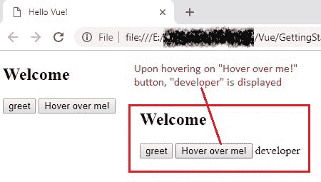
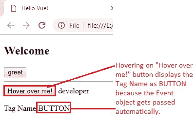

# 12 监听键盘和鼠标事件

> 原文： [https://javabeginnerstutorial.com/vue-js/12-listening-to-keyboard-and-mouse-events/](https://javabeginnerstutorial.com/vue-js/12-listening-to-keyboard-and-mouse-events/)

准备好使用 Vue 监听键盘上的某些键代码和某些鼠标按钮了吗？ 那我们深入吧！ 如果尚未阅读，请确保阅读“[监听 DOM 事件和事件修饰符](https://javabeginnerstutorial.com/vue-js/11-listening-to-dom-events-and-event-modifiers/)”。 因为这更多地是我们已经看到的内容的延续。

### 起始代码

**`Index.html`**

```js
<!DOCTYPE html>
<html>
  <head>
    <title>Hello Vue!</title>
    <!-- including Vue with development version CDN -->
    <script src="https://cdn.jsdelivr.net/npm/vue/dist/vue.js"></script>
  </head>
  <body>
    <div id="app">
      <h2>Welcome</h2>
      <button>Greet</button>
    </div>
    <!-- including index.js file -->
    <script src="index.js"></script>
  </body>
</html>
```

**`Index.js`**

```js
new Vue({
  el: "#app",
  data: {
  },
  // define all custom methods within the 'methods' object
  methods: {
    greet() {
      alert("Hi");
    }
  }
});
```

## 监听键盘事件

在开发人员世界中，即使用户没有明确单击页面上提供的 HTML 按钮来处理这种情况，我们也会经常听`Enter`键以确保执行相应的操作。 在使用 Vue 监听键事件时，我们可以使用通常的`v-on`指令来提及所需的键修饰符，如下所示：

**`Index.html`（代码段）**

```js
 <!-- Using key modifiers along with keyboard events -->
<button v-on:keyup.13="greet">greet</button>
```

每当用户释放按键或按键上升时，就会触发`keyup`事件。 在这种情况下，我们要监听`Enter`键，而不仅仅是其他键。 因此，让我们通过在`keyup`事件之后添加一个点来提及其键码为`13`。 想知道我怎么知道那个关键代码？ 常用的，通常会放在我们的头上。 如果不是，请尝试 [https://keycode.info/](https://keycode.info/) 获取键盘上任何键的键码。 太酷了！

但是，记住密码还是一直找 Google 麻烦吗？ 不用担心，就像`.once`，`.prevent`，`.self`等事件修饰符一样，Vue 为我们提供了用于大多数常用键的**键修饰符**。 清单是这样的

*   `.enter`
*   `.tab`
*   `.delete`（同时捕获“删除”和“退格”键）
*   `.esc`
*   `.space`
*   `.up`
*   `.down`
*   `.left`
*   `.right`

现在，您可以安全地用键修饰符`.enter`替换键码`13`，它将像超级按钮一样工作。 专注于按钮并单击键盘上的`Enter`，将显示一条警告消息，显示为`Hi`。

**注意**：按键修饰符仅适用于与键盘相关的事件，例如`keyup`。 这里没有火箭科学或量子物理学的东西！* ？

## 自定义键修饰符别名

除了 Vue 附带的关键修饰符之外，您还可以继续进行自己的设置，为您选择的任何关键代码设置自定义别名。 这是通过全局`config.keyCodes`对象完成的。

将以下行添加到“`index.js`”文件中以启用“`v-on:keyup.a`”，

```js
Vue.config.keyCodes.a = 65;
```

**`Index.html`（代码段）**

```js
<button v-on:keyup.a="greet">greet</button>
```

在此，释放键“`a`”时，将触发键代码为`65`的`keyup`事件，并调用方法“`greet()`”。 Cakewalk！

## 更多关于鼠标事件的示例！

在我们的[上一篇文章](https://javabeginnerstutorial.com/vue-js/11-listening-to-dom-events-and-event-modifiers/)中，我们看到了最著名的鼠标事件*点击事件*。 现在让我们再看看`mouseover`。

假设，将鼠标指针悬停在“`Hover over me!`”按钮上时，应显示“`developer`”文本。

在 Vue 实例的数据对象中添加“`role`”，并定义一个名为“`showRole`”的方法，以将此角色属性更新为`String`和`developer`。 触发`mouseover`事件时调用此方法。

**`Index.js`**

```js
new Vue({
  el: "#app",
  data: {
    role: ""
  },
  // define all custom methods within the 'methods' object
  methods: {
    showRole() {
      // 'this' keyword refers to the current Vue instance
      this.role = "developer";
    }
  }
});
```

**`Index.html`（代码段）**

```js
<button v-on:mouseover="showRole">Hover over me!</button>
 {{ role }}
```



我们还没有完成！

## 使用事件对象

还记得 JavaScript 世界中的[本机事件对象](https://www.w3schools.com/jsref/obj_event.asp)吗？ 触发事件时，将创建`Event`对象，并将其自动传递给使用`v-on`指令调用的任何方法。 再次感谢 Vue！ 让我们看一些示例来了解这一点。

`Event`对象具有“`target`”方法，该方法返回触发事件的元素，并与`element.tagName`属性一起使用返回元素的 HTML 标记名称。

**`Index.html`（代码段）**

```html
<div>
  <!-- Listening to mouse events -->
  <button v-on:mouseover="showRole">Hover over me!</button>
  {{ role }} 
  <p>{{ "Tag Name:" + tagName }}</p>
</div>
```

**`Index.js`**

```jsscript
new Vue({
  el: "#app",
  data: {
    role: "",
    tagName: ""
  },
  // define all custom methods within the 'methods' object
  methods: {
    showRole() {
      // 'this' keyword refers to the current Vue instance
      this.role = "developer";
      this.tagName = event.target.tagName;
    }
  }
});
```

使用`event.target`将返回“`[object HTMLButtonElement]`”，而`event.target.tagName`将返回“`BUTTON`”。



## 使用事件对象传递参数

到目前为止，我们肯定知道两件事，

1.  将创建`Event`对象，并将其自动传递给触发事件时正在调用的方法。
2.  只需在方法名称后面的括号内指定参数，即可将参数传递给这些方法非常容易。

如果我们想使用此自动创建的`Event`对象将自己的参数传递，该怎么办？ 我们也可以这样做吗？

答案是肯定的！ 绝对没错！！

这里要记住的重点是**命名**。 Vue 将原始 DOM 事件存储在名为“`$event`”的变量中。 注意不要覆盖或拼写错误，因为它是 Vue.js 使用的受保护名称，以了解这不是自定义参数，而是`Event`对象本身。

让我们对代码进行这些更改。

**`Index.html`（代码段）**

```html
<button v-on:mouseover="showRole('developer', $event)">Hover over me!</button>
{{ role }} 
<p>{{ "Tag Name:" + tagName }}</p>
```

**`Index.js`（代码段）**

```jsscript
showRole(customRole, event) {
  // 'this' keyword refers to the current Vue instance
  this.role = customRole;
  this.tagName = event.target.tagName;
}
```

在总结之前，这里是供您欣赏的完整代码！

**`Index.html`**

```html
<!DOCTYPE html>
<html>
  <head>
    <title>Hello Vue!</title>
    <!-- including Vue with development version CDN -->
    <script src="https://cdn.jsdelivr.net/npm/vue/dist/vue.js"></script>
  </head>
  <body>
    <div id="app">
      <h2>Welcome</h2>
      <!-- Using key modifiers with keyboard events -->
      <button v-on:keyup.enter="greet">greet</button>
      <hr/>
      <div>
        <!-- Passing arguments along with original DOM event -->
        <button v-on:mouseover="showRole('developer', $event)">Hover over me!</button>
        {{ role }} 
        <p>{{ "Tag Name:" + tagName }}</p>
      </div>
    </div>
    <!-- including index.js file -->
    <script src="index.js"></script>
  </body>
</html>
```

**`Index.js`**

```jsscript
new Vue({
  el: "#app",
  data: {
    role: "",
    tagName: ""
  },
  // define all custom methods within the 'methods' object
  methods: {
    greet() {
        alert("Hi");
    },
    showRole(customRole, event) {
      // 'this' keyword refers to the current Vue instance
      this.role = customRole;
      this.tagName = event.target.tagName;
    }
  }
});
```

因此，我们现在可以将自定义参数与带有`$event`变量的自动创建的`Event`对象一起传递。 上面讨论的所有代码以及注释都可以在 [GitHub 仓库](https://github.com/JBTAdmin/vuejs)中找到。

这使我们到了本主题的结尾。 祝您有美好的一天！
