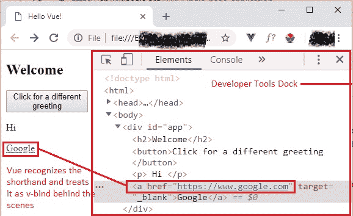

# 13 让我们使用简写

> 原文： [https://javabeginnerstutorial.com/vue-js/13-shorthands-for-v-bind-and-v-on/](https://javabeginnerstutorial.com/vue-js/13-shorthands-for-v-bind-and-v-on/)

欢迎回来！ 有人说简写吗？ 是的，这就是我们今天要关注的重点。 我们已经使用 [Vue 指令](https://javabeginnerstutorial.com/js/vue-js/what-is-vuejs/)已有一段时间了。 `v-`前缀有多种帮助。 它直观地表示我们正在处理代码中与 Vue 相关的属性（最重要的原因）。

到目前为止，您应该已经了解`v-bind`和`v-on`是我们模板中最常用的两个指令。 为什么？ 因为我们一直在处理[事件](https://javabeginnerstutorial.com/vue-js/11-listening-to-dom-events-and-event-modifiers/)（特别是单击）和[数据绑定](https://javabeginnerstutorial.com/vue-js/6-data-binding-p2/)！ 因此，对于这两个最常用的指令，Vue 为我们提供了捷径或编写它们的简便方法。

## 起始代码

`Index.html`

```js
<!DOCTYPE html>
<html>
  <head>
    <title>Hello Vue!</title>
    <!-- including Vue with development version CDN -->
    <script src="https://cdn.jsdelivr.net/npm/vue/dist/vue.js"></script>
  </head>
  <body>
    <div id="app">
      <h2>Welcome</h2>
    </div>
    <!-- including index.js file -->
    <script src="index.js"></script>
  </body>
</html>
```

`Index.js`

```js
new Vue({
  el: "#app",
  data: {
  },
  // define all custom methods within the 'methods' object
  methods: {
  }
});
```

## `v-bind`的简写

让我们使用`v-bind`属性将 HTML `<a>`标记的`href`属性绑定到“`https://www.google.com`” URL，

*`Index.html`（代码段）*

```js
<a v-bind:href="url" target="_blank">Google</a>
```

然后在 Vue 实例的数据对象中定义“`url`”，

*`Index.js`（代码段）*

```js
data: {
    url: "https://www.google.com"
}
```

这段代码工作得很好。 单击链接“`Google`”，将打开一个新标签，并导航到 Google 页面。 但是我们想看起来很酷。 不是吗？因此，编写`v-bind`指令的简短方法是一次性删除`v-bind`一词，而仅使用**冒号**。

```js
<!— Cool way of writing v-bind -->
<a :href="url" target="_blank">Google</a> 
```

刚开始时可能看起来有些混乱，但是一旦您掌握了它，您很快就会感到赞赏。 这两个代码段（带和不带简写）的工作原理完全相同。 区别只是少了一些字符和更易读的代码。

如下图所示，即使是简写形式，所有受 Vue.js 支持的浏览器（在我们的示例中为 Chrome）都可以正确解析它，并将`url`的值绑定到`href`属性。 请注意，冒号（`v-bind`的简写语法）没有出现在最终呈现的 HTML 中，可以在 Chrome DevTools 扩展坞的“元素”窗格中清楚地看到。



## `v-on`的简写

为了理解`v-on`指令的简写语法，让我们有一个按钮。 单击它后，我们将触发名为“`greet`”的方法，以在消息`Hi`和`Hello`之间切换。

完整的语法是

*`Index.html`（代码段）*

```html
<button v-on:click="greet">Click for a different greeting</button>
```

*`Index.js`（代码段）*

```jsscript
data: {
  message: "Hi",
  url: "https://www.google.com"
},
methods: {
  greet() {
    this.message === "Hi" ? this.message = "Hello" : this.message = "Hi";
  }
}
```

好的。 此处的缩写是将单词`v-on`和冒号替换为`@`符号。 就这样！ 它是如此简单！！

*`Index.html`（代码段）*

```html
<!-- Using v-on shorthand --> <button @click="greet">Click for a different greeting</button> 
```

## 最终代码

`Index.html`

```html
<!DOCTYPE html>
<html>
  <head>
    <title>Hello Vue!</title>
    <!-- including Vue with development version CDN -->
    <script src="https://cdn.jsdelivr.net/npm/vue/dist/vue.js"></script>
  </head>
  <body>
    <div id="app">
      <h2>Welcome</h2>
      <!-- Using v-on shorthand -->
      <button @click="greet">Click for a different greeting</button>
      <p> {{ message }} </p>
      <!-- Using v-bind shorthand -->
      <a :href="url" target="_blank">Google</a>
    </div>
    <!-- including index.js file -->
    <script src="index.js"></script>
  </body>
</html>
```

`Index.js`

```jsscript
new Vue({
  el: "#app",
  data: {
    message: "Hi",
    url: "https://www.google.com"
  },
  // define all custom methods within the 'methods' object
  methods: {
    greet() {
      // 'this' keyword refers to the current Vue instance
      this.message === "Hi" ? this.message = "Hello" : this.message = "Hi";
    }
  }
});
```

代码看起来更加简洁，优雅且不那么冗长（显然！）。 您将在处理事件负载的实际应用中更好地看到它。 请记住，使用简写语法完全是可选的，完全由您决定。 上面讨论的所有代码以及注释都可以在 [GitHub 仓库](https://github.com/JBTAdmin/vuejs)中找到。

*警告：我将在以后的所有代码示例中使用这些简写形式。 与他们合作的次数越多，您就越感到舒适！*

**为什么要使用简写？**

让我们了解使用这些简写来说服您的原因，

1.  由于经常以完整形式使用这些指令，因此代码变得冗长。
2.  在将 Vue.js 用作管理所有前端代码的框架的应用（例如 [SPA](https://en.wikipedia.org/wiki/Single-page_application)）中，很明显正在使用 Vue，而前缀`v-`并不那么重要。
3.  干净，易读的代码是每个开发人员最终想要的。

这使我们到了本文的结尾。 祝你今天愉快。
