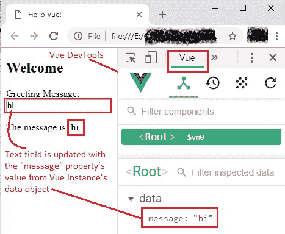
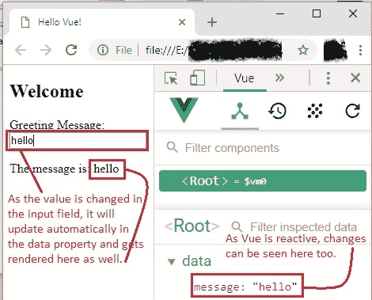

# 14 使用`v-model`进行双向数据绑定

> 原文： [https://javabeginnerstutorial.com/vue-js/14-two-way-binding-v-model/](https://javabeginnerstutorial.com/vue-js/14-two-way-binding-v-model/)

终于，有一天，要了解难题的缺失部分，即[数据绑定](https://javabeginnerstutorial.com/vue-js/5-data-binding-p1/)。 到目前为止，我们已经了解了如何使用插值，如何将`v-bind`用于属性绑定以及如何将`v-on`用于监听事件。 缺少的部分是`v-model`，它用于双向数据绑定，而这正是我们今天要重点关注的内容！

## 大字警报！

*双向数据绑定*：这只是模型（Vue 实例中的`data`对象）和视图之间的关系。 对视图所做的任何更改（例如，由用户执行）将立即反映在基础 Vue 模型中，并将在视图中呈现此数据的所有位置进行更新。 换一种说法，

1.  使用对`data`属性（模型）所做的更改来更新视图
2.  并且，只要在视图中进行更改，数据属性（模型）就会更新

你的头在旋转吗？ 别担心！ 我们将通过一个示例来理解这个概念。

## `v-model`指令

通常使用表单输入和控件创建这种双向绑定。 而`v-model`是用于实现该目标的指令！ 具体来说，以下是`v-model`所使用的确切 HTML 元素，

*   `<input>`
*   `<textarea>`
*   `<select>`
*   组件（*我们将在“高级 VueJS”部分介绍此主题*）

## 实践示例

让我们以`<input>`元素为例，在网页上显示一个文本字段。 让我们在 Vue 实例的`data`对象中也具有“`message`”属性，该属性用作我们的 Vue 模型，并具有`<p>`标签以使用胡须语法（文本插值）呈现值。 现在，我们要

1.  用`message`属性的值填充文本字段，例如“`hi`”，即使用模型更新视图。
2.  每当用户在文本字段中更改值“`hi`”时，都必须在数据属性`message`中进行更新，在我们的示例中，即使用视图和视图的更改来更新模型
3.  同时将其呈现在`<p>`标签中

通过将`v-model`指令添加到`<input>`标记并将“`message`”属性绑定到它，可以完成所有这三个步骤，

```js
<input type="text" v-model="data_property_to_bind"></input>
```

**`Index.html`**

```js
<!DOCTYPE html>
<html>
  <head>
    <title>Hello Vue!</title>
    <!-- including Vue with development version CDN -->
    <script src="https://cdn.jsdelivr.net/npm/vue/dist/vue.js"></script>
  </head>
  <body>
    <div id="app">
      <h2>Welcome</h2>
      <div>
        <!-- two-way binding with v-model -->
        Greeting Message:
        <input type="text" v-model="message"></input> 
        <p>The message is: {{ message }}</p>
      </div>
    </div>
    <!-- including index.js file -->
    <script src="index.js"></script>
  </body>
</html>
```

**`Index.js`**

```js
new Vue({
  el: "#app",
  data: {
    message: "hi"
  }
});
```

因此，`v-model`指令告诉 vue.js 为输入字段和引号内提到的`message`数据属性设置双向绑定。 当然，所有这些都会以**反应**发生！

初始输出如下。



图像的右半部分显示 [Vue DevTools](https://javabeginnerstutorial.com/vue-js/4-vue-devtools-setup/) 窗格。 也可以看到具有`message`属性及其值的`data`对象。

当我们将文本字段中的消息从“`hi`”更改为“`hello`”时，我们键入的每个字符都将在基础数据模型（如 Vue Devtools 中所示）上进行反应式更新，并在输出结果的视图中进行更新，在`<p>`标签中使用小胡子语法。



我强烈建议您如图所示打开 Vue Devtools 并更改文本字段中的值，以查看此更改是被动发生的。 这将是您的盛宴！ 我可以保证。

## 修饰符

`v-model`带有三个修饰符。 如果您错过了修饰符部分，请[查看他](https://javabeginnerstutorial.com/vue-js/11-listening-to-dom-events-and-event-modifiers/)。

**用法**：遵循`v-model`指令，添加一个点并指定修饰符。

*   `.lazy` – 在更改事件（而非输入事件）之后将输入与数据同步

```html
<input v-model.lazy="message">
```

*   `.number` – 用于将有效的输入字符串转换为数字

```html
<input v-model.number="age">
```

*   `.trim` – 自动修剪用户输入

```html
<input v-model.trim="message">
```

该代码一如既往在 [GitHub 仓库](https://github.com/JBTAdmin/vuejs)中可用。

试一试，并注意 Vue 如何根据输入类型是否为文本字段，复选框，单选按钮，选择，多选，文本区域元素等来正确更新元素……它看起来和听起来很神奇，因为你需要用于完成这项艰巨的的所有语法，都是一个简单的指令`v-model`。 如果遇到任何问题，请随时在评论部分留言。

祝您有美好的一天！
