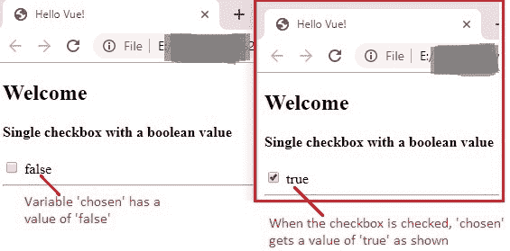
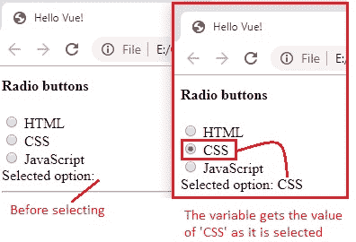
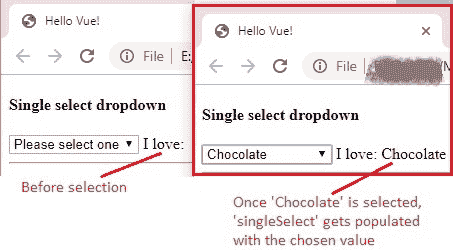
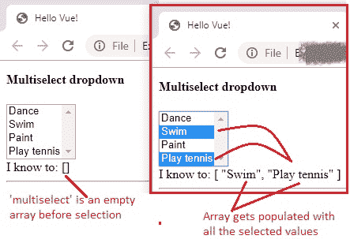
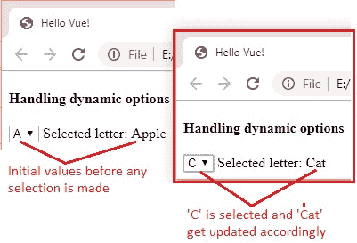

# 15 表单输入绑定

> 原文： [https://javabeginnerstutorial.com/vue-js/15-form-input-bindings/](https://javabeginnerstutorial.com/vue-js/15-form-input-bindings/)

欢迎参加有约束力的讨论！ 现在我们已经了解了这个超级巨星`v-model`，它用于在表单元素上实现[双向数据绑定](https://javabeginnerstutorial.com/vue-js/14-two-way-binding-v-model/)，让我们直观地了解 Vue 如何在引擎盖下神奇地工作，通过选择正确的更方式来更新特定 HTML 元素，基于它是单选按钮还是复选框还是`select`元素。

今天，我们将讨论以下内容，

1.  单选框
2.  多个复选框
3.  单选按钮
4.  单选下拉菜单
5.  多选下拉菜单
6.  带有动态选项的下拉菜单

第一件事第一！ 以下是我们将要使用的初始代码，

## 起始代码

index.html

```js
<!DOCTYPE html>
<html>
  <head>
    <title>Hello Vue!</title>
    <!-- including Vue with development version CDN -->
    <script src="https://cdn.jsdelivr.net/npm/vue/dist/vue.js"></script>
  </head>
  <body>
    <div id="app">
      <h2>Welcome</h2>
    </div>
    <!-- including index.js file -->
    <script src="index.js"></script>
  </body>
</html>
```

index.js

```js
new Vue({
  el: "#app",
  data: {
  }
});
```

## 单选框

看下面的代码片段，

`index.html`（代码段）

```js
<div>
  <h4>Single checkbox with a boolean value</h4>
  <!-- form input bindings: single checkbox -->
  <input type="checkbox" id="single" v-model="chosen">
  <label for="single">{{ chosen }}</label>
</div>
```

`index.js`

```js
new Vue({
  el: "#app",
  data: {
    chosen: false
  }
});
```

我们有一个`id`，`single`复选框。 让我们有一个变量`chosen`，该变量在 Vue 实例的`data`属性中分配为`false`。 选中该复选框可使`chosen`的值为`true`。 当与输入类型`checkbox`一起使用时，如果是布尔值，`v-model`就是这样工作的。


## 多个复选框

现在，让我们有四个复选框，其值均绑定到同一数组。

`index.html`（代码段）

```html
<div>
  <h4>Multiple checkboxes with values of an array</h4>
  <!-- value bindings: multiple checkboxes -->
  <input type="checkbox" id="cars" value="Cars" v-model="checkedFilms">
  <label for="cars">Cars</label>
  <input type="checkbox" id="brave" value="Brave" v-model="checkedFilms">
  <label for="brave">Brave</label>
  <input type="checkbox" id="up" value="Up" v-model="checkedFilms">
  <label for="up">Up</label>
  <input type="checkbox" id="ratatouille" value="Ratatouille" v-model="checkedFilms">
  <label for="ratatouille">Ratatouille</label>
  <br/>
  <span>Selected pixar films are: {{ checkedFilms }}</span>
</div>
```

`index.js`（代码段）

```jsscript
data: { 
  checkedFilms: [] 
}
```

因此，所有四个输入元素均为`checkbox`类型，并且每个元素都具有与数组`checkedFilms`”的双向绑定。 请注意，该数组的初始值在 Vue 实例的`data`属性中为空。 在这里`v-model`的工作方式是，在数组`checkedFilms`中填充所选复选框的值。


## 单选按钮

很容易猜出`v-model`在单选按钮下的行为。 由于我们只能从组中选择一个单选按钮，因此绑定两种方式的变量将获取所选单选按钮的值。

`index.html`（代码段）

```html
<div>
  <h4>Radio buttons</h4>
  <input type="radio" id="html" value="HTML" v-model="selected">
  <label for="html">HTML</label>
  <br>
  <input type="radio" id="css" value="CSS" v-model="selected">
  <label for="two">CSS</label>
  <br>
  <input type="radio" id="javascript" value="JavaScript" v-model="selected">
  <label for="JavaScript">JavaScript</label>
  <br>
  <span>Selected option: {{ selected }}</span>
</div>
```

`index.js`（代码段）

```jsscript
data: { 
  selected: '' 
}
```

根据选择的选项，变量`selected`获得`HTML`或`CSS`或`JavaScript`的值。



## 单选下拉菜单

这是一个正常的下拉列表，您可以在其中选择一个选项。

`index.html`（代码段）

```html
<div>
  <h4>Radio buttons</h4>
  <input type="radio" id="html" value="HTML" v-model="selected">
  <label for="html">HTML</label>
  <br>
  <input type="radio" id="css" value="CSS" v-model="selected">
  <label for="two">CSS</label>
  <br>
  <input type="radio" id="javascript" value="JavaScript" v-model="selected">
  <label for="JavaScript">JavaScript</label>
  <br>
  <span>Selected option: {{ selected }}</span>
</div>
```

`index.js`（代码段）

```jsscript
data: { 
  singleSelect: '' 
}
```

变量`singleSelect`最初是一个空字符串。 由于`v-model`的魔力，它获得了从下拉列表中选择的选项的值。


## 多选下拉菜单

在这里，我们可以从下拉菜单中选择多个选项，因此 Vue 实例的`data`属性中`multiselect`变量的初始值是一个空数组。

`index.html` （代码段）

```html
<div>
  <h4>Multiselect dropdown</h4>
  <select v-model="multiselect" multiple>
    <option value="Dance">Dance</option>
    <option value="Swim">Swim</option>
    <option value="Paint">Paint</option>
    <option value="Play tennis">Play tennis</option>
  </select>
  <br>
  <span>I know to: {{ multiselect }}</span>
</div>
```

`index.js`（代码段）

```jsscript
data: { 
  multiselect: [] 
}
```

将使用从下拉列表中选择的所有值填充数组。 （对于多项选择，请向下按`Ctrl`键，然后选择。）



## 带有动态选项的下拉菜单

在实时场景中，下拉菜单的选项并不总是已知的。 另外，对值进行硬编码永远不是一个好习惯。 因此，在必须处理动态数据的情况下，可以将`v-bind`与`v-model`一起使用。 *结合使用它们会赋予您无穷的力量！* 让我们也利用`v-for`指令遍历我们可能要处理的所有选项。

`index.html`（代码段）

```html
<div>
  <h4>Handling dynamic options</h4>
  <select v-model="dynamicSelection">
    <option v-for="letter in alphabet" v-bind:value="letter.word">
      {{ letter.for }}
    </option>
  </select>
  <span>Selected letter: {{ dynamicSelection }}</span>
</div>
```

`Index.js`（代码段）

```jsscript
data: {	
  dynamicSelection: 'Apple',
  alphabet: [
    { word: 'Apple', for: 'A' },
    { word: 'Bat', for: 'B' },
    { word: 'Cat', for: 'C' }
  ]
}
```

在此，对于`alphabet`数组中的每个对象，下拉列表中均列出了“A”，“B”和“C”，并且`word`绑定到了选项标签的`value`属性。 根据选择的值，`word`在`dynamicSelection`变量中更新。 请注意，初始值是`alphabet`数组中的第一个单词。



到此为止，让我们看一下到目前为止的完整代码。

`index.html`

```html
<!DOCTYPE html>
<html>
  <head>
    <title>Hello Vue!</title>
    <!-- including Vue with development version CDN -->
    <script src="https://cdn.jsdelivr.net/npm/vue/dist/vue.js"></script>
  </head>
  <body>
    <div id="app">
      <h2>Welcome</h2>
      <div>
        <h4>Single checkbox with a boolean value</h4>
        <!-- value bindings: single checkbox -->
        <input type="checkbox" id="single" v-model="chosen">
        <label for="single">{{ chosen }}</label>
      </div>
      <hr/>
      <div>
        <h4>Multiple checkboxes with values of an array</h4>
        <!-- value bindings: multiple checkboxes -->
        <input type="checkbox" id="cars" value="Cars" v-model="checkedFilms">
        <label for="cars">Cars</label>
        <input type="checkbox" id="brave" value="Brave" v-model="checkedFilms">
        <label for="brave">Brave</label>
        <input type="checkbox" id="up" value="Up" v-model="checkedFilms">
        <label for="up">Up</label>
        <input type="checkbox" id="ratatouille" value="Ratatouille" v-model="checkedFilms">
        <label for="ratatouille">Ratatouille</label>
        <br/>
        <span>Selected pixar films are: {{ checkedFilms }}</span>
      </div>
      <hr/>
      <div>
        <h4>Radio buttons</h4>
        <input type="radio" id="html" value="HTML" v-model="selected">
        <label for="html">HTML</label>
        <br>
        <input type="radio" id="css" value="CSS" v-model="selected">
        <label for="two">CSS</label>
        <br>
        <input type="radio" id="javascript" value="JavaScript" v-model="selected">
        <label for="JavaScript">JavaScript</label>
        <br>
        <span>Selected option: {{ selected }}</span>
      </div>
      <hr/>
      <div>
        <h4>Single select dropdown</h4>
        <select v-model="singleSelect">
          <option disabled value="">Please select one</option>
          <option>Chocolate</option>
          <option>Ice cream</option>
          <option>Green Tea</option>
        </select>
        <span>I love: {{ singleSelect }}</span>
      </div>
      <hr/>
      <div>
        <h4>Multiselect dropdown</h4>
        <select v-model="multiselect" multiple>
          <option value="Dance">Dance</option>
          <option value="Swim">Swim</option>
          <option value="Paint">Paint</option>
          <option value="Play tennis">Play tennis</option>
        </select>
        <br>
        <span>I know to: {{ multiselect }}</span>
      </div>
      <hr/>
      <div>
        <h4>Handling dynamic options</h4>
        <select v-model="dynamicSelection">
          <option v-for="letter in alphabet" v-bind:value="letter.word">
            {{ letter.for }}
          </option>
        </select>
        <span>Selected letter: {{ dynamicSelection }}</span>
      </div>
    </div>
    <!-- including index.js file -->
    <script src="index.js"></script>
    <link rel="stylesheet" href="style.css"></link>
  </body>
</html>
```

`index.js`

```jsscript
new Vue({
  el: "#app",
  data: {
    chosen: false,
    checkedFilms: [],
    selected: '',
    singleSelect: '',
    multiselect: [],
    dynamicSelection: 'Apple',
    alphabet: [
      { word: 'Apple', for: 'A' },
      { word: 'Bat', for: 'B' },
      { word: 'Cat', for: 'C' }
    ]
  }
});
```

与往常一样，可以在 [GitHub 仓库](https://github.com/JBTAdmin/vuejs)中找到整个代码，以方便参考。 随意拨叉并编写代码以符合您的内心需求。

现在是时候在您自己的示例中练习其中的一些表单输入，如果您有任何疑问，请在评论部分留言。

祝你今天愉快！
