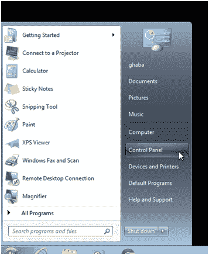
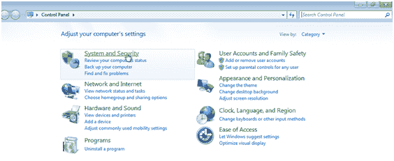
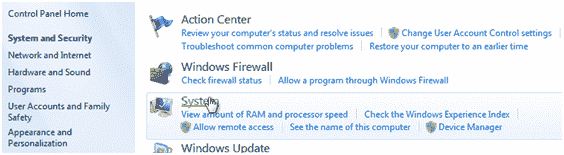
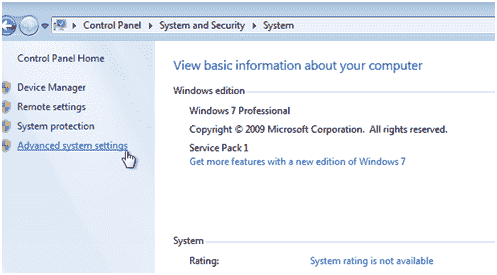
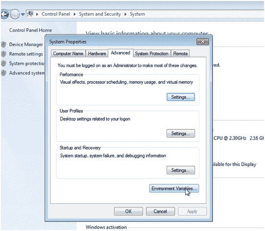
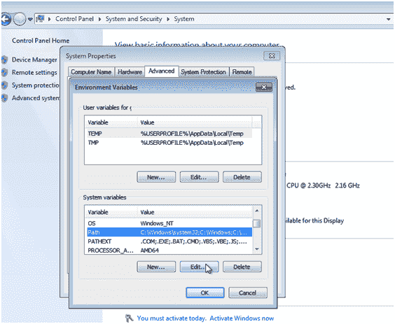
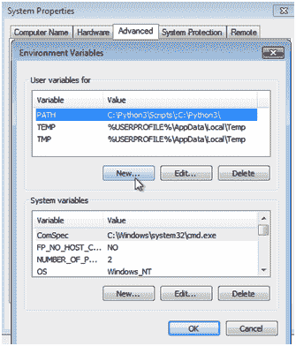
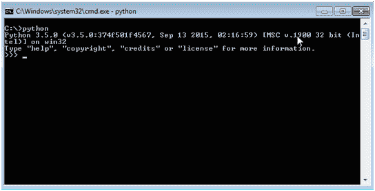

# 如何在 Windows 中安装 python

> 原文： [https://javabeginnerstutorial.com/python-tutorial/how-to-install-python-in-windows/](https://javabeginnerstutorial.com/python-tutorial/how-to-install-python-in-windows/)

如果使用 Windows，则必须比使用类似 Unix 的系统（Linux，Mac）做更多的配置。 

您唯一需要做的就是将 Python 和`pip`添加到`PATH`，以便通过命令行使用它。 这可以通过三种方式实现。

一种是临时的，您编写一个批处理脚本，每次您通过此脚本打开命令行时，该脚本都会启动并设置`PATH`。 我不会更详细地说明如何实现这一点，因为我认为这不是最好的方法，有时您想从自己所在的位置访问 Python。

这两个永久性解​​决方案是相同的，唯一的区别是，在一个版本中，您必须手动执行相同的步骤，而另一个版本则需要自动执行。

自动版本是在安装 Python 时选中“将 Python 3.5 添加到`PATH`”复选框。 这会自动在路径中创建所需的条目，使您可以通过命令行访问 Python。

另外，如果您选择“自定义安装”，您也可以选择将 Python 添加到`PATH`中。

**在安装过程中将 Python 添加到`PATH`** 

第二个版本适用于那些错过了上一步的人。 在这种情况下，您必须手动编辑路径。 现在是以下步骤：

在 Windows 上打开“开始菜单”，然后选择“控制面板”：

  

**打开控制面板**  

在“控制面板”中选择“系统和安全性”：

  

**选择系统和安全性**  

在“系统和安全性”视图中，选择“系统”：

**选择系统**  

在“系统”视图中，从左侧选择“高级系统设置”：

**单击高级系统设置**  

在“高级系统设置”窗口中，从底部选择“环境变量…”：

**打开环境变量**  

现在，您可以在窗口下部的“系统变量”中搜索“路径”条目。 在这里，您应该选择条目，然后单击“编辑...”。 现在，将 Python 的安装位置添加到该条目的末尾，并用分号将其与之前的条目分开。 例如，我将输入以下内容：

`C:\Python3\Scripts\; C:\Python3\`

Python 安装下的脚本文件夹包含点，因此将其也添加到路径是明智的。  

**系统变量**  

另外，您可以仅为您的用户创建一个环境变量。 在这种情况下，在窗口的上部选择“新建”，称为“...的用户变量”，然后添加一个新条目，其中变量设置为“`PATH`”，并且值是您安装 Python 的位置 - 在上一步中。

**用户变量**  

现在，如果您打开命令行并输入 python ，您应该会看到类似以下命令提示符的内容：

**使用 Python 的命令提示符**  

就是这样。 现在，您每次打开命令行即可访问 Python。

如果要在其他平台上安装 python。 您可能希望在我们讨论 [linux python 安装的地方看到本文](https://javabeginnerstutorial.com/python-tutorial/python-setup-for-windows-mac-linux/)。

### 参考文献

*   [适用于 Windows 的 Python 版本](https://www.python.org/downloads/windows/)
