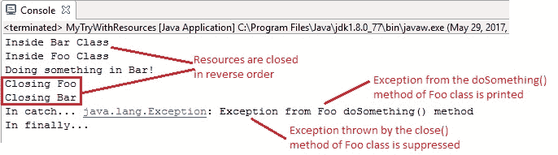

# 异常处理 – `try-with-resources`语句

> 原文： [https://javabeginnerstutorial.com/core-java-tutorial/exception-handling-try-resources/](https://javabeginnerstutorial.com/core-java-tutorial/exception-handling-try-resources/)

通常，`finally`块用于关闭所有资源（即文件，数据库连接，套接字或在任务完成后应关闭的任何东西），以防止任何泄漏。

*示例代码：*

```java
public class ResourceMgt {
	public static void main(String[] args) {
		BufferedReader br = null;
		try {
			br = new BufferedReader(new FileReader("C://test.txt"));
			System.out.println(br.readLine());
		} catch (IOException e) {
			e.printStackTrace();
		} finally {
			if (br != null)
				try {
					br.close();
				} catch (IOException e) {
					e.printStackTrace();
				}
		} //finally
	} // main
}
```

如果您看上面的示例代码，要关闭`BufferedReader`资源，我们必须检查它是否仍然打开，然后调用`close()`方法。 `close`方法可能会引发异常，因此必须将其包围在`try catch`块中。 对于每个打开的资源，都将重复此代码。 对于大型应用，由于这个原因，您将看到很多重复的代码。

在 Java 7 和更高版本中，`try-with-resources`语句可确保在该语句的末尾关闭所有打开的资源。 因此，`try-with-resources`语句不过是声明一个或多个资源的`try`语句。 所谓资源就是实现`java.lang.AutoCloseable`接口的任何对象。 该接口又包括实现`java.io.Closeable`接口的所有对象。

因此，使用`try-with-resources`语句的同一示例可以写成：

```java
public class ResourceMgt {
	public static void main(String[] args) {
		try(BufferedReader br = new BufferedReader(new FileReader("C://test.txt"))){
			System.out.println(br.readLine());
		} catch (IOException e) {
			e.printStackTrace();
		} 
	} // main
}
```

在`try`关键字之后立即引入一个括号，并且所有资源都应仅在该括号内声明。 这些资源用分号分隔。

如您所见，使用`try-with-resources`语句的代码

*   减少行数即可读取。
*   代码看起来很整洁。
*   如果`finally`块的唯一目的只是关闭资源，则不需要。
*   自动资源管理。

在我们的示例中，由于在`try-with-resource`语句中声明了`BufferedReader`实例，因此无论`try`语句是否成功完成，都将关闭它（如``readLine()`方法可以引发`IOException`）。

**值得注意的要点**：

*   `try-with-resources`语句就像普通的`try`语句一样。 它可以拥有常规`catch`和`finally`块。
*   重要的是要记住，在`catch`和`finally`块运行之前，已声明的资源已关闭。
*   要在同一`try`语句中声明多个资源，必须使用

例如，

```java
try(BufferedReader br = new BufferedReader(new FileReader("C://test.txt")); 
       ZipFile zf = new ZipFile("test1.zip")){…}
```

*   一旦`try-with-resources`块完成（成功完成或引发异常），这些资源的`close`方法将以相反的顺序自动调用。

考虑以上示例，

`ZipFile`和`BufferedWriter`的`close()`方法将按照上述顺序（即反向顺序）被调用，以避免可能出现的任何依赖问题。

*   如果在初始化任何资源时有任何问题，那么到目前为止所有已初始化的资源都将以相反的顺序关闭。
*   要将自定义类用作资源，这些类必须实现[`lang.AutoCloseable`](https://docs.oracle.com/javase/8/docs/api/java/lang/AutoCloseable.html)或[`java.io.Closeable`](https://docs.oracle.com/javase/8/docs/api/java/io/Closeable.html)接口。
*   `Closeable`和`AutoCloseable`接口的`close()`方法分别引发`IOException`和`Exception`类型的异常。
*   由于`AutoCloseable`接口的子类可以覆盖`close`方法的此行为以引发专门的异常（例如`IOException`或根本没有异常），因此最好使用`AutoCloseable`进行自定义。

## `AutoCloseable`接口的自定义实现：

`AutoCloseable`接口非常容易实现，因为它只有一个方法`close()`。

```java
public interface AutoClosable {
    public void close() throws Exception;
}
```

让我们创建两个实现`AutoCloseable`接口的自定义类，

`Bar.java`

```java
public class Bar implements AutoCloseable{

	public Bar(){
		System.out.println("Inside Bar Class");
	}
	public void doSomething(){
		System.out.println("Doing something in Bar!");
	}
	public void close() throws Exception{
		System.out.println("Closed Bar");
	}
}
```

`Foo.java`

```java
public class Foo implements AutoCloseable{

	public Foo(){
		System.out.println("Inside Foo Class");
	}
	public void doSomething() throws Exception{
		throw new Exception("Exception from Foo doSomething() method");
	}
	public void close() throws Exception{
		System.out.println("Closing Foo");
		throw new Exception("Unable to close Foo...");
	}
}
```

`Foo`类的`doSomething()`和`close()`方法引发异常。

`MyTryWithResources.java`

```java
public class MyTryWithResources {

	public static void main(String[] args){
		try(Bar b = new Bar(); Foo f = new Foo()){
			b.doSomething();
			f.doSomething();
		}catch(Exception ex){
			System.out.println("In catch... " + ex);
		}finally{
			System.out.println("In finally...");
		}
	}
}
```

### 输出：



**说明**：

1.  这里首先要注意的是打开和关闭资源的顺序。 打开栏，然后打开`Foo`，但在关闭时，遵循相反的顺序。 `Foo`关闭，然后关闭`Bar`资源。
2.  `Foo`的`close()`会引发异常，但是如果您注意到生成的输出，则会将其抑制。 `MyTryWithResources`的`main`方法仅引发由`doSomething()`在`try`块中生成的异常。

这是在`try-with-resources`中要理解的主要概念。 让我们尝试逐步传播这些信息，

*   `Bar`和`Foo`资源在`try-with-resources`块中创建。
*   `Try`块开始执行。
*   `Bar`类的`doSomething()`成功执行，并输出消息“在`Bar`中做某事！” 进行控制台。
*   `Foo`类的`doSomething()`方法引发异常。
*   在将控件转移到`catch`方法以处理异常之前，通过调用资源各自的`close()`方法来关闭资源。
*   `Foo`类的`close()`将消息“正在关闭`Foo`”打印到控制台，并抛出一个异常，该异常在`try`块抛出的异常暴露时被抑制。
*   仅当`try`块和`try-with-resources`语句（`close()`方法）都抛出异常时，`try-with-resources`语句对这种异常的抑制才发生。
*   `Bar`类的`close()`运行，并将消息“`Closing Bar`”显示在控制台上。
*   然后，`finally`块执行。

3.  如果您还想检索抑制的异常怎么办？ 不要担心。 在 Java SE 7 和更高版本中，可以使用`getSuppressed()`方法检索它们。
4.  尽管关闭特定资源时会引发异常，但是所有打开的资源都将被关闭，而与引发的异常无关。 在我们的示例中，尽管关闭`Foo`资源时发生异常，但`Bar`资源也成功关闭。

为了获取被抑制的异常，只需将行`exception_handler_reference_variable.getSuppressed()`添加到`MyTryWithResources`类的`catch`块中，如下所示，

```java
catch(Exception ex){
			System.out.println("No. of suppressed exceptions: " + ex.getSuppressed().length);
			System.out.println("In catch... " + ex);
		}
```

### 输出：

```java
Inside Bar Class
Inside Foo Class
Doing something in Bar!
Closing Foo
Closed Bar
No. of suppressed exceptions: 1
In catch... java.lang.Exception: Exception from Foo doSomething() method
In finally...
```

通过遵循这些示例，您可以毫不费力地围绕这个概念进行思考。 祝你今天愉快！

