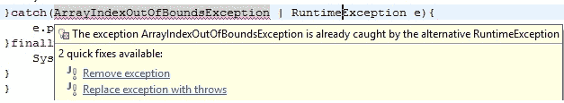

# Java 异常处理 – `try catch`块

> 原文： [https://javabeginnerstutorial.com/core-java-tutorial/exception-handling-try-catch-java/](https://javabeginnerstutorial.com/core-java-tutorial/exception-handling-try-catch-java/)

作为开发人员，我们每天处理风险情况。 服务器故障，或者没有足够的空间分配堆上的对象，或者给定位置不存在文件，依此类推。 因此，每次我们决定采取有风险的措施时，我们都必须通知编译器我们知道这是有风险的事情，并且已经准备好处理它。 我们如何处理这不是编译器的问题。 它需要记住的是，我们正在照顾可能出现的任何特殊情况。

我们通过将代码包装在 Java 的`try catch`中来处理这些情况。

### `try/catch/finally`块的基本语法：

```java
try{
     //code that could throw an exception
     //if exception thrown, following code is not reachable
     //control jumps to catch block
}catch(ExceptionType referenceVariable){
	//code that is executed only when an exception is thrown
	//does something using the exception reference variable
	//usually prints stack trace or exception description
}finally{
	//cleanup code
	//always executes regardless of an exception
}
```

### 注意

1.  在`try`块和`catch`块之间不能编写任何代码。
2.  `try`块必须紧随其后的是`catch`或`finally`块，或二者兼而有之。 如果没有`catch`块，则尽管`finally`方法具有`try/finally`，但`final`方法应**声明异常**。
3.  您不能拥有不带`catch`或`finally`的`try`块。
4.  如果您不想在代码中处理异常，请使用**引发并声明**子句。 谁调用您的代码都必须使用`try/catch`块来处理它。

## 控制流

1.  如果`try`块成功，即未引发异常，则控制将移至`finally`块（如果存在）。 跳过`catch`块。 在没有`finally`块的情况下，将执行`catch`块下面的任何代码。
2.  如果`try`块失败（发生异常），则控制权转移到处理异常的`catch`块。 `try`块中的其余代码永远不会执行。 如果存在`finally`块，则在`catch`块执行完成后运行。
3.  如果`try/catch`块**具有**返回语句，那么即使执行`finally`块！ 流控制首先跳转到`finally`块，然后返回`return`语句。

### 示例

```java
public class TryCatch1 {

public static void main(String[] args) {
	System.out.println(riskyAction());
	}

public static String riskyAction(){
	try{
		System.out.println("Started executing try block");
		return "returning from try block";
	}catch(Exception e){
		return "returning from catch blcok";
	}finally{
		System.out.println("print statement from finally");
	}
	}
}
```

### 输出

```java
Started executing try block
print statement from finally
returning from try block
```

### 解释

1.  `try`块运行并打印“开始执行`try`块”。
2.  一旦遇到`return`语句，流程将立即转移到`finally`块并打印“`finally`的`print`语句”。
3.  `finally`块执行完成后，控制权返回`try`块中的`return`语句，并返回“从`try`块返回”。
4.  如果`finally`块具有**返回语句**，则来自`try/catch`块的`return`语句将被覆盖。

### 示例

```java
public class TryCatch2{

public static void main(String[] args) {
	System.out.println(riskyAction("hello"));
	System.out.println("-----------");
	System.out.println(riskyAction("howdy"));
	}

public static String riskyAction(String greeting){
	try{
		if(greeting.equals("hello")){
			System.out.println(greeting + " from try block");
		}else{
			throw new Exception();
		}
		return "returning from try block";
	}catch(Exception e){
		System.out.println(greeting + " from catch block");
		return "returning from catch block";
	}finally{
		return "returning from finally block";
	}
	}
}
```

### 输出

```java
hello from try block
returning from finally block
-----------
howdy from catch block
returning from finally block
```

### 解释

对于方法调用，`riskyAction("hello")`：`try`块成功并打印`try`块中的“hello”。 由于它具有`return`语句，因此控制权转移到`finally`块。 `finally`块还具有一个`return`语句，该语句将覆盖`try`块中的语句，因此该方法将返回并打印“`finally`块返回”到控制台。

对于`riskyAction("howdy")`：`try`块引发异常，该异常在 catch 块中处理，该异常打印`catch`块中的“howdy”。 就像我们在`try`块成功的情况下看到的一样，`finally`块的`return`语句也覆盖`catch`块中的`return`语句。 结果，该方法返回并打印“从`finally`块返回”到控制台。

**注意**：由于无论是否发生异常，`finally`块总是被执行，因此，如果它具有`return`语句，则可以预期到意外的结果，并且可能变得难以调试。 **作为一种好的做法，最好避免在`finally`块中编写`return`语句。**

## 捕获多个异常

在 Java 7 之前，为了处理多个异常，使用了多个`catch`块（从最特定到最普通）。 编写代码是为了打印栈跟踪，执行错误恢复，链接异常，允许用户做出决定等。但是编写多个`catch`块包含许多**重复代码**。 另外，程序员倾向于捕获更广泛或更普遍的异常，而不是特定的异常。 例如，捕获`IOException`而不是`FileNotFoundException`。

从 **Java SE 7 和更高版本**起，这些缺陷已通过**单`catch`块**解决，该块可以**处理多种类型的异常**。 在这里，要处理的异常类型在以竖线（`|`）分隔的`catch`子句的主题中指定。

#### 示例

```java
catch(ArrayIndexOutOfBoundsException | SQLException ex){
	ex.printStackTrace();
}
```

#### 注意

1.  每当单个`catch`块处理多个异常时，引用变量（上例中为“`ex`”）为`final`，因此将其视为常量。 因此，无法为其分配其他任何值。 在某些情况下，这限制了异常处理能力。
2.  不能将异常类型与其父类组合在一起，因为子类异常由于已经被捕获而变得不可访问。

#### 示例



## 仔细查看`Finally`块

1.  一旦`try`块中的控件退出，无论是否引发异常，都将始终执行`finally`块。
2.  `finally`块未执行，
    1.  如果在执行`try/catch`块代码时 JVM 退出
    2.  如果在控制权到达`finally`块之前执行了`System.exit()`
    3.  如果执行`try/catch`代码的线程被中断或杀死
3.  `finally`块通过关闭可能已打开的资源来防止任何资源泄漏。
4.  如果要恢复任何资源，则必须将代码放在`finally`块中。
5.  仅带有`finally`块的`try`块（即没有`catch`块）仍应声明该异常以进行处理。

在 **Java SE 7 和更高版本中，考虑使用`try-with-resources`语句**自动关闭不再使用的资源。 开发人员不需要为此记住通过编写`finally`块来释放使用的资源。

[`try-with-resources`语句的文章](https://javabeginnerstutorial.com/core-java-tutorial/exception-handling-try-resources/)提供了详细的信息以及其优势，摘要和示例代码片段。

