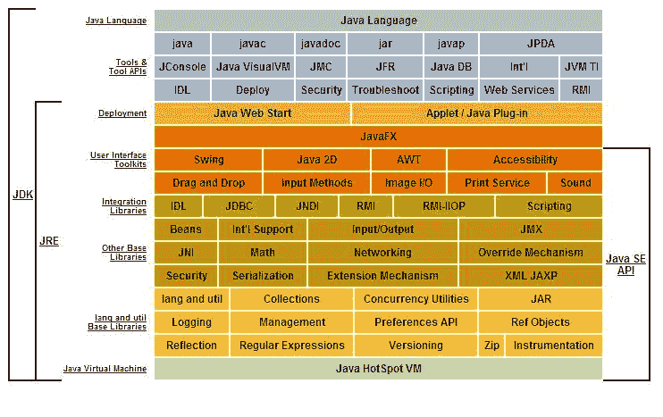

# jdk vs jre vs jvm

> 原文： [https://javabeginnerstutorial.com/core-java-tutorial/jdk-vs-jre-vs-jvm/](https://javabeginnerstutorial.com/core-java-tutorial/jdk-vs-jre-vs-jvm/)

为了了解 JDK vs JRE vs JVM。 您需要首先了解每个术语。 因此，我们首先定义 JDK（Java 开发工具包），JRE（Java 运行时环境）和 JVM（Java 虚拟机）。

## JDK（Java 开发套件）

JDK 包含**开发和运行** Java 应用所需的所有内容。

## JRE（Java 运行时环境）

JRE 包含**运行**已编译的 Java 应用所需的所有内容。 它不包含开发 Java 应用所需的代码库。

## JVM（Java 虚拟机）

JVM 是一种虚拟机，可在您的操作系统上运行，为编译后的
Java 代码提供推荐的环境。 JVM 仅适用于字节码。 因此，您需要编译 Java 应用（`.java`），以便可以将其转换为字节码格式（也称为`.class`文件）。

然后，JVM 将使用它来运行应用。 JVM 仅提供执行 Java 字节码所需的环境。

## JDK vs JRE vs JVM

下表显示了每种 Java 技术的不同功能。

 

图片提供：Oracle 公司

现在，根据该图，您可以确定有什么区别。

JRE = JVM + 运行应用所需的库。

JDK = JRE + 开发 Java 应用所需的库。

### Java 可移植性

为了理解 Java 的可移植性，您需要从头到尾了解 Java 代码会发生什么。

*   Java 源代码（由开发人员编写）（机器中性）
*   编译代码/字节码（由`javac`编译）（机器中性）
*   执行的字节码（由 JVM 执行）（机器特定）

在步骤 2 中，`javac`（Java 编译器）将 Java 代码转换为字节码。 可以将其移动到任何计算机（Windows/Linux）并由 JVM 执行。 JVM 读取字节码并生成机器特定的代码。 为了生成特定于机器的代码，JVM 需要特定于机器。 因此，每种类型的计算机（Windows/Linux/Mac）都具有特定的 JVM。 因此，编码器
无需费心生成字节码。 JVM 负责可移植性。 因此，最终的答案是 Java 是可移植
，而 JVM 是特定于机器的。

<https://www.youtube.com/embed/RJ5NLb2zLhw?start=5&amp;feature=oembed>

