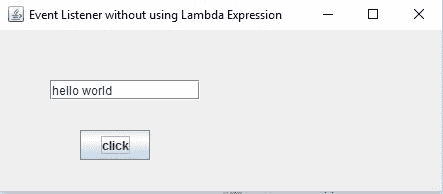
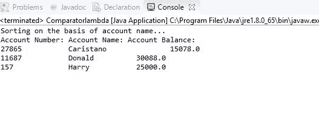

# Java Lambda：初学者指南

> 原文： [https://javabeginnerstutorial.com/core-java-tutorial/java-lambda-beginners-guide/](https://javabeginnerstutorial.com/core-java-tutorial/java-lambda-beginners-guide/)

本文介绍了 Java 8 中的 Java Lambda 表达式。[您可以在此处找到完整的代码](https://github.com/JBTAdmin/java-tutorial/tree/master/lambda/src)。

## Java Lambda 表达式

Java Lambda 表达式是 Java 的一个重要的新功能，已在 Java 8 中引入。Lambda 表达式是不属于任何类的匿名函数（无名称的函数），表示该函数没有名称，并且没有类。 Lambda 表达式通过促进 Java 中的函数式编程大大简化了开发。 它用于提供函数式接口的实现（函数式接口是仅包含一种方法的接口。例如，Java 标准的`Runnable`接口是函数式接口）。 它还有助于迭代，过滤和从集合库中提取数据。 Lambda 表达式使您可以将代码视为数据，将函数视为方法参数。

### Lambda 表达式的语法

让我们讨论 Lambda 表达式的语法。

Lambda 表达式包含三个组件，一组参数，一个 Lambda 运算符和一个函数体。 这是三个组成部分

*   **参数列表**：这里是参数，也可以为空或非空。
*   **Lambda 表达式**： Lambda 表达式或箭头（`->`）用于分隔参数列表和函数体。
*   **函数正文**：它包含 Lambda 表达式的函数语句。

输入参数在 lambda 运算符的左侧，而函数体在 lambda 运算符的右侧。 此 Lambda 表达式语法可减少将五行代码合并为一行的代码的庞大性。

参数列表`->`函数正文

### Lambda 表达的特征

以下是 Lambda 表达的一些重要特征。

*   **类型声明**：类型声明是可选的。 由您自己决定，如果您不声明参数类型，则编译器可以从参数值中进行猜测。 例如你可以写

```java
(5,4) -> function body
```

*   **参数周围的括号**：参数周围的括号也是可选的。 您可以根据需要放置括号，否则保留原样。 如果 Lambda 表达式中有多个参数，则需要括号，如上面的示例所示。 对于一个参数，您可以编写为

```java
5 -> function body
```

*   **花括号**：如果只有一条语句，围绕函数主体的花括号也是可选的。 对于多个语句，需要在函数主体周围使用花括号。 例如

```java
(5, 4) -> 5+4;
```

*   **返回语句**：在 Lambda 表达式中，返回语句也是可选的。 如果主体具有单个表达式，则 Java 编译器会自动返回值。 如果函数主体返回一个值，则应使用花括号将其括起来。

### Lambda 表达的示例

以下是 Lambda 表达式的一些示例。

```java
(x, y) -> x+y;
```

上面编写的 Lambda 表达式表示给定两个整数`x`，`y`，并返回另一个具有`x`和`y`之和的整数。

另一个

```java
( ) -> 42
```

上面编写的 Lambda 表达式表示未给出整数，并返回整数 42。

**前提条件**

要运行 Java Lambda 表达式，必须满足以下条件。

*   Java 开发套件（JDK8）
*   NetBeans 或 Eclipse

### 没有参数的 Lambda 表达式

在此示例中，我将展示如何使用不带参数的 Java Lambda 表达式。 打开您的 IDE（我将使用 Eclipse Neon）并开始创建一个新项目。 将其命名为`Lambda`。 创建一个名为`NoParameter`的类。

```java
public class NoParameter {

  public static void main(String[] args) {
    // TODO Auto-generated method stub
     // lambda expression with return type 
    NoParameterInterface message = () -> {
    		return "Hello World with No Parameter";
    	};
        System.out.println( message.HelloWorld( ));
  }

}

@FunctionalInterface
interface NoParameterInterface {

  //Here is a method with no parameter and return type as String
    public String HelloWorld();
}
```

上面的示例通过使用不带参数的 Lambda 表达式显示了一个 Hello World 消息。

### 单参数 Lambda 表达式

您已经看到了不带参数的 Lambda 表达式示例。 我们来看一个带有单个参数的 Lambda 表达式示例。 为此，创建一个名为`SingleParameter`的类，并将以下代码粘贴在那里。

```java
public class SingleParameter {

  public static void main(String[] args) {
    // TODO Auto-generated method stub
     // lambda expression with single parameter num and returns square of num without any return statement 
    SingleParameterInterface Square = (num) -> num*num;
        System.out.println(Square.SquareOfFive(5));
  }

}

@FunctionalInterface
interface SingleParameterInterface {

  //A method with single parameter and return type as int 
    public int SquareOfFive(int s);
}
```

上面的示例显示了带有单个参数的 Lambda 表达式。 它以 5 作为输入，并返回 5 的平方，而没有任何`return`语句。 如上所述，如果只有一条语句，则无需指定`return`关键字。 编译器会自动返回该值。

### 多参数 Lambda 表达式

让我们以包含多个参数的 Java Lambda 表达式为例。 创建一个新的 Java 类，并将其命名为`MulipleParamater`。 打开它，并在其中粘贴以下代码。

```java
public class MulipleParamater {

  public static void main(String[] args) {
    // TODO Auto-generated method stub
    //lambda expression which add two number
    MulipleParamaterInterface add = (a, b) -> a + b;
        System.out.println("Sum of 5 and 4 is: "+add.sum(5, 4));
  }

}

interface MulipleParamaterInterface {

  //here is a method with multiple parameter and int as return type 
    public int sum(int a, int b);
}
```

上面的示例显示了具有多个参数的 Lambda 表达式。 它以 5 和 4 作为输入，并返回`sum`为 9。同样，它无需指定`return`关键字即可工作。

### 事件监听器

让我们探索一些更高级的示例，这些示例是 Java 中的事件监听器。 Lambda 表达式如何用于实现事件监听器。 您将看到带有 Lambda 表达式和没有 Lambda 表达式的事件监听器的两个示例。

**没有 Lambda 表达式的事件监听器**

首先，检查没有 Lambda 表达式的事件监听器。 转到 eclipse 并创建一个新类，将其命名为`eListener`。 打开它并粘贴以下代码。

```java
import java.awt.event.*;		//import for event listener
import javax.swing.JButton;   	//import for JButton class
import javax.swing.JFrame;    	//import for JFrame class
import javax.swing.JTextField;  //import for JTextField 

public class eListener {  
  //event listener class without Lambda Expressions
  static JTextField textfield;
  static JButton button;
  static JFrame frame;

    public static void main(String[] args) {  
        textfield=new JTextField(); 
        button=new JButton("click");  
        frame=new JFrame("Event Listener without using Lambda Expression"); 

        //set positions of text field and button
        textfield.setBounds(50, 50,150,20);         
        button.setBounds(80,100,70,30);  

        //action listener on button 
        button.addActionListener(new ActionListener(){
        	  public void actionPerformed(ActionEvent e){  
        		  textfield.setText("hello world");
        	  }
          });

        frame.add(textfield);
        frame.add(button);  
        frame.setDefaultCloseOperation(JFrame.EXIT_ON_CLOSE);  
        frame.setLayout(null);  
        frame.setSize(300, 200);  
        frame.setVisible(true);  

    }  

}
```

上面编写的代码显示了 Java 中不使用 Lambda 表达式的事件监听器的示例。 因此，您必须熟悉该代码。 使用了简单的`JButton``，JFrame`和`JTextField`。 当用户单击按钮时，文本字段将显示 Hello World 消息。 这是输出



**具有 Lambda 表达式的事件监听器**

现在使用 Lambda 表达式检查事件监听器。 转到 eclipse 并创建一个名为`eListenerLambda`的新类。打开并粘贴以下代码。

```java
import javax.swing.JButton;   	//import for JButton class
import javax.swing.JFrame;    	//import for JFrame class
import javax.swing.JTextField;  //import for JTextField 

public class eListenerLambda {  
  //event listener class without Lambda Expressions
  static JTextField textfield;
  static JButton button;
  static JFrame frame;
  
    public static void main(String[] args) {  
        textfield=new JTextField(); 
        button=new JButton("click");  
        frame=new JFrame("Event Listener without using Lambda Expression"); 
        
        //set positions of text field and button
        textfield.setBounds(50, 50,150,20);         
        button.setBounds(80,100,70,30);  
          
        // lambda expression implementing here.  
        button.addActionListener(e-> {textfield.setText("hello world");});  
          
         
        frame.add(textfield);
        frame.add(button);  
        frame.setDefaultCloseOperation(JFrame.EXIT_ON_CLOSE);  
        frame.setLayout(null);  
        frame.setSize(300, 200);  
        frame.setVisible(true);  
  
    }  
  
}
```

上面编写的代码显示了带有 Lambda 表达式的 Java 事件监听器的示例。 如果我们将这两个代码进行比较，您将检查第一个示例中的动作监听器代码是否包含三个语句，而使用 Lambda 表达式可以在一个语句中解决问题。 这两个代码的输出与上面显示的相同。

### 使用 Lambda 表达式的比较器示例

让我们再看看使用 Lambda 表达式作为比较器示例的另一段代码。 创建一个新类，并将其命名为`Comparatorlambda.java`。 打开它并粘贴以下代码。

```java
import java.util.ArrayList;  
import java.util.Collections;  
import java.util.List;  

//account class holds the details of a bank account of customers like account number, name and account balance
class Account{  
    int accountNumber;  
    String name;  
    float AccountBalance;  
    public Account(int accountNumber, String name, float AccountBalance) {  
        super();  
        this.accountNumber = accountNumber;  
        this.name = name;  
        this.AccountBalance = AccountBalance;  
    }  
}  

//comparator class using Lambda Expressions
public class Comparatorlambda{  
  
    public static void main(String[] args) {  
        List<Account> list=new ArrayList<Account>();  
          
        //Adding account details in list  
        list.add(new Account(00235,"Harry",25000));  
        list.add(new Account(11687,"Donald",30088));  
        list.add(new Account(27865,"Caristano",15078));  
          
        System.out.println("Sorting on the basis of account name...");  
  
        // implementing lambda expression  
        Collections.sort(list,(p1,p2)->{  
        return p1.name.compareTo(p2.name);  
        
        });  
        System.out.println("Account Number: Account Name: Account Balance:"); 
        for(Account p:list){  
            System.out.println(p.accountNumber+" \t\t"+p.name+" \t\t"+p.AccountBalance);  
        }  
  
    }  
}
```

此示例具有一个帐户类，其中包含名称，号码和帐户余额之类的帐户信息。 Lambda 表达式用于根据帐户名称对帐户进行比较和排序。 这是用于此目的的 Lambda 表达式。

```java
Collections.sort(list,(p1,p2)->{return p1.name.compareTo(p2.name); });
```

以下是此代码的输出



## 总结

Lambda 表达式用于定义函数式接口的内联实现。 您在上面的示例中看到，Lambda 表达式节省了我们的时间，并大大减少了代码语句。 它通过促进函数式编程为 Java 提供了强大的功能。 Java 的这一新功能改变了完整的编码方式，简化了开发过程，因为它利用了多核环境的并行功能。