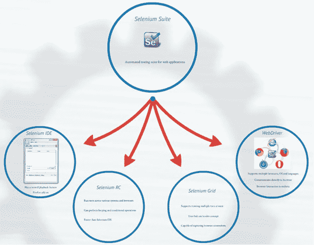
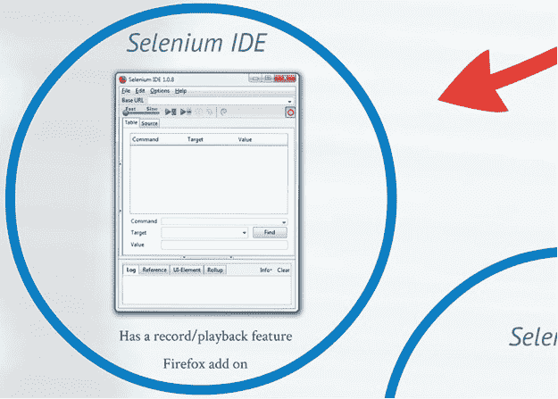
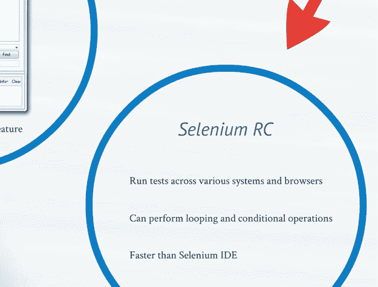
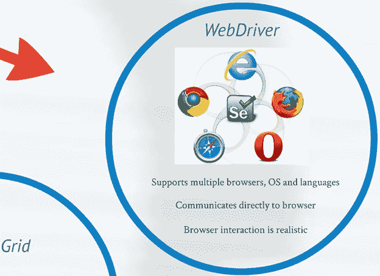

# 4 Selenium 工具套件

> 原文： [https://javabeginnerstutorial.com/selenium/4-selenium-tool-suite/](https://javabeginnerstutorial.com/selenium/4-selenium-tool-suite/)

朋友！ 到了另一个 **BrainBell** – **图片的时间**！ 我们通过可视化学习的内容越多，我们在以后的时间记得和回忆的就越好。

谁不喜欢图片，众所周知，一张图片值一千字。 因此，此博客文章将全部为图片！ 我以视觉方式提出了 Selenium 的**成分**的高级概念。 因为图像使学习变得更加有趣和充满乐趣。

## 初探

## Selenium 工具套件：

## Selenium IDE：

## Selenium RC：

## Selenium 网格：

## WebDriver：

您现在看到的是 Selenium 工具套件的快速转发版本。 有很多要说的，但是所有这些都可以等到他们相应的帖子让生活焕然一新！

在另一篇文章中再见。 祝你有美好的一天！

